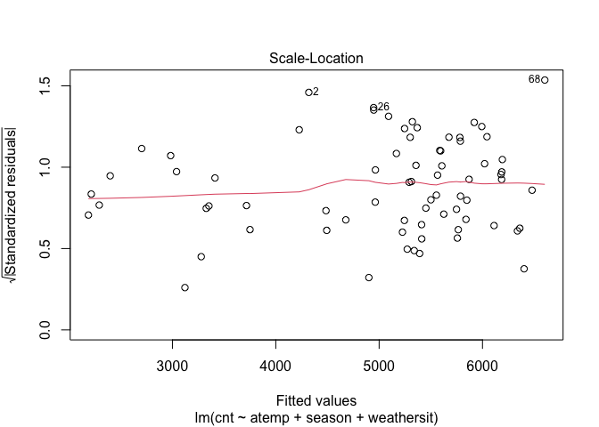

Project2
================
Rashmi Kadam, Dionte Watie
7/6/2021

-   [Introduction](#introduction)
-   [Linear Regresion Model](#linear-regresion-model)
-   [Fitting Random forest model](#fitting-random-forest-model)
-   [Fitted Boosted Tree Model](#fitted-boosted-tree-model)

### Introduction

*Bike Data Analysis for Friday*

For this study we will be aiming to predict the number of bike users.
The bike users have been split into two groups that will be the target
variables (response), casual bikers that rent bikes casually and
registered bikers that rent bikes regularly. The predictor variables
that will be in question are:

-   weekday (day of the week)
-   season
-   yr (year)
-   holiday (whether it is a holiday or not)
-   weathersit (weather: rainy, snowy, clear, cloudy)
-   mnth
-   atemp (Feeling temperature)
-   windspeed

The response and predictor variables will be used in various Multiple
Linear Regression Models, Logistics Models, and Tree fits. The models
will then be tested against the testing data set and the results will
determine which model would be best to use for prediction.

``` r
library(tidyverse)
library(corrplot)
library(ggplot2)
library(ggpubr)
library(caret)
library(randomForest)
```

``` r
set.seed(1)

# read Bike data
bikeData <- read_csv("day.csv")
```

    ## 
    ## ── Column specification ─────────────────────────────────────────────────────────────────────────
    ## cols(
    ##   instant = col_double(),
    ##   dteday = col_date(format = ""),
    ##   season = col_double(),
    ##   yr = col_double(),
    ##   mnth = col_double(),
    ##   holiday = col_double(),
    ##   weekday = col_double(),
    ##   workingday = col_double(),
    ##   weathersit = col_double(),
    ##   temp = col_double(),
    ##   atemp = col_double(),
    ##   hum = col_double(),
    ##   windspeed = col_double(),
    ##   casual = col_double(),
    ##   registered = col_double(),
    ##   cnt = col_double()
    ## )

``` r
wnum <- weekday
wnum
```

    ## [1] 5

``` r
# filtering weekday data
bikeDataWD <- bikeData %>% filter(weekday == wnum)

# Correlation graph has been used to select the predictors
Correlation <- cor(select(bikeDataWD, casual, registered, cnt,holiday, mnth, season,  weathersit ,yr, temp, atemp, hum, windspeed))

corrplot(Correlation)
```

<!-- -->

``` r
#Selected the predictors and factored the categorical predictors.

bikeDataM <- bikeDataWD %>% select (season, holiday, mnth, weathersit, atemp, windspeed, casual, registered, cnt, yr)

#
bikeDataM$mnth <- as.factor(bikeDataM$mnth)

bikeDataM$season <- factor(bikeDataM$season,
                          levels = c("1", "2","3","4") , 
                          labels = c("Spring","Summer","Fall","Winter"))

bikeDataM$holiday <- factor(bikeDataM$holiday, 
                           levels = c("0", "1") , 
                           labels = c("Working Day","Holiday"))


bikeDataM$weathersit <- factor(bikeDataM$weathersit,
                          levels = c("1", "2","3","4") , 
                          labels = c("Good:Clear/Sunny","Moderate:Cloudy/Mist","Bad: Rain/Snow/Fog",
                                     "Worse: Heavy Rain/Snow/Fog"))

bikeDataM$yr <- factor(bikeDataM$yr,
                      levels = c("0", "1") , 
                      labels = c("2011","2012"))
```

Created train and test data sets

``` r
train <- sample(1:nrow(bikeDataM), size = nrow(bikeDataM)*0.7)
test <- dplyr::setdiff(1:nrow(bikeDataM), train)
bikeDataTrain <- bikeDataM[train, ]
bikeDataTest <- bikeDataM[test, ]


summary(bikeDataTrain)
```

    ##     season          holiday        mnth                         weathersit     atemp       
    ##  Spring:14   Working Day:71   6      : 9   Good:Clear/Sunny          :50   Min.   :0.1884  
    ##  Summer:19   Holiday    : 1   9      : 9   Moderate:Cloudy/Mist      :22   1st Qu.:0.3455  
    ##  Fall  :20                    5      : 7   Bad: Rain/Snow/Fog        : 0   Median :0.5215  
    ##  Winter:19                    10     : 7   Worse: Heavy Rain/Snow/Fog: 0   Mean   :0.4903  
    ##                               12     : 7                                   3rd Qu.:0.6056  
    ##                               4      : 6                                   Max.   :0.8409  
    ##                               (Other):27                                                   
    ##    windspeed           casual         registered        cnt          yr    
    ##  Min.   :0.02239   Min.   :  54.0   Min.   :1299   Min.   :1421   2011:34  
    ##  1st Qu.:0.13294   1st Qu.: 452.0   1st Qu.:3340   1st Qu.:3721   2012:38  
    ##  Median :0.16832   Median : 822.0   Median :4013   Median :4911            
    ##  Mean   :0.18184   Mean   : 802.7   Mean   :4236   Mean   :5039            
    ##  3rd Qu.:0.22986   3rd Qu.:1062.2   3rd Qu.:5289   3rd Qu.:6337            
    ##  Max.   :0.37811   Max.   :1807.0   Max.   :6917   Max.   :8167            
    ## 

``` r
#Side by side bar plots for month and count by year
  
Year <- bikeDataTrain$yr

ggplot(bikeDataTrain, aes(fill=Year, y=cnt, x=mnth)) + 
    geom_bar(position="dodge", stat="identity") + xlab("Months") + ylab('Total Users')
```

<!-- -->

``` r
#Boxplot of season versus count

ggplot(bikeDataTrain, aes(x = season,y=cnt)) +
  geom_boxplot(fill="steelblue") +ylab('Total Users')
```

<!-- -->

``` r
#Scatter plots for casual and registered versus actual temperature

mintemp <- -16
maxtemp <- 50

bikeDataTrain$atemp = bikeDataTrain$atemp * (maxtemp - mintemp) + mintemp
bikeDataTrain$atemp
```

    ##  [1]  5.041592  5.415614 32.458322  7.207514  8.915858  7.457258 -0.001600 26.042528  0.457892
    ## [10] 24.125492 17.790878 25.416914 33.667178  6.915464 14.457350 23.209478 21.750086 27.542378
    ## [19] 10.623872 22.292342 25.792586 23.917328 23.000522 18.501500 11.957336 18.460250 18.916772
    ## [28] 25.208486 35.916458 26.708600  3.416672 17.290664 23.458892 27.334478 24.459650 19.958714
    ## [37]  5.375222 28.083578 -1.908406 23.625278 27.166772  3.916622 -3.564742  4.249922 15.291722
    ## [46] 22.750778 12.791114 22.666958 -2.216626 18.041150 -1.416772 12.582686  9.790622 30.417272
    ## [55] 20.373986  5.041592  6.457622 13.874042 18.782594 16.832558 22.210436  2.707964  5.874578
    ## [64] 18.374978 18.958550  7.498772 23.583764 39.499136  0.833036  5.249228 27.375464 31.791986

``` r
  cTemp <- ggplot(bikeDataTrain,aes(x=atemp, y=casual)) + geom_point() + geom_smooth() + ylim(0, 7000) 
  rTemp <- ggplot(bikeDataTrain, aes(x=atemp, y=registered)) + geom_point() + geom_smooth() + ylim(0, 7000) 
  
  ggarrange(cTemp, rTemp, labels = c("Casual Users", "Registered Users"), ncol = 2, nrow = 1)
```

    ## `geom_smooth()` using method = 'loess' and formula 'y ~ x'
    ## `geom_smooth()` using method = 'loess' and formula 'y ~ x'

<!-- -->

``` r
#Bar plots split by casual and registered users for season and holiday
rSeason <- ggplot(bikeDataTrain, aes(fill = holiday, x = season,y = registered,)) + geom_bar(position= 'dodge',stat = 'identity')

cSeason <- ggplot(bikeDataTrain, aes(fill = holiday, x = season,y = casual,)) + geom_bar(position= 'dodge',stat = 'identity')

ggarrange(cSeason, rSeason, labels= c("Casual Users", "Registered Users"), ncol = 2, nrow = 1)
```

<!-- -->

``` r
#Density plot for weathersit by year 
weather <- ggplot(bikeDataTrain, aes(x= weathersit))
weather + geom_density(adjust= 0.5, alpha= 0.5, aes(fill= Year), kernel="gaussian")
```

<!-- -->

``` r
#ECDF plot for count by year
cntPlot <- ggplot(bikeDataTrain, aes(x= cnt))
cntPlot + stat_ecdf(geom = 'step', aes(color= Year)) + ylab("ECDF")
```

<!-- -->

``` r
#Summary Statistics by Dionte
#variance, stdev, mean, and median of casual users by month
statsCasual <- bikeDataTrain %>% 
  group_by(mnth) %>% 
  summarise(avg = mean(casual), 
            med = median(casual), 
            var = var(casual), 
            stDev = sd(casual))
statsCasual
```

    ## # A tibble: 12 x 5
    ##    mnth    avg   med     var stDev
    ##    <fct> <dbl> <dbl>   <dbl> <dbl>
    ##  1 1      160.  148    8802.  93.8
    ##  2 2      359   349   46300  215. 
    ##  3 3      716   716   56448  238. 
    ##  4 4      920.  946  381808. 618. 
    ##  5 5     1143. 1069   74192. 272. 
    ##  6 6      991.  898  108428. 329. 
    ##  7 7     1127. 1288. 144421. 380. 
    ##  8 8     1085. 1051  100148. 316. 
    ##  9 9      871.  875  132810. 364. 
    ## 10 10     910.  949  145212. 381. 
    ## 11 11     514.  477   16051. 127. 
    ## 12 12     366.  349   28167. 168.

``` r
#variance, stdev, mean, and median of registered users by month
statsRegistered <- bikeDataTrain %>% 
  group_by(mnth) %>% 
  summarise(avg = mean(registered), 
            med = median(registered), 
            var = var(registered), 
            stDev = sd(registered))
statsRegistered
```

    ## # A tibble: 12 x 5
    ##    mnth    avg   med      var stDev
    ##    <fct> <dbl> <dbl>    <dbl> <dbl>
    ##  1 1     2522. 3040  1208746. 1099.
    ##  2 2     2583. 2348  1260352. 1123.
    ##  3 3     3092. 3092. 1087812. 1043.
    ##  4 4     3793  4185  3431933. 1853.
    ##  5 5     4843. 5227   965712.  983.
    ##  6 6     4625  4414   935705.  967.
    ##  7 7     4774. 4982  1292849. 1137.
    ##  8 8     4605  3893  1620912. 1273.
    ##  9 9     4876. 4372  3072500. 1753.
    ## 10 10    4742  4036  2432528. 1560.
    ## 11 11    4589. 5222. 1116208. 1057.
    ## 12 12    3417. 3402  1393686. 1181.

``` r
#variance, stdev, mean, and median of total bike users by season
statsCnt <- bikeDataTrain %>% 
  group_by(season) %>% 
  summarise(avg = mean(cnt), 
            med = median(cnt), 
            var = var(cnt), 
            stDev = sd(cnt))
statsCnt
```

    ## # A tibble: 4 x 5
    ##   season   avg   med      var stDev
    ##   <fct>  <dbl> <dbl>    <dbl> <dbl>
    ## 1 Spring 2984  3129   913548.  956.
    ## 2 Summer 5497. 5312  3121253. 1767.
    ## 3 Fall   5842. 5680. 2179597. 1476.
    ## 4 Winter 5250. 5202  2456131. 1567.

``` r
#Calculating z statistic
tapply(bikeDataTrain$casual, INDEX = bikeDataTrain$weathersit, FUN = function(x){x -mean(x)/sd(x)})
```

    ## $`Good:Clear/Sunny`
    ##  [1] 1256.95355  346.95355  160.95355  706.95355 1480.95355  868.95355  171.95355  576.95355
    ##  [9] 1414.95355 1363.95355  481.95355 1376.95355 1247.95355  765.95355 1513.95355 1066.95355
    ## [17]  673.95355  906.95355 1315.95355  826.95355  426.95355  946.95355 1485.95355  966.95355
    ## [25]  827.95355  359.95355  146.95355  860.95355 1048.95355   51.95355  437.95355  891.95355
    ## [33]  895.95355 1337.95355 1057.95355 1804.95355  812.95355 1518.95355  488.95355  304.95355
    ## [41] 1011.95355  881.95355  875.95355  265.95355 1316.95355  615.95355 1560.95355  559.95355
    ## [49] 1042.95355  961.95355
    ## 
    ## $`Moderate:Cloudy/Mist`
    ##  [1]  454.4319  170.4319  531.4319  740.4319  468.4319  795.4319  873.4319 1180.4319  256.4319
    ## [10] 1323.4319  745.4319 1509.4319  219.4319  546.4319 1043.4319  146.4319  113.4319  415.4319
    ## [19]  305.4319  527.4319  642.4319  347.4319
    ## 
    ## $`Bad: Rain/Snow/Fog`
    ## NULL
    ## 
    ## $`Worse: Heavy Rain/Snow/Fog`
    ## NULL

``` r
# summary statistics by Rashmi
#min max stdev and mean of feeling temperature by season
statsAtemp <- bikeDataTrain %>%
  group_by(season) %>%
  summarise(
    atemp.min = min(atemp),
    atemp.max = max(atemp),
    atemp.med = median(atemp),
    atemp.stdev = sd(atemp),
    atemp.mean = mean(atemp))
statsAtemp
```

    ## # A tibble: 4 x 6
    ##   season atemp.min atemp.max atemp.med atemp.stdev atemp.mean
    ##   <fct>      <dbl>     <dbl>     <dbl>       <dbl>      <dbl>
    ## 1 Spring  -3.56         18.8      4.48        7.28       5.22
    ## 2 Summer   2.71         30.4     20.4         7.16      19.1 
    ## 3 Fall    -0.00160      39.5     26.9         8.22      25.9 
    ## 4 Winter   3.42         22.7     10.6         6.75      11.8

``` r
#min max stdev and mean of total bike users per year
statsYear<- bikeDataTrain %>%
  group_by(yr) %>%
  summarise(
    cnt.min = min(cnt),
    cnt.max = max(cnt),
    cnt.med = median(cnt),
    cnt.stdev = sd(cnt),
    cnt.mean = mean(cnt)) 
statsYear
```

    ## # A tibble: 2 x 6
    ##   yr    cnt.min cnt.max cnt.med cnt.stdev cnt.mean
    ##   <fct>   <dbl>   <dbl>   <dbl>     <dbl>    <dbl>
    ## 1 2011     1421    5538   4100.     1219.    3811.
    ## 2 2012     3095    8167   6264.     1511.    6138.

``` r
#min max stdev and mean of total bike users per holiday
statsHoliday<- bikeDataTrain %>%
  group_by(holiday) %>%
  summarise(
    cnt.min = min(cnt),
    cnt.max = max(cnt),
    cnt.med = median(cnt),
    cnt.stdev = sd(cnt),
    cnt.mean = mean(cnt)) 
statsHoliday
```

    ## # A tibble: 2 x 6
    ##   holiday     cnt.min cnt.max cnt.med cnt.stdev cnt.mean
    ##   <fct>         <dbl>   <dbl>   <dbl>     <dbl>    <dbl>
    ## 1 Working Day    1421    8167    4917     1804.    5063.
    ## 2 Holiday        3368    3368    3368       NA     3368

``` r
#contingency table 

table(bikeDataTrain$holiday, bikeDataTrain$season)
```

    ##              
    ##               Spring Summer Fall Winter
    ##   Working Day     14     19   20     18
    ##   Holiday          0      0    0      1

### Linear Regresion Model

Idea of linear regression model -Linear regression model assumes a
linear relationship between the input variables (x) and the single
output variable(y).The linear equation assigns one scale factor to each
input value or column, called a coefficient and represented by the
capital Greek letter Beta (B). It is a slope term.Regression models
estimate the values of Beta. Betas are chosen by using ordinary least
square method.Ordinary least squares minimize the sum of squared
residuals assuming normality and constant variance on error terms.It is
called linear regression because it is linear in parameters.

``` r
#Fitting multiple regression models
set.seed(1)

bikeDataTrainF <- bikeDataTrain %>% select(cnt,season,weathersit,atemp,yr)
bikeDataTestF <- bikeDataTest %>% select(cnt,season,weathersit,atemp,yr)

lmRM<-lm(log(cnt)~.,data=bikeDataTrainF)
summary(lmRM)
```

    ## 
    ## Call:
    ## lm(formula = log(cnt) ~ ., data = bikeDataTrainF)
    ## 
    ## Residuals:
    ##      Min       1Q   Median       3Q      Max 
    ## -0.68410 -0.09485  0.05666  0.13466  0.34401 
    ## 
    ## Coefficients:
    ##                                 Estimate Std. Error t value Pr(>|t|)    
    ## (Intercept)                     7.702779   0.066285 116.207  < 2e-16 ***
    ## seasonSummer                    0.389247   0.085562   4.549 2.41e-05 ***
    ## seasonFall                      0.430236   0.099884   4.307 5.70e-05 ***
    ## seasonWinter                    0.489253   0.075287   6.498 1.32e-08 ***
    ## weathersitModerate:Cloudy/Mist -0.177241   0.053876  -3.290  0.00162 ** 
    ## atemp                           0.011635   0.003387   3.435  0.00104 ** 
    ## yr2012                          0.487660   0.048227  10.112 5.71e-15 ***
    ## ---
    ## Signif. codes:  0 '***' 0.001 '**' 0.01 '*' 0.05 '.' 0.1 ' ' 1
    ## 
    ## Residual standard error: 0.204 on 65 degrees of freedom
    ## Multiple R-squared:  0.7874, Adjusted R-squared:  0.7678 
    ## F-statistic: 40.13 on 6 and 65 DF,  p-value: < 2.2e-16

``` r
lmFit <- train(log(cnt) ~ ., data = bikeDataTrainF , 
         method = "lm", 
         preProcess = c("center", "scale"),
         trControl = trainControl(method = "cv", number = 10))

predlm <- predict(lmFit, newdata = dplyr::select(bikeDataTestF,-cnt))

lmRM <- postResample(predlm, bikeDataTestF$cnt)

lmRMSE <- lmRM["RMSE"]

lmRMSE
```

    ##     RMSE 
    ## 4290.067

``` r
#Fitting Multiple Linear Regression model
#Using BIC to select predictors for the best fit model
set.seed(1)

#bic_selection = step(
#  lm(cnt ~ 1, bikeDataTrain),
#  scope = cnt ~ season + holiday + mnth + weathersit + atemp + windspeed + Year,
#  direction = "both", k = log(nrow(bikeDataTrain))
#)
#Best fit linear regression model
bikeDataTrainF2 <- bikeDataTrain %>% select(cnt, atemp, season,weathersit)
bikeDataTestF2 <- bikeDataTest %>% select(cnt, atemp, season,weathersit)

bestLm <- lm(cnt ~ atemp + season + weathersit, data = bikeDataTrain)
bestLm
```

    ## 
    ## Call:
    ## lm(formula = cnt ~ atemp + season + weathersit, data = bikeDataTrain)
    ## 
    ## Coefficients:
    ##                    (Intercept)                           atemp                    seasonSummer  
    ##                        3105.40                           34.35                         1870.32  
    ##                     seasonFall                    seasonWinter  weathersitModerate:Cloudy/Mist  
    ##                        2140.78                         2049.28                         -842.06

``` r
summary(bestLm)
```

    ## 
    ## Call:
    ## lm(formula = cnt ~ atemp + season + weathersit, data = bikeDataTrain)
    ## 
    ## Residuals:
    ##     Min      1Q  Median      3Q     Max 
    ## -3216.0 -1047.0  -237.6   998.2  2495.8 
    ## 
    ## Coefficients:
    ##                                Estimate Std. Error t value Pr(>|t|)    
    ## (Intercept)                     3105.40     432.70   7.177 7.85e-10 ***
    ## atemp                             34.35      23.90   1.437 0.155380    
    ## seasonSummer                    1870.32     603.67   3.098 0.002859 ** 
    ## seasonFall                      2140.78     704.40   3.039 0.003398 ** 
    ## seasonWinter                    2049.28     531.15   3.858 0.000262 ***
    ## weathersitModerate:Cloudy/Mist  -842.06     379.88  -2.217 0.030098 *  
    ## ---
    ## Signif. codes:  0 '***' 0.001 '**' 0.01 '*' 0.05 '.' 0.1 ' ' 1
    ## 
    ## Residual standard error: 1440 on 66 degrees of freedom
    ## Multiple R-squared:  0.4067, Adjusted R-squared:  0.3618 
    ## F-statistic: 9.049 on 5 and 66 DF,  p-value: 1.372e-06

``` r
plot(bestLm)
```

<!-- --><!-- --><!-- --><!-- -->

``` r
bestLmFit <- train(cnt~ atemp + season +weathersit, data= bikeDataTrainF2,
                   method = "lm",
                   preProcess = c("center", "scale"),
                   trControl = trainControl(method = "cv", number = 10))
lmFitPred <- predict(bestLmFit, newdata = dplyr::select(bikeDataTestF2,-cnt))

lm2RM <- postResample(lmFitPred, bikeDataTestF2$cnt)

lm2RMSE <- lm2RM["RMSE"]

lm2RMSE
```

    ##     RMSE 
    ## 1644.447

### Fitting Random forest model

Random Forest model is tree based method used to prediction. It is
powerful ensembling machine learning algorithm which extends the idea of
bagging but instead of including every predictor, we are including
subset of predictors. It works by creating bootstrap samples fitting a
tree for each bootstrap sample. Random Forest method avoids correlation
amoung the trees. It uses m subset of predictors.

m = SQRT(p) for classification and m = p/3 for regression.

``` r
set.seed(1)


rfFit <- train(cnt ~ ., 
               method = "rf",
               trControl = trainControl(method = "repeatedcv",
                                        repeats = 3,
                                        number = 10),
               tuneGrid = data.frame(mtry = 1:9),
               data = bikeDataTrainF)
rfFit
```

    ## Random Forest 
    ## 
    ## 72 samples
    ##  4 predictor
    ## 
    ## No pre-processing
    ## Resampling: Cross-Validated (10 fold, repeated 3 times) 
    ## Summary of sample sizes: 65, 65, 65, 64, 65, 65, ... 
    ## Resampling results across tuning parameters:
    ## 
    ##   mtry  RMSE       Rsquared   MAE      
    ##   1     1437.0058  0.7846311  1184.9179
    ##   2     1074.3258  0.8085942   875.7493
    ##   3      927.6570  0.8075060   777.9085
    ##   4      899.0003  0.7948091   755.9792
    ##   5      909.5923  0.7817693   761.1626
    ##   6      926.3998  0.7671905   766.5178
    ##   7      939.9662  0.7552803   768.2961
    ##   8      952.9693  0.7468399   766.6648
    ##   9      952.5824  0.7444319   769.3218
    ## 
    ## RMSE was used to select the optimal model using the smallest value.
    ## The final value used for the model was mtry = 4.

``` r
rfPred <- predict(rfFit,  newdata = dplyr::select(bikeDataTestF,-cnt))
rfRM <- postResample(rfPred, bikeDataTestF$cnt)
rfRMSE <- rfRM["RMSE"]

rfRMSE
```

    ##     RMSE 
    ## 1289.858

### Fitted Boosted Tree Model

The Boosted tree fit model is used on the bike data set to create a
model candidate. The training data set was used in the model to find the
highest accuracy rate when using the tuning parameters n.trees,
interaction.depth, shrinkage, and n.minobsinnode. When the highest rate
was chosen given the parameters, it was used for prediction against the
testing data set. Finally, the predictions was tested finding the RMSE,
Rsquared, and MAE values

``` r
set.seed(1)

trCtrl <- trainControl(method = "repeatedcv", number = 10, repeats =3)
set.seed(1)
BoostFit <- train(cnt ~., data = bikeDataTrain,
                     method = "gbm",
                      verbose = FALSE,
                     preProcess = c("center", "scale"),
                     trControl = trCtrl)
BoostFit
```

    ## Stochastic Gradient Boosting 
    ## 
    ## 72 samples
    ##  9 predictor
    ## 
    ## Pre-processing: centered (23), scaled (23) 
    ## Resampling: Cross-Validated (10 fold, repeated 3 times) 
    ## Summary of sample sizes: 65, 65, 65, 64, 65, 65, ... 
    ## Resampling results across tuning parameters:
    ## 
    ##   interaction.depth  n.trees  RMSE      Rsquared   MAE     
    ##   1                   50      436.3789  0.9634195  346.4696
    ##   1                  100      414.6411  0.9673600  335.3650
    ##   1                  150      401.0454  0.9692070  330.7119
    ##   2                   50      419.2357  0.9630923  331.4558
    ##   2                  100      401.8124  0.9659060  327.8147
    ##   2                  150      379.6442  0.9685948  312.3789
    ##   3                   50      438.4638  0.9622301  352.0209
    ##   3                  100      414.2199  0.9654996  337.4878
    ##   3                  150      396.1829  0.9679282  327.4971
    ## 
    ## Tuning parameter 'shrinkage' was held constant at a value of 0.1
    ## Tuning
    ##  parameter 'n.minobsinnode' was held constant at a value of 10
    ## RMSE was used to select the optimal model using the smallest value.
    ## The final values used for the model were n.trees = 150, interaction.depth = 2, shrinkage =
    ##  0.1 and n.minobsinnode = 10.

``` r
BoostFitPred <- predict(BoostFit, newdata = dplyr::select(bikeDataTest, -cnt))
BoostFitPred
```

    ##  [1] 2321.262 2086.781 2086.781 2321.262 2238.600 2321.262 2173.795 2665.249 2053.237 3324.882
    ## [11] 5366.797 3531.749 3343.924 4875.947 2477.535 3813.029 2987.365 3188.407 3318.048 4112.951
    ## [21] 3625.439 3400.504 2463.680 4837.816 7289.506 5287.086 6310.231 7365.725 6263.019 7273.478
    ## [31] 5521.655 4173.576

``` r
bfRM <- postResample(BoostFitPred, bikeDataTest$cnt)

bfRMSE <- bfRM["RMSE"]
bfRMSE
```

    ##     RMSE 
    ## 519.9885

``` r
cRMSEsTitles <- c("Linear Regression Model","Liner Regression Model 2","Random Forest","Boosted Tree")
  
cRMSEs <- c(lm = lmRMSE, lm2 = lm2RMSE, rf = rfRMSE, boost = bfRMSE)
cRMSEs
```

    ##    lm.RMSE   lm2.RMSE    rf.RMSE boost.RMSE 
    ##  4290.0674  1644.4471  1289.8584   519.9885

``` r
bestCRMSE <- cRMSEsTitles[which.min(cRMSEs)]

bestCRMSE
```

    ## [1] "Boosted Tree"

*Best model fit is :Boosted Tree model*
