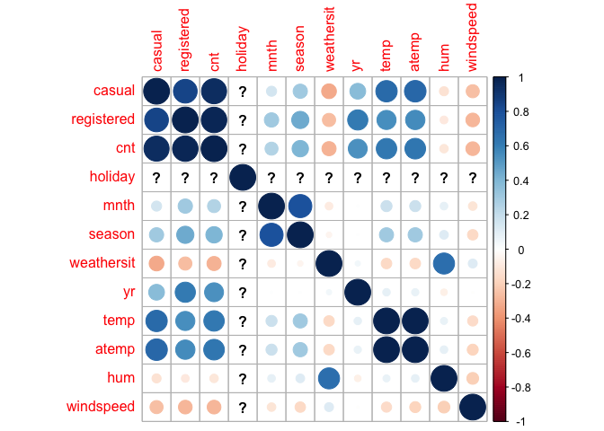
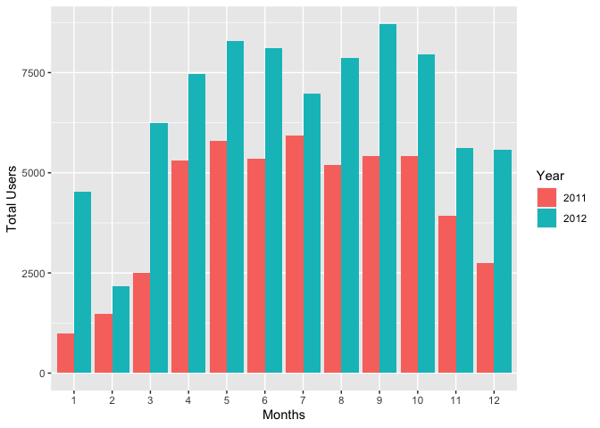
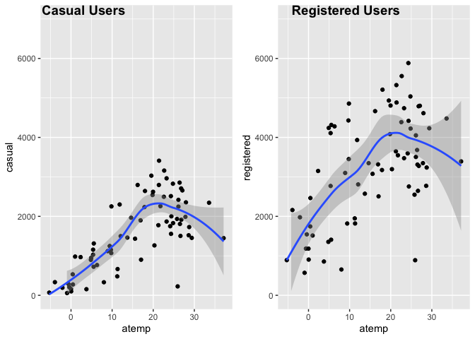
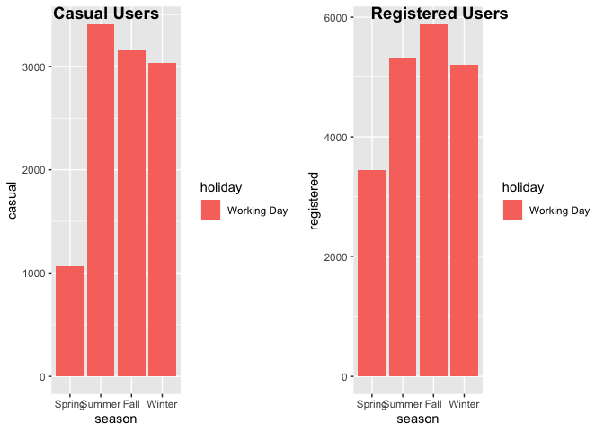
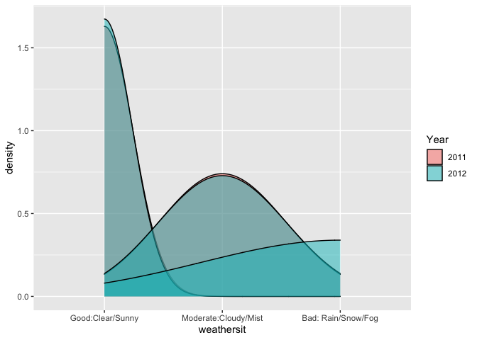
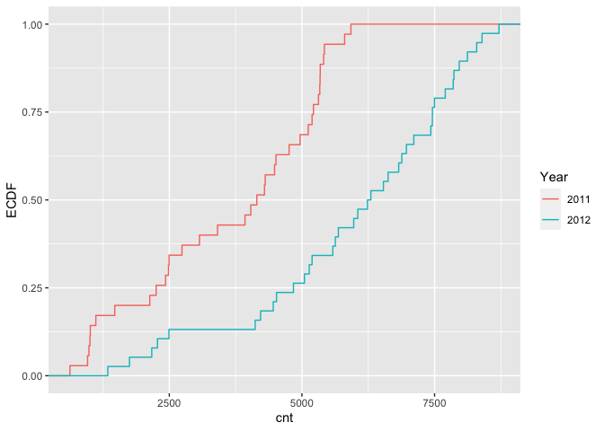
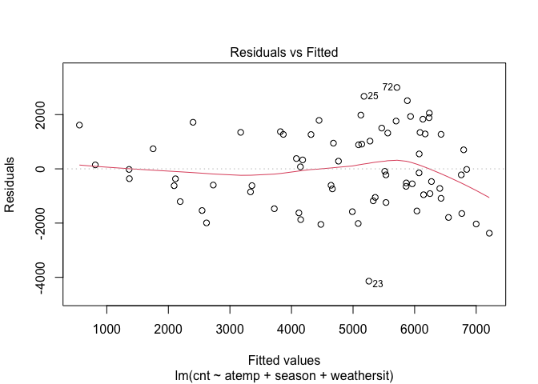
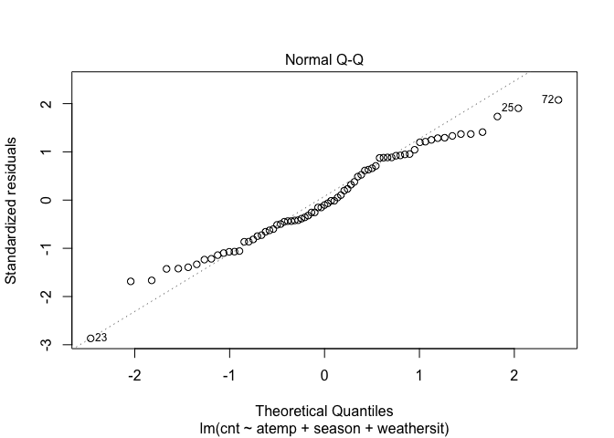
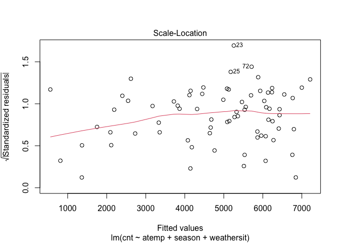
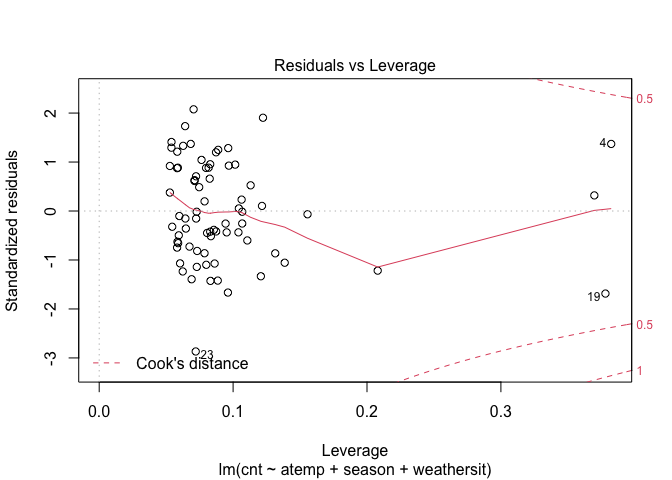

Project2
================
Rashmi Kadam, Dionte Watie
7/6/2021

-   [Introduction](#introduction)
-   [Linear Regresion Model](#linear-regresion-model)
-   [Fitting Random forest model](#fitting-random-forest-model)
-   [Fitted Boosted Tree Model](#fitted-boosted-tree-model)

### Introduction

*Bike Data Analysis for Saturday*

For this study we will be aiming to predict the number of bike users.
The bike users have been split into two groups that will be the target
variables (response), casual bikers that rent bikes casually and
registered bikers that rent bikes regularly. The predictor variables
that will be in question are:

-   weekday (day of the week)
-   season
-   yr (year)
-   holiday (whether it is a holiday or not)
-   weathersit (weather: rainy, snowy, clear, cloudy)
-   mnth
-   atemp (Feeling temperature)
-   windspeed

The response and predictor variables will be used in various Multiple
Linear Regression Models, Logistics Models, and Tree fits. The models
will then be tested against the testing data set and the results will
determine which model would be best to use for prediction.

``` r
library(tidyverse)
library(corrplot)
library(ggplot2)
library(ggpubr)
library(caret)
library(randomForest)
```

``` r
set.seed(1)

# read Bike data
bikeData <- read_csv("day.csv")
```

    ## 
    ## ── Column specification ─────────────────────────────────────────────────────────────────────────
    ## cols(
    ##   instant = col_double(),
    ##   dteday = col_date(format = ""),
    ##   season = col_double(),
    ##   yr = col_double(),
    ##   mnth = col_double(),
    ##   holiday = col_double(),
    ##   weekday = col_double(),
    ##   workingday = col_double(),
    ##   weathersit = col_double(),
    ##   temp = col_double(),
    ##   atemp = col_double(),
    ##   hum = col_double(),
    ##   windspeed = col_double(),
    ##   casual = col_double(),
    ##   registered = col_double(),
    ##   cnt = col_double()
    ## )

``` r
wnum <- weekday
wnum
```

    ## [1] 6

``` r
# filtering weekday data
bikeDataWD <- bikeData %>% filter(weekday == wnum)

# Correlation graph has been used to select the predictors
Correlation <- cor(select(bikeDataWD, casual, registered, cnt,holiday, mnth, season,  weathersit ,yr, temp, atemp, hum, windspeed))

corrplot(Correlation)
```

<!-- -->

``` r
#Selected the predictors and factored the categorical predictors.

bikeDataM <- bikeDataWD %>% select (season, holiday, mnth, weathersit, atemp, windspeed, casual, registered, cnt, yr)

#
bikeDataM$mnth <- as.factor(bikeDataM$mnth)

bikeDataM$season <- factor(bikeDataM$season,
                          levels = c("1", "2","3","4") , 
                          labels = c("Spring","Summer","Fall","Winter"))

bikeDataM$holiday <- factor(bikeDataM$holiday, 
                           levels = c("0", "1") , 
                           labels = c("Working Day","Holiday"))


bikeDataM$weathersit <- factor(bikeDataM$weathersit,
                          levels = c("1", "2","3","4") , 
                          labels = c("Good:Clear/Sunny","Moderate:Cloudy/Mist","Bad: Rain/Snow/Fog",
                                     "Worse: Heavy Rain/Snow/Fog"))

bikeDataM$yr <- factor(bikeDataM$yr,
                      levels = c("0", "1") , 
                      labels = c("2011","2012"))
```

Created train and test data sets

``` r
train <- sample(1:nrow(bikeDataM), size = nrow(bikeDataM)*0.7)
test <- dplyr::setdiff(1:nrow(bikeDataM), train)
bikeDataTrain <- bikeDataM[train, ]
bikeDataTest <- bikeDataM[test, ]


summary(bikeDataTrain)
```

    ##     season          holiday        mnth                         weathersit     atemp       
    ##  Spring:13   Working Day:73   6      : 8   Good:Clear/Sunny          :45   Min.   :0.1623  
    ##  Summer:21   Holiday    : 0   8      : 8   Moderate:Cloudy/Mist      :25   1st Qu.:0.3264  
    ##  Fall  :21                    10     : 8   Bad: Rain/Snow/Fog        : 3   Median :0.5132  
    ##  Winter:18                    12     : 8   Worse: Heavy Rain/Snow/Fog: 0   Mean   :0.4803  
    ##                               5      : 7                                   3rd Qu.:0.6181  
    ##                               9      : 7                                   Max.   :0.8049  
    ##                               (Other):27                                                   
    ##    windspeed          casual       registered        cnt          yr    
    ##  Min.   :0.0454   Min.   :  57   Min.   : 570   Min.   : 627   2011:35  
    ##  1st Qu.:0.1461   1st Qu.: 902   1st Qu.:2464   1st Qu.:3068   2012:38  
    ##  Median :0.1897   Median :1521   Median :3347   Median :5138            
    ##  Mean   :0.1952   Mean   :1567   Mean   :3252   Mean   :4819            
    ##  3rd Qu.:0.2357   3rd Qu.:2301   3rd Qu.:4316   3rd Qu.:6299            
    ##  Max.   :0.4073   Max.   :3410   Max.   :5883   Max.   :8714            
    ## 

``` r
#Side by side bar plots for month and count by year
  
Year <- bikeDataTrain$yr

ggplot(bikeDataTrain, aes(fill=Year, y=cnt, x=mnth)) + 
    geom_bar(position="dodge", stat="identity") + xlab("Months") + ylab('Total Users')
```

<!-- -->

``` r
#Boxplot of season versus count

ggplot(bikeDataTrain, aes(x = season,y=cnt)) +
  geom_boxplot(fill="steelblue") +ylab('Total Users')
```

<!-- -->

``` r
#Scatter plots for casual and registered versus actual temperature

mintemp <- -16
maxtemp <- 50

bikeDataTrain$atemp = bikeDataTrain$atemp * (maxtemp - mintemp) + mintemp
bikeDataTrain$atemp
```

    ##  [1] 12.082472  4.832042 20.294192 -2.082778  0.458486  5.373836 26.125622 21.750350  9.791414
    ## [10] 26.417936 -0.625036 21.415928 29.375528  5.541278 24.125492 24.333986 24.292208 26.833736
    ## [19] -0.957742 19.542386 26.626628 33.583622 25.946696  8.915264 17.998778 16.915850 15.581792
    ## [28] 17.041514 27.834428 27.084272 24.833936  6.333278 11.248958 21.375008 26.500964 27.958772
    ## [37] 21.251192  4.915664 37.124258  0.041828 28.750508 28.626164 -0.416542 -5.291236  5.374364
    ## [46] 14.625386 24.417014  2.332622 24.792686  7.999250 16.207736 -3.916258  9.832136 11.832728
    ## [55] 23.249936 19.957922  3.749972 11.331986 19.832786  5.499500 13.707986 25.792058  0.999686
    ## [64]  9.415742 22.584128 17.873972  0.416972 26.792222 26.125358 -0.001600  9.707528 22.667222
    ## [73] 23.250728

``` r
  cTemp <- ggplot(bikeDataTrain,aes(x=atemp, y=casual)) + geom_point() + geom_smooth() + ylim(0, 7000) 
  rTemp <- ggplot(bikeDataTrain, aes(x=atemp, y=registered)) + geom_point() + geom_smooth() + ylim(0, 7000) 
  
  ggarrange(cTemp, rTemp, labels = c("Casual Users", "Registered Users"), ncol = 2, nrow = 1)
```

    ## `geom_smooth()` using method = 'loess' and formula 'y ~ x'
    ## `geom_smooth()` using method = 'loess' and formula 'y ~ x'

<!-- -->

``` r
#Bar plots split by casual and registered users for season and holiday
rSeason <- ggplot(bikeDataTrain, aes(fill = holiday, x = season,y = registered,)) + geom_bar(position= 'dodge',stat = 'identity')

cSeason <- ggplot(bikeDataTrain, aes(fill = holiday, x = season,y = casual,)) + geom_bar(position= 'dodge',stat = 'identity')

ggarrange(cSeason, rSeason, labels= c("Casual Users", "Registered Users"), ncol = 2, nrow = 1)
```

<!-- -->

``` r
#Density plot for weathersit by year 
weather <- ggplot(bikeDataTrain, aes(x= weathersit))
weather + geom_density(adjust= 0.5, alpha= 0.5, aes(fill= Year), kernel="gaussian")
```

<!-- -->

``` r
#ECDF plot for count by year
cntPlot <- ggplot(bikeDataTrain, aes(x= cnt))
cntPlot + stat_ecdf(geom = 'step', aes(color= Year)) + ylab("ECDF")
```

<!-- -->

``` r
#Summary Statistics by Dionte
#variance, stdev, mean, and median of casual users by month
statsCasual <- bikeDataTrain %>% 
  group_by(mnth) %>% 
  summarise(avg = mean(casual), 
            med = median(casual), 
            var = var(casual), 
            stDev = sd(casual))
statsCasual
```

    ## # A tibble: 12 x 5
    ##    mnth    avg   med      var  stDev
    ##    <fct> <dbl> <dbl>    <dbl>  <dbl>
    ##  1 1      450.  332   186058.  431. 
    ##  2 2      193.  192     8837.   94.0
    ##  3 3     1244.  974.  510998.  715. 
    ##  4 4     1797. 1714.  591304.  769. 
    ##  5 5     2363. 2496   616605.  785. 
    ##  6 6     2248. 2263   346521.  589. 
    ##  7 7     1895. 1988   272937.  522. 
    ##  8 8     1802. 1872.  601187.  775. 
    ##  9 9     2018. 1776   373176.  611. 
    ## 10 10    1762  2067  1069834  1034. 
    ## 11 11    1056. 1156    97151.  312. 
    ## 12 12     541.  470   155381.  394.

``` r
#variance, stdev, mean, and median of registered users by month
statsRegistered <- bikeDataTrain %>% 
  group_by(mnth) %>% 
  summarise(avg = mean(registered), 
            med = median(registered), 
            var = var(registered), 
            stDev = sd(registered))
statsRegistered
```

    ## # A tibble: 12 x 5
    ##    mnth    avg   med      var stDev
    ##    <fct> <dbl> <dbl>    <dbl> <dbl>
    ##  1 1     1789  1526. 1664838  1290.
    ##  2 2     1355. 1184   309312.  556.
    ##  3 3     2502. 2332. 1547178. 1244.
    ##  4 4     3187. 3224. 1351225. 1162.
    ##  5 5     3796. 3681   895236.  946.
    ##  6 6     4239. 4486.  642711.  802.
    ##  7 7     3611. 3392   326858.  572.
    ##  8 8     3422. 3664. 1747043. 1322.
    ##  9 9     4103. 3647  1551208. 1245.
    ## 10 10    3352. 3246  2607403. 1615.
    ## 11 11    2952. 2770  1493202. 1222.
    ## 12 12    2602. 2142  2235929. 1495.

``` r
#variance, stdev, mean, and median of total bike users by season
statsCnt <- bikeDataTrain %>% 
  group_by(season) %>% 
  summarise(avg = mean(cnt), 
            med = median(cnt), 
            var = var(cnt), 
            stDev = sd(cnt))
statsCnt
```

    ## # A tibble: 4 x 5
    ##   season   avg   med      var stDev
    ##   <fct>  <dbl> <dbl>    <dbl> <dbl>
    ## 1 Spring 2034. 1749  1350737. 1162.
    ## 2 Summer 5738. 5805  3176850. 1782.
    ## 3 Fall   5709. 5687  2934888. 1713.
    ## 4 Winter 4719. 5164. 3809336. 1952.

``` r
#Calculating z statistic
tapply(bikeDataTrain$casual, INDEX = bikeDataTrain$weathersit, FUN = function(x){x -mean(x)/sd(x)})
```

    ## $`Good:Clear/Sunny`
    ##  [1] 1496.9306 2255.9306 1067.9306 2852.9306  285.9306 3407.9306 1452.9306 1310.9306 1747.9306
    ## [10] 2509.9306 1911.9306 3028.9306 2342.9306 1896.9306 1985.9306 2654.9306  764.9306 2792.9306
    ## [19] 1804.9306 1445.9306 1726.9306  202.9306 1153.9306 1962.9306 1998.9306  965.9306 2824.9306
    ## [28] 2792.9306  330.9306 2249.9306 1866.9306 2619.9306  152.9306  662.9306 2538.9306  721.9306
    ## [37] 1932.9306  978.9306 1246.9306 2232.9306  529.9306 2705.9306 2415.9306 3157.9306 2960.9306
    ## 
    ## $`Moderate:Cloudy/Mist`
    ##  [1]  896.46534  273.46534 1027.46534 2245.46534 1555.46534 1502.46534  224.46534 1118.46534
    ##  [9] 2641.46534 1432.46534  900.46534 1827.46534  478.46534 2353.46534 1774.46534  949.46534
    ## [17]   98.46534 1519.46534   66.46534  329.46534 2299.46534 1460.46534 2494.46534  157.46534
    ## [25] 1151.46534
    ## 
    ## $`Bad: Rain/Snow/Fog`
    ## [1] 1263.23741  191.23741   56.23741
    ## 
    ## $`Worse: Heavy Rain/Snow/Fog`
    ## NULL

``` r
# summary statistics by Rashmi
#min max stdev and mean of feeling temperature by season
statsAtemp <- bikeDataTrain %>%
  group_by(season) %>%
  summarise(
    atemp.min = min(atemp),
    atemp.max = max(atemp),
    atemp.med = median(atemp),
    atemp.stdev = sd(atemp),
    atemp.mean = mean(atemp))
statsAtemp
```

    ## # A tibble: 4 x 6
    ##   season atemp.min atemp.max atemp.med atemp.stdev atemp.mean
    ##   <fct>      <dbl>     <dbl>     <dbl>       <dbl>      <dbl>
    ## 1 Spring    -5.29       11.3    0.0418        5.20       2.19
    ## 2 Summer     1.00       28.8   21.4           7.42      18.8 
    ## 3 Fall      15.6        37.1   26.1           4.32      26.2 
    ## 4 Winter    -0.958      21.3    9.56          6.86       9.63

``` r
#min max stdev and mean of total bike users per year
statsYear<- bikeDataTrain %>%
  group_by(yr) %>%
  summarise(
    cnt.min = min(cnt),
    cnt.max = max(cnt),
    cnt.med = median(cnt),
    cnt.stdev = sd(cnt),
    cnt.mean = mean(cnt)) 
statsYear
```

    ## # A tibble: 2 x 6
    ##   yr    cnt.min cnt.max cnt.med cnt.stdev cnt.mean
    ##   <fct>   <dbl>   <dbl>   <dbl>     <dbl>    <dbl>
    ## 1 2011      627    5923    4150     1701.    3630.
    ## 2 2012     1341    8714    6267     1981.    5914.

``` r
#min max stdev and mean of total bike users per holiday
statsHoliday<- bikeDataTrain %>%
  group_by(holiday) %>%
  summarise(
    cnt.min = min(cnt),
    cnt.max = max(cnt),
    cnt.med = median(cnt),
    cnt.stdev = sd(cnt),
    cnt.mean = mean(cnt)) 
statsHoliday
```

    ## # A tibble: 1 x 6
    ##   holiday     cnt.min cnt.max cnt.med cnt.stdev cnt.mean
    ##   <fct>         <dbl>   <dbl>   <dbl>     <dbl>    <dbl>
    ## 1 Working Day     627    8714    5138     2169.    4819.

``` r
#contingency table 

table(bikeDataTrain$holiday, bikeDataTrain$season)
```

    ##              
    ##               Spring Summer Fall Winter
    ##   Working Day     13     21   21     18
    ##   Holiday          0      0    0      0

### Linear Regresion Model

Idea of linear regression model -Linear regression model assumes a
linear relationship between the input variables (x) and the single
output variable(y).The linear equation assigns one scale factor to each
input value or column, called a coefficient and represented by the
capital Greek letter Beta (B). It is a slope term.Regression models
estimate the values of Beta. Betas are chosen by using ordinary least
square method.Ordinary least squares minimize the sum of squared
residuals assuming normality and constant variance on error terms.It is
called linear regression because it is linear in parameters.

``` r
#Fitting multiple regression models
set.seed(1)

bikeDataTrainF <- bikeDataTrain %>% select(cnt,season,weathersit,atemp,yr)
bikeDataTestF <- bikeDataTest %>% select(cnt,season,weathersit,atemp,yr)

lmRM<-lm(log(cnt)~.,data=bikeDataTrainF)
summary(lmRM)
```

    ## 
    ## Call:
    ## lm(formula = log(cnt) ~ ., data = bikeDataTrainF)
    ## 
    ## Residuals:
    ##      Min       1Q   Median       3Q      Max 
    ## -1.16720 -0.10302  0.04792  0.18088  0.56001 
    ## 
    ## Coefficients:
    ##                                 Estimate Std. Error t value Pr(>|t|)    
    ## (Intercept)                     7.304015   0.101388  72.040  < 2e-16 ***
    ## seasonSummer                    0.608262   0.152991   3.976 0.000179 ***
    ## seasonFall                      0.434797   0.193234   2.250 0.027834 *  
    ## seasonWinter                    0.646426   0.124708   5.184 2.31e-06 ***
    ## weathersitModerate:Cloudy/Mist -0.212049   0.081890  -2.589 0.011852 *  
    ## weathersitBad: Rain/Snow/Fog   -0.646017   0.197991  -3.263 0.001760 ** 
    ## atemp                           0.025323   0.006594   3.840 0.000281 ***
    ## yr2012                          0.516758   0.073997   6.983 1.86e-09 ***
    ## ---
    ## Signif. codes:  0 '***' 0.001 '**' 0.01 '*' 0.05 '.' 0.1 ' ' 1
    ## 
    ## Residual standard error: 0.3137 on 65 degrees of freedom
    ## Multiple R-squared:  0.7713, Adjusted R-squared:  0.7467 
    ## F-statistic: 31.32 on 7 and 65 DF,  p-value: < 2.2e-16

``` r
lmFit <- train(log(cnt) ~ ., data = bikeDataTrainF , 
         method = "lm", 
         preProcess = c("center", "scale"),
         trControl = trainControl(method = "cv", number = 10))

predlm <- predict(lmFit, newdata = dplyr::select(bikeDataTestF,-cnt))

lmRM <- postResample(predlm, bikeDataTestF$cnt)

lmRMSE <- lmRM["RMSE"]

lmRMSE
```

    ##     RMSE 
    ## 4474.009

``` r
#Fitting Multiple Linear Regression model
#Using BIC to select predictors for the best fit model
set.seed(1)

#bic_selection = step(
#  lm(cnt ~ 1, bikeDataTrain),
#  scope = cnt ~ season + holiday + mnth + weathersit + atemp + windspeed + Year,
#  direction = "both", k = log(nrow(bikeDataTrain))
#)
#Best fit linear regression model
bikeDataTrainF2 <- bikeDataTrain %>% select(cnt, atemp, season,weathersit)
bikeDataTestF2 <- bikeDataTest %>% select(cnt, atemp, season,weathersit)

bestLm <- lm(cnt ~ atemp + season + weathersit, data = bikeDataTrain)
bestLm
```

    ## 
    ## Call:
    ## lm(formula = cnt ~ atemp + season + weathersit, data = bikeDataTrain)
    ## 
    ## Coefficients:
    ##                    (Intercept)                           atemp                    seasonSummer  
    ##                         2158.8                           103.8                          1857.6  
    ##                     seasonFall                    seasonWinter  weathersitModerate:Cloudy/Mist  
    ##                         1202.2                          1947.5                          -796.5  
    ##   weathersitBad: Rain/Snow/Fog  
    ##                        -1387.2

``` r
summary(bestLm)
```

    ## 
    ## Call:
    ## lm(formula = cnt ~ atemp + season + weathersit, data = bikeDataTrain)
    ## 
    ## Residuals:
    ##     Min      1Q  Median      3Q     Max 
    ## -4141.8 -1052.0  -148.9  1273.0  3000.9 
    ## 
    ## Coefficients:
    ##                                Estimate Std. Error t value Pr(>|t|)    
    ## (Intercept)                      2158.8      456.8   4.726 1.24e-05 ***
    ## atemp                             103.8       31.5   3.294  0.00159 ** 
    ## seasonSummer                     1857.6      731.1   2.541  0.01342 *  
    ## seasonFall                       1202.2      923.3   1.302  0.19744    
    ## seasonWinter                     1947.5      595.9   3.268  0.00172 ** 
    ## weathersitModerate:Cloudy/Mist   -796.5      391.0  -2.037  0.04567 *  
    ## weathersitBad: Rain/Snow/Fog    -1387.2      944.4  -1.469  0.14662    
    ## ---
    ## Signif. codes:  0 '***' 0.001 '**' 0.01 '*' 0.05 '.' 0.1 ' ' 1
    ## 
    ## Residual standard error: 1499 on 66 degrees of freedom
    ## Multiple R-squared:  0.562,  Adjusted R-squared:  0.5221 
    ## F-statistic: 14.11 on 6 and 66 DF,  p-value: 2.91e-10

``` r
plot(bestLm)
```

<!-- --><!-- --><!-- --><!-- -->

``` r
bestLmFit <- train(cnt~ atemp + season +weathersit, data= bikeDataTrainF2,
                   method = "lm",
                   preProcess = c("center", "scale"),
                   trControl = trainControl(method = "cv", number = 10))
lmFitPred <- predict(bestLmFit, newdata = dplyr::select(bikeDataTestF2,-cnt))

lm2RM <- postResample(lmFitPred, bikeDataTestF2$cnt)

lm2RMSE <- lm2RM["RMSE"]

lm2RMSE
```

    ##     RMSE 
    ## 2143.654

### Fitting Random forest model

Random Forest model is tree based method used to prediction. It is
powerful ensembling machine learning algorithm which extends the idea of
bagging but instead of including every predictor, we are including
subset of predictors. It works by creating bootstrap samples fitting a
tree for each bootstrap sample. Random Forest method avoids correlation
amoung the trees. It uses m subset of predictors.

m = SQRT(p) for classification and m = p/3 for regression.

``` r
set.seed(1)


rfFit <- train(cnt ~ ., 
               method = "rf",
               trControl = trainControl(method = "repeatedcv",
                                        repeats = 3,
                                        number = 10),
               tuneGrid = data.frame(mtry = 1:9),
               data = bikeDataTrainF)
rfFit
```

    ## Random Forest 
    ## 
    ## 73 samples
    ##  4 predictor
    ## 
    ## No pre-processing
    ## Resampling: Cross-Validated (10 fold, repeated 3 times) 
    ## Summary of sample sizes: 66, 66, 66, 65, 66, 66, ... 
    ## Resampling results across tuning parameters:
    ## 
    ##   mtry  RMSE       Rsquared   MAE      
    ##   1     1616.7122  0.8072712  1330.3905
    ##   2     1170.9150  0.8250677   970.7398
    ##   3     1006.8617  0.8313830   833.8713
    ##   4      966.5802  0.8278423   791.6794
    ##   5      956.0080  0.8254897   783.8759
    ##   6      962.4914  0.8203022   783.1807
    ##   7      969.8237  0.8176697   790.3419
    ##   8      977.7847  0.8164742   792.8830
    ##   9      971.2612  0.8183471   787.4427
    ## 
    ## RMSE was used to select the optimal model using the smallest value.
    ## The final value used for the model was mtry = 5.

``` r
rfPred <- predict(rfFit,  newdata = dplyr::select(bikeDataTestF,-cnt))
rfRM <- postResample(rfPred, bikeDataTestF$cnt)
rfRMSE <- rfRM["RMSE"]

rfRMSE
```

    ##     RMSE 
    ## 2516.737

### Fitted Boosted Tree Model

The Boosted tree fit model is used on the bike data set to create a
model candidate. The training data set was used in the model to find the
highest accuracy rate when using the tuning parameters n.trees,
interaction.depth, shrinkage, and n.minobsinnode. When the highest rate
was chosen given the parameters, it was used for prediction against the
testing data set. Finally, the predictions was tested finding the RMSE,
Rsquared, and MAE values

``` r
set.seed(1)

trCtrl <- trainControl(method = "repeatedcv", number = 10, repeats =3)
set.seed(1)
BoostFit <- train(cnt ~., data = bikeDataTrain,
                     method = "gbm",
                      verbose = FALSE,
                     preProcess = c("center", "scale"),
                     trControl = trCtrl)
BoostFit
```

    ## Stochastic Gradient Boosting 
    ## 
    ## 73 samples
    ##  9 predictor
    ## 
    ## Pre-processing: centered (23), scaled (23) 
    ## Resampling: Cross-Validated (10 fold, repeated 3 times) 
    ## Summary of sample sizes: 66, 66, 66, 65, 66, 66, ... 
    ## Resampling results across tuning parameters:
    ## 
    ##   interaction.depth  n.trees  RMSE      Rsquared   MAE     
    ##   1                   50      458.8514  0.9666034  355.0910
    ##   1                  100      448.5513  0.9684737  362.2976
    ##   1                  150      443.9635  0.9692611  359.9372
    ##   2                   50      481.8708  0.9644788  383.1396
    ##   2                  100      485.0024  0.9657399  395.0970
    ##   2                  150      482.5299  0.9655306  392.7640
    ##   3                   50      450.2811  0.9701024  357.4076
    ##   3                  100      441.7945  0.9714665  357.2427
    ##   3                  150      445.3170  0.9719107  357.8356
    ## 
    ## Tuning parameter 'shrinkage' was held constant at a value of 0.1
    ## Tuning
    ##  parameter 'n.minobsinnode' was held constant at a value of 10
    ## RMSE was used to select the optimal model using the smallest value.
    ## The final values used for the model were n.trees = 100, interaction.depth = 3, shrinkage =
    ##  0.1 and n.minobsinnode = 10.

``` r
BoostFitPred <- predict(BoostFit, newdata = dplyr::select(bikeDataTest, -cnt))
BoostFitPred
```

    ##  [1] 1373.200 1524.328 1545.586 1783.248 1627.338 1586.961 2551.070 1719.333 1773.197 4164.462
    ## [11] 4962.883 4984.321 2507.609 4157.163 4186.855 3882.591 3423.248 3337.164 1577.955 3882.094
    ## [21] 2086.727 4204.252 2390.736 3737.333 7137.407 2859.620 6277.424 6685.004 6098.848 7539.544
    ## [31] 7331.040 6286.833

``` r
bfRM <- postResample(BoostFitPred, bikeDataTest$cnt)

bfRMSE <- bfRM["RMSE"]
bfRMSE
```

    ##     RMSE 
    ## 486.0087

``` r
cRMSEsTitles <- c("Linear Regression Model","Liner Regression Model 2","Random Forest","Boosted Tree")
  
cRMSEs <- c(lm = lmRMSE, lm2 = lm2RMSE, rf = rfRMSE, boost = bfRMSE)
cRMSEs
```

    ##    lm.RMSE   lm2.RMSE    rf.RMSE boost.RMSE 
    ##  4474.0086  2143.6540  2516.7371   486.0087

``` r
bestCRMSE <- cRMSEsTitles[which.min(cRMSEs)]

bestCRMSE
```

    ## [1] "Boosted Tree"

*Best model fit is :Boosted Tree model*
