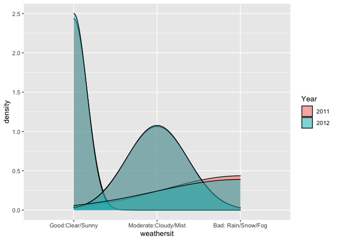

Project2
================
Rashmi Kadam, Dionte Watie
7/6/2021

-   [Introduction](#introduction)
-   [Linear Regresion Model](#linear-regresion-model)
-   [Fitting Random forest model](#fitting-random-forest-model)
-   [Fitted Boosted Tree Model](#fitted-boosted-tree-model)

### Introduction

*Bike Data Analysis for Sunday*

For this study we will be aiming to predict the number of bike users.
The bike users have been split into two groups that will be the target
variables (response), casual bikers that rent bikes casually and
registered bikers that rent bikes regularly. The predictor variables
that will be in question are:

-   weekday (day of the week)
-   season
-   yr (year)
-   holiday (whether it is a holiday or not)
-   weathersit (weather: rainy, snowy, clear, cloudy)
-   mnth
-   atemp (Feeling temperature)
-   windspeed

The response and predictor variables will be used in various Multiple
Linear Regression Models, Logistics Models, and Tree fits. The models
will then be tested against the testing data set and the results will
determine which model would be best to use for prediction.

``` r
library(tidyverse)
library(corrplot)
library(ggplot2)
library(ggpubr)
library(caret)
library(randomForest)
```

``` r
set.seed(1)

# read Bike data
bikeData <- read_csv("day.csv")
```

    ## 
    ## ── Column specification ─────────────────────────────────────────────────────────────────────────
    ## cols(
    ##   instant = col_double(),
    ##   dteday = col_date(format = ""),
    ##   season = col_double(),
    ##   yr = col_double(),
    ##   mnth = col_double(),
    ##   holiday = col_double(),
    ##   weekday = col_double(),
    ##   workingday = col_double(),
    ##   weathersit = col_double(),
    ##   temp = col_double(),
    ##   atemp = col_double(),
    ##   hum = col_double(),
    ##   windspeed = col_double(),
    ##   casual = col_double(),
    ##   registered = col_double(),
    ##   cnt = col_double()
    ## )

``` r
wnum <- weekday
wnum
```

    ## [1] 0

``` r
# filtering weekday data
bikeDataWD <- bikeData %>% filter(weekday == wnum)

# Correlation graph has been used to select the predictors
Correlation <- cor(select(bikeDataWD, casual, registered, cnt,holiday, mnth, season,  weathersit ,yr, temp, atemp, hum, windspeed))

corrplot(Correlation)
```

<!-- -->

``` r
#Selected the predictors and factored the categorical predictors.

bikeDataM <- bikeDataWD %>% select (season, holiday, mnth, weathersit, atemp, windspeed, casual, registered, cnt, yr)

#
bikeDataM$mnth <- as.factor(bikeDataM$mnth)

bikeDataM$season <- factor(bikeDataM$season,
                          levels = c("1", "2","3","4") , 
                          labels = c("Spring","Summer","Fall","Winter"))

bikeDataM$holiday <- factor(bikeDataM$holiday, 
                           levels = c("0", "1") , 
                           labels = c("Working Day","Holiday"))


bikeDataM$weathersit <- factor(bikeDataM$weathersit,
                          levels = c("1", "2","3","4") , 
                          labels = c("Good:Clear/Sunny","Moderate:Cloudy/Mist","Bad: Rain/Snow/Fog",
                                     "Worse: Heavy Rain/Snow/Fog"))

bikeDataM$yr <- factor(bikeDataM$yr,
                      levels = c("0", "1") , 
                      labels = c("2011","2012"))
```

Created train and test data sets

``` r
train <- sample(1:nrow(bikeDataM), size = nrow(bikeDataM)*0.7)
test <- dplyr::setdiff(1:nrow(bikeDataM), train)
bikeDataTrain <- bikeDataM[train, ]
bikeDataTest <- bikeDataM[test, ]


summary(bikeDataTrain)
```

    ##     season          holiday        mnth                         weathersit     atemp       
    ##  Spring:13   Working Day:73   5      : 8   Good:Clear/Sunny          :52   Min.   :0.1017  
    ##  Summer:21   Holiday    : 0   8      : 8   Moderate:Cloudy/Mist      :20   1st Qu.:0.3597  
    ##  Fall  :20                    10     : 8   Bad: Rain/Snow/Fog        : 1   Median :0.5189  
    ##  Winter:19                    6      : 7   Worse: Heavy Rain/Snow/Fog: 0   Mean   :0.4876  
    ##                               9      : 7                                   3rd Qu.:0.6168  
    ##                               12     : 7                                   Max.   :0.7904  
    ##                               (Other):28                                                   
    ##    windspeed           casual       registered        cnt          yr    
    ##  Min.   :0.05038   Min.   :  54   Min.   : 451   Min.   : 754   2011:34  
    ##  1st Qu.:0.14116   1st Qu.: 781   1st Qu.:2302   1st Qu.:3249   2012:39  
    ##  Median :0.18221   Median :1467   Median :3105   Median :4649            
    ##  Mean   :0.19089   Mean   :1420   Mean   :3024   Mean   :4445            
    ##  3rd Qu.:0.22513   3rd Qu.:2135   3rd Qu.:3772   3rd Qu.:5531            
    ##  Max.   :0.40921   Max.   :3283   Max.   :5657   Max.   :8227            
    ## 

``` r
#Side by side bar plots for month and count by year
  
Year <- bikeDataTrain$yr

ggplot(bikeDataTrain, aes(fill=Year, y=cnt, x=mnth)) + 
    geom_bar(position="dodge", stat="identity") + xlab("Months") + ylab('Total Users')
```

<!-- -->

``` r
#Boxplot of season versus count

ggplot(bikeDataTrain, aes(x = season,y=cnt)) +
  geom_boxplot(fill="steelblue") +ylab('Total Users')
```

<!-- -->

``` r
#Scatter plots for casual and registered versus actual temperature

mintemp <- -16
maxtemp <- 50

bikeDataTrain$atemp = bikeDataTrain$atemp * (maxtemp - mintemp) + mintemp
bikeDataTrain$atemp
```

    ##  [1] 11.873978  8.998622 25.126250 -9.290572  0.208214  5.749508 26.542214 21.917000  6.457028
    ## [10] 26.334050  5.391458 22.541822 33.541514  6.291236 24.209114 22.209050 18.249578 28.584650
    ## [19]  5.207714 11.707658 25.209608 32.251214 26.765294 13.707986 14.872886 17.208164 16.375442
    ## [28] 19.376000 29.541650 28.500764 23.335736  8.415908  6.790922 21.958778 26.625836 30.542936
    ## [37] 21.794042  7.707728 36.166136  3.250286 26.459450 31.209272  1.125086 -8.332450  7.915628
    ## [46] 13.581464 24.626300  7.738220 23.834564  7.346774 21.875750 -5.332750 17.541464 11.540942
    ## [55] 24.709064 22.625708  2.477426  8.790986  9.707264  9.086006 20.416358 27.918314  0.522374
    ## [64] 14.082800 20.084642 18.582878  1.000478 27.792122 28.208978 -0.707800  9.749636 21.166250
    ## [73] 21.750350

``` r
  cTemp <- ggplot(bikeDataTrain,aes(x=atemp, y=casual)) + geom_point() + geom_smooth() + ylim(0, 7000) 
  rTemp <- ggplot(bikeDataTrain, aes(x=atemp, y=registered)) + geom_point() + geom_smooth() + ylim(0, 7000) 
  
  ggarrange(cTemp, rTemp, labels = c("Casual Users", "Registered Users"), ncol = 2, nrow = 1)
```

    ## `geom_smooth()` using method = 'loess' and formula 'y ~ x'
    ## `geom_smooth()` using method = 'loess' and formula 'y ~ x'

<!-- -->

``` r
#Bar plots split by casual and registered users for season and holiday
rSeason <- ggplot(bikeDataTrain, aes(fill = holiday, x = season,y = registered,)) + geom_bar(position= 'dodge',stat = 'identity')

cSeason <- ggplot(bikeDataTrain, aes(fill = holiday, x = season,y = casual,)) + geom_bar(position= 'dodge',stat = 'identity')

ggarrange(cSeason, rSeason, labels= c("Casual Users", "Registered Users"), ncol = 2, nrow = 1)
```

<!-- -->

``` r
#Density plot for weathersit by year 
weather <- ggplot(bikeDataTrain, aes(x= weathersit))
weather + geom_density(adjust= 0.5, alpha= 0.5, aes(fill= Year), kernel="gaussian")
```

<!-- -->

``` r
#ECDF plot for count by year
cntPlot <- ggplot(bikeDataTrain, aes(x= cnt))
cntPlot + stat_ecdf(geom = 'step', aes(color= Year)) + ylab("ECDF")
```

<!-- -->

``` r
#Summary Statistics by Dionte
#variance, stdev, mean, and median of casual users by month
statsCasual <- bikeDataTrain %>% 
  group_by(mnth) %>% 
  summarise(avg = mean(casual), 
            med = median(casual), 
            var = var(casual), 
            stDev = sd(casual))
statsCasual
```

    ## # A tibble: 12 x 5
    ##    mnth    avg   med     var stDev
    ##    <fct> <dbl> <dbl>   <dbl> <dbl>
    ##  1 1      351.  284   78707.  281.
    ##  2 2      275.  354   30964.  176.
    ##  3 3     1037.  982  353945.  595.
    ##  4 4     1817. 1970. 885660.  941.
    ##  5 5     2118. 2154. 471636.  687.
    ##  6 6     2099. 2224  240766.  491.
    ##  7 7     1806. 1832. 222689.  472.
    ##  8 8     1485  1376. 104143.  323.
    ##  9 9     2034. 2166  263825.  514.
    ## 10 10    1390. 1308. 435628.  660.
    ## 11 11     839.  922  108111.  329.
    ## 12 12     452.  408   47804.  219.

``` r
#variance, stdev, mean, and median of registered users by month
statsRegistered <- bikeDataTrain %>% 
  group_by(mnth) %>% 
  summarise(avg = mean(registered), 
            med = median(registered), 
            var = var(registered), 
            stDev = sd(registered))
statsRegistered
```

    ## # A tibble: 12 x 5
    ##    mnth    avg   med      var stDev
    ##    <fct> <dbl> <dbl>    <dbl> <dbl>
    ##  1 1     1580. 1608   810138.  900.
    ##  2 2     1306. 1269    18432.  136.
    ##  3 3     1970. 1435  1246657. 1117.
    ##  4 4     2840. 3088. 1950678. 1397.
    ##  5 5     3326. 3196   659962   812.
    ##  6 6     3932  4340   679828   825.
    ##  7 7     3832. 3790.  424996.  652.
    ##  8 8     3218  3130   491371.  701.
    ##  9 9     4071. 3466  1746188. 1321.
    ## 10 10    3083. 2938   515801.  718.
    ## 11 11    2945. 2697   696246.  834.
    ## 12 12    2181. 2211  1364584. 1168.

``` r
#variance, stdev, mean, and median of total bike users by season
statsCnt <- bikeDataTrain %>% 
  group_by(season) %>% 
  summarise(avg = mean(cnt), 
            med = median(cnt), 
            var = var(cnt), 
            stDev = sd(cnt))
statsCnt
```

    ## # A tibble: 4 x 5
    ##   season   avg   med      var stDev
    ##   <fct>  <dbl> <dbl>    <dbl> <dbl>
    ## 1 Spring 2005. 1787  1321583. 1150.
    ## 2 Summer 5167. 4906  3211526. 1792.
    ## 3 Fall   5408. 5150. 1655269. 1287.
    ## 4 Winter 4301. 4381  1987514. 1410.

``` r
#Calculating z statistic
tapply(bikeDataTrain$casual, INDEX = bikeDataTrain$weathersit, FUN = function(x){x -mean(x)/sd(x)})
```

    ## $`Good:Clear/Sunny`
    ##  [1] 1617.22037 1649.22037   71.22037  218.22037 1199.22037 2180.22037 1574.22037  597.22037
    ##  [9] 3281.22037  395.22037 2702.22037 1419.22037  920.22037 1631.22037 2568.22037 2452.22037
    ## [17] 1247.22037  883.22037 1705.22037 1413.22037 2227.22037 1746.22037 1351.22037 1741.22037
    ## [25] 2549.22037 2492.22037 1918.22037 1201.22037  352.22037 1465.22037 1296.22037  406.22037
    ## [33]   52.22037  950.22037 2353.22037 1656.22037 2844.22037  282.22037 2078.22037 2170.22037
    ## [41]  301.22037  684.22037  980.22037 2519.22037  808.22037 2395.22037  307.22037 2222.22037
    ## [49] 2004.22037  362.22037 2164.22037 2632.22037
    ## 
    ## $`Moderate:Cloudy/Mist`
    ##  [1] 2542.0938  779.0938 1336.0938  996.0938 1580.0938 1481.0938  536.0938  614.0938 1637.0938
    ## [10] 1542.0938  890.0938 1136.0938 1206.0938  129.0938 2345.0938 1683.0938 1708.0938  470.0938
    ## [19] 2133.0938  439.0938
    ## 
    ## $`Bad: Rain/Snow/Fog`
    ## [1] NA
    ## 
    ## $`Worse: Heavy Rain/Snow/Fog`
    ## NULL

``` r
# summary statistics by Rashmi
#min max stdev and mean of feeling temperature by season
statsAtemp <- bikeDataTrain %>%
  group_by(season) %>%
  summarise(
    atemp.min = min(atemp),
    atemp.max = max(atemp),
    atemp.med = median(atemp),
    atemp.stdev = sd(atemp),
    atemp.mean = mean(atemp))
statsAtemp
```

    ## # A tibble: 4 x 6
    ##   season atemp.min atemp.max atemp.med atemp.stdev atemp.mean
    ##   <fct>      <dbl>     <dbl>     <dbl>       <dbl>      <dbl>
    ## 1 Spring    -9.29       9.09      3.25        6.37       2.15
    ## 2 Summer     0.522     27.8      21.9         7.10      19.4 
    ## 3 Fall      16.4       36.2      27.3         4.62      27.1 
    ## 4 Winter     0.208     21.8       9.75        6.14      10.8

``` r
#min max stdev and mean of total bike users per year
statsYear<- bikeDataTrain %>%
  group_by(yr) %>%
  summarise(
    cnt.min = min(cnt),
    cnt.max = max(cnt),
    cnt.med = median(cnt),
    cnt.stdev = sd(cnt),
    cnt.mean = mean(cnt)) 
statsYear
```

    ## # A tibble: 2 x 6
    ##   yr    cnt.min cnt.max cnt.med cnt.stdev cnt.mean
    ##   <fct>   <dbl>   <dbl>   <dbl>     <dbl>    <dbl>
    ## 1 2011      754    5511    4032     1397.    3653.
    ## 2 2012     1027    8227    5464     1989.    5135.

``` r
#min max stdev and mean of total bike users per holiday
statsHoliday<- bikeDataTrain %>%
  group_by(holiday) %>%
  summarise(
    cnt.min = min(cnt),
    cnt.max = max(cnt),
    cnt.med = median(cnt),
    cnt.stdev = sd(cnt),
    cnt.mean = mean(cnt)) 
statsHoliday
```

    ## # A tibble: 1 x 6
    ##   holiday     cnt.min cnt.max cnt.med cnt.stdev cnt.mean
    ##   <fct>         <dbl>   <dbl>   <dbl>     <dbl>    <dbl>
    ## 1 Working Day     754    8227    4649     1881.    4445.

``` r
#contingency table 

table(bikeDataTrain$holiday, bikeDataTrain$season)
```

    ##              
    ##               Spring Summer Fall Winter
    ##   Working Day     13     21   20     19
    ##   Holiday          0      0    0      0

### Linear Regresion Model

Idea of linear regression model -Linear regression model assumes a
linear relationship between the input variables (x) and the single
output variable(y).The linear equation assigns one scale factor to each
input value or column, called a coefficient and represented by the
capital Greek letter Beta (B). It is a slope term.Regression models
estimate the values of Beta. Betas are chosen by using ordinary least
square method.Ordinary least squares minimize the sum of squared
residuals assuming normality and constant variance on error terms.It is
called linear regression because it is linear in parameters.

``` r
#Fitting multiple regression models
set.seed(1)

bikeDataTrainF <- bikeDataTrain %>% select(cnt,season,weathersit,atemp,yr)
bikeDataTestF <- bikeDataTest %>% select(cnt,season,weathersit,atemp,yr)

lmRM<-lm(log(cnt)~.,data=bikeDataTrainF)
summary(lmRM)
```

    ## 
    ## Call:
    ## lm(formula = log(cnt) ~ ., data = bikeDataTrainF)
    ## 
    ## Residuals:
    ##      Min       1Q   Median       3Q      Max 
    ## -0.64850 -0.13943  0.02437  0.12188  0.70258 
    ## 
    ## Coefficients:
    ##                                 Estimate Std. Error t value Pr(>|t|)    
    ## (Intercept)                     7.210603   0.076670  94.047  < 2e-16 ***
    ## seasonSummer                    0.688758   0.129094   5.335 1.29e-06 ***
    ## seasonFall                      0.486542   0.154012   3.159   0.0024 ** 
    ## seasonWinter                    0.686665   0.102192   6.719 5.42e-09 ***
    ## weathersitModerate:Cloudy/Mist -0.160012   0.068395  -2.340   0.0224 *  
    ## weathersitBad: Rain/Snow/Fog   -1.601319   0.262836  -6.092 6.71e-08 ***
    ## atemp                           0.025546   0.005014   5.095 3.22e-06 ***
    ## yr2012                          0.388374   0.058597   6.628 7.84e-09 ***
    ## ---
    ## Signif. codes:  0 '***' 0.001 '**' 0.01 '*' 0.05 '.' 0.1 ' ' 1
    ## 
    ## Residual standard error: 0.2479 on 65 degrees of freedom
    ## Multiple R-squared:  0.8225, Adjusted R-squared:  0.8034 
    ## F-statistic: 43.03 on 7 and 65 DF,  p-value: < 2.2e-16

``` r
lmFit <- train(log(cnt) ~ ., data = bikeDataTrainF , 
         method = "lm", 
         preProcess = c("center", "scale"),
         trControl = trainControl(method = "cv", number = 10))

predlm <- predict(lmFit, newdata = dplyr::select(bikeDataTestF,-cnt))

lmRM <- postResample(predlm, bikeDataTestF$cnt)

lmRMSE <- lmRM["RMSE"]

lmRMSE
```

    ##    RMSE 
    ## 4122.28

``` r
#Fitting Multiple Linear Regression model
#Using BIC to select predictors for the best fit model
set.seed(1)

#bic_selection = step(
#  lm(cnt ~ 1, bikeDataTrain),
#  scope = cnt ~ season + holiday + mnth + weathersit + atemp + windspeed + Year,
#  direction = "both", k = log(nrow(bikeDataTrain))
#)
#Best fit linear regression model
bikeDataTrainF2 <- bikeDataTrain %>% select(cnt, atemp, season,weathersit)
bikeDataTestF2 <- bikeDataTest %>% select(cnt, atemp, season,weathersit)

bestLm <- lm(cnt ~ atemp + season + weathersit, data = bikeDataTrain)
bestLm
```

    ## 
    ## Call:
    ## lm(formula = cnt ~ atemp + season + weathersit, data = bikeDataTrain)
    ## 
    ## Coefficients:
    ##                    (Intercept)                           atemp                    seasonSummer  
    ##                         1869.6                            88.2                          2038.3  
    ##                     seasonFall                    seasonWinter  weathersitModerate:Cloudy/Mist  
    ##                         1294.8                          1743.8                          -715.9  
    ##   weathersitBad: Rain/Snow/Fog  
    ##                        -3737.1

``` r
summary(bestLm)
```

    ## 
    ## Call:
    ## lm(formula = cnt ~ atemp + season + weathersit, data = bikeDataTrain)
    ## 
    ## Residuals:
    ##     Min      1Q  Median      3Q     Max 
    ## -2132.1  -796.4  -254.0   911.7  3103.7 
    ## 
    ## Coefficients:
    ##                                Estimate Std. Error t value Pr(>|t|)    
    ## (Intercept)                     1869.64     347.70   5.377 1.07e-06 ***
    ## atemp                             88.20      24.94   3.537 0.000746 ***
    ## seasonSummer                    2038.31     641.97   3.175 0.002277 ** 
    ## seasonFall                      1294.79     766.09   1.690 0.095721 .  
    ## seasonWinter                    1743.83     508.32   3.431 0.001043 ** 
    ## weathersitModerate:Cloudy/Mist  -715.93     340.11  -2.105 0.039104 *  
    ## weathersitBad: Rain/Snow/Fog   -3737.13    1299.21  -2.876 0.005411 ** 
    ## ---
    ## Signif. codes:  0 '***' 0.001 '**' 0.01 '*' 0.05 '.' 0.1 ' ' 1
    ## 
    ## Residual standard error: 1233 on 66 degrees of freedom
    ## Multiple R-squared:  0.6058, Adjusted R-squared:   0.57 
    ## F-statistic: 16.91 on 6 and 66 DF,  p-value: 1.031e-11

``` r
plot(bestLm)
```

<!-- --><!-- --><!-- --><!-- -->

``` r
bestLmFit <- train(cnt~ atemp + season +weathersit, data= bikeDataTrainF2,
                   method = "lm",
                   preProcess = c("center", "scale"),
                   trControl = trainControl(method = "cv", number = 10))
lmFitPred <- predict(bestLmFit, newdata = dplyr::select(bikeDataTestF2,-cnt))

lm2RM <- postResample(lmFitPred, bikeDataTestF2$cnt)

lm2RMSE <- lm2RM["RMSE"]

lm2RMSE
```

    ##     RMSE 
    ## 1825.715

### Fitting Random forest model

Random Forest model is tree based method used to prediction. It is
powerful ensembling machine learning algorithm which extends the idea of
bagging but instead of including every predictor, we are including
subset of predictors. It works by creating bootstrap samples fitting a
tree for each bootstrap sample. Random Forest method avoids correlation
amoung the trees. It uses m subset of predictors.

m = SQRT(p) for classification and m = p/3 for regression.

``` r
set.seed(1)


rfFit <- train(cnt ~ ., 
               method = "rf",
               trControl = trainControl(method = "repeatedcv",
                                        repeats = 3,
                                        number = 10),
               tuneGrid = data.frame(mtry = 1:9),
               data = bikeDataTrainF)
rfFit
```

    ## Random Forest 
    ## 
    ## 73 samples
    ##  4 predictor
    ## 
    ## No pre-processing
    ## Resampling: Cross-Validated (10 fold, repeated 3 times) 
    ## Summary of sample sizes: 66, 66, 66, 65, 66, 66, ... 
    ## Resampling results across tuning parameters:
    ## 
    ##   mtry  RMSE       Rsquared   MAE      
    ##   1     1469.7057  0.7090458  1202.6628
    ##   2     1110.1253  0.7428097   901.6411
    ##   3      975.6633  0.7571009   771.0524
    ##   4      931.1567  0.7665358   723.2981
    ##   5      915.6874  0.7698378   704.0202
    ##   6      913.6537  0.7694149   700.5037
    ##   7      906.0025  0.7730313   694.9591
    ##   8      913.7284  0.7696131   701.8287
    ##   9      913.0272  0.7700757   700.5598
    ## 
    ## RMSE was used to select the optimal model using the smallest value.
    ## The final value used for the model was mtry = 7.

``` r
rfPred <- predict(rfFit,  newdata = dplyr::select(bikeDataTestF,-cnt))
rfRM <- postResample(rfPred, bikeDataTestF$cnt)
rfRMSE <- rfRM["RMSE"]

rfRMSE
```

    ##     RMSE 
    ## 2411.775

### Fitted Boosted Tree Model

The Boosted tree fit model is used on the bike data set to create a
model candidate. The training data set was used in the model to find the
highest accuracy rate when using the tuning parameters n.trees,
interaction.depth, shrinkage, and n.minobsinnode. When the highest rate
was chosen given the parameters, it was used for prediction against the
testing data set. Finally, the predictions was tested finding the RMSE,
Rsquared, and MAE values

``` r
set.seed(1)

trCtrl <- trainControl(method = "repeatedcv", number = 10, repeats =3)
set.seed(1)
BoostFit <- train(cnt ~., data = bikeDataTrain,
                     method = "gbm",
                      verbose = FALSE,
                     preProcess = c("center", "scale"),
                     trControl = trCtrl)
BoostFit
```

    ## Stochastic Gradient Boosting 
    ## 
    ## 73 samples
    ##  9 predictor
    ## 
    ## Pre-processing: centered (23), scaled (23) 
    ## Resampling: Cross-Validated (10 fold, repeated 3 times) 
    ## Summary of sample sizes: 66, 66, 66, 65, 66, 66, ... 
    ## Resampling results across tuning parameters:
    ## 
    ##   interaction.depth  n.trees  RMSE      Rsquared   MAE     
    ##   1                   50      447.5912  0.9612227  338.3803
    ##   1                  100      420.4025  0.9641070  321.5388
    ##   1                  150      415.5749  0.9648222  320.8596
    ##   2                   50      421.9357  0.9608198  326.7881
    ##   2                  100      407.8791  0.9637861  322.2290
    ##   2                  150      407.0865  0.9650772  322.7291
    ##   3                   50      436.1658  0.9605381  342.2295
    ##   3                  100      414.5619  0.9632630  329.7346
    ##   3                  150      409.7615  0.9638924  328.5200
    ## 
    ## Tuning parameter 'shrinkage' was held constant at a value of 0.1
    ## Tuning
    ##  parameter 'n.minobsinnode' was held constant at a value of 10
    ## RMSE was used to select the optimal model using the smallest value.
    ## The final values used for the model were n.trees = 150, interaction.depth = 2, shrinkage =
    ##  0.1 and n.minobsinnode = 10.

``` r
BoostFitPred <- predict(BoostFit, newdata = dplyr::select(bikeDataTest, -cnt))
BoostFitPred
```

    ##  [1] 1740.390 1363.135 1647.571 1860.895 1892.281 1358.817 2446.950 2614.559 2767.851 4134.348
    ## [11] 5513.481 4502.247 3414.497 3882.924 3467.495 3477.914 3329.773 2547.269 2024.559 2849.448
    ## [21] 3016.163 1816.225 3402.157 3087.038 6238.346 4921.734 5715.176 6801.776 5935.352 6621.336
    ## [31] 6636.246 6934.618

``` r
bfRM <- postResample(BoostFitPred, bikeDataTest$cnt)

bfRMSE <- bfRM["RMSE"]
bfRMSE
```

    ##     RMSE 
    ## 382.0896

``` r
cRMSEsTitles <- c("Linear Regression Model","Liner Regression Model 2","Random Forest","Boosted Tree")
  
cRMSEs <- c(lm = lmRMSE, lm2 = lm2RMSE, rf = rfRMSE, boost = bfRMSE)
cRMSEs
```

    ##    lm.RMSE   lm2.RMSE    rf.RMSE boost.RMSE 
    ##  4122.2798  1825.7147  2411.7753   382.0896

``` r
bestCRMSE <- cRMSEsTitles[which.min(cRMSEs)]

bestCRMSE
```

    ## [1] "Boosted Tree"

*Best model fit is :Boosted Tree model*
