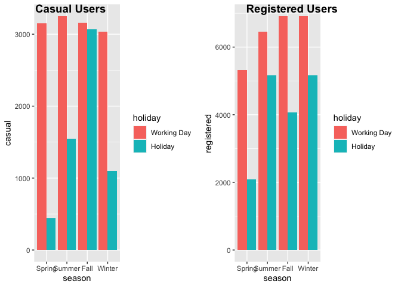

Project2
================
Rashmi Kadam, Dionte Watie
7/6/2021

-   [Introduction](#introduction)
-   [Linear Regresion Model](#linear-regresion-model)
-   [Fitting Random forest model](#fitting-random-forest-model)
-   [Fitted Boosted Tree Model](#fitted-boosted-tree-model)

### Introduction

*Bike Data Analysis for Sunday*

For this study we will be aiming to predict the number of bike users.
The bike users have been split into two groups that will be the target
variables (response), casual bikers that rent bikes casually and
registered bikers that rent bikes regularly. The predictor variables
that will be in question are:

-   weekday (day of the week)
-   season
-   yr (year)
-   holiday (whether it is a holiday or not)
-   weathersit (weather: rainy, snowy, clear, cloudy)
-   mnth
-   atemp (Feeling temperature)
-   windspeed

The response and predictor variables will be used in various Multiple
Linear Regression Models, Logistics Models, and Tree fits. The models
will then be tested against the testing data set and the results will
determine which model would be best to use for prediction.

``` r
library(tidyverse)
library(corrplot)
library(ggplot2)
library(ggpubr)
library(caret)
library(randomForest)
```

``` r
set.seed(1)

# read Bike data
bikeData <- read_csv("day.csv")
```

    ## 
    ## ── Column specification ──────────────────────────────────────────────────────────────────────────────────────────────────────────────────
    ## cols(
    ##   instant = col_double(),
    ##   dteday = col_date(format = ""),
    ##   season = col_double(),
    ##   yr = col_double(),
    ##   mnth = col_double(),
    ##   holiday = col_double(),
    ##   weekday = col_double(),
    ##   workingday = col_double(),
    ##   weathersit = col_double(),
    ##   temp = col_double(),
    ##   atemp = col_double(),
    ##   hum = col_double(),
    ##   windspeed = col_double(),
    ##   casual = col_double(),
    ##   registered = col_double(),
    ##   cnt = col_double()
    ## )

``` r
# filtering weekday data
bikeDataWD <- bikeData %>% filter(weekday == weekday)

# Correlation graph has been used to select the predictors
Correlation <- cor(select(bikeDataWD, casual, registered, cnt,holiday, mnth, season,  weathersit ,yr, temp, atemp, hum, windspeed))

corrplot(Correlation)
```

<!-- -->

``` r
#Selected the predictors and factored the categorical predictors.

bikeDataM <- bikeDataWD %>% select (season, holiday, mnth, weathersit, atemp, windspeed, casual, registered, cnt, yr)

#
bikeDataM$mnth <- as.factor(bikeDataM$mnth)

bikeDataM$season <- factor(bikeDataM$season,
                          levels = c("1", "2","3","4") , 
                          labels = c("Spring","Summer","Fall","Winter"))

bikeDataM$holiday <- factor(bikeDataM$holiday, 
                           levels = c("0", "1") , 
                           labels = c("Working Day","Holiday"))


bikeDataM$weathersit <- factor(bikeDataM$weathersit,
                          levels = c("1", "2","3","4") , 
                          labels = c("Good:Clear/Sunny","Moderate:Cloudy/Mist","Bad: Rain/Snow/Fog",
                                     "Worse: Heavy Rain/Snow/Fog"))

bikeDataM$yr <- factor(bikeDataM$yr,
                      levels = c("0", "1") , 
                      labels = c("2011","2012"))
```

Created train and test data sets

``` r
train <- sample(1:nrow(bikeDataM), size = nrow(bikeDataM)*0.7)
test <- dplyr::setdiff(1:nrow(bikeDataM), train)
bikeDataTrain <- bikeDataM[train, ]
bikeDataTest <- bikeDataM[test, ]


summary(bikeDataTrain)
```

    ##     season           holiday         mnth                          weathersit      atemp           windspeed           casual      
    ##  Spring:129   Working Day:498   5      : 50   Good:Clear/Sunny          :335   Min.   :0.07907   Min.   :0.02239   Min.   :   9.0  
    ##  Summer:135   Holiday    : 13   10     : 45   Moderate:Cloudy/Mist      :165   1st Qu.:0.34026   1st Qu.:0.13682   1st Qu.: 332.0  
    ##  Fall  :129                     1      : 44   Bad: Rain/Snow/Fog        : 11   Median :0.48673   Median :0.17787   Median : 742.0  
    ##  Winter:118                     8      : 44   Worse: Heavy Rain/Snow/Fog:  0   Mean   :0.47411   Mean   :0.18886   Mean   : 867.2  
    ##                                 2      : 43                                    3rd Qu.:0.60638   3rd Qu.:0.22886   3rd Qu.:1109.0  
    ##                                 3      : 43                                    Max.   :0.84090   Max.   :0.44156   Max.   :3252.0  
    ##                                 (Other):242                                                                                        
    ##    registered        cnt          yr     
    ##  Min.   : 416   Min.   : 431   2011:243  
    ##  1st Qu.:2689   1st Qu.:3332   2012:268  
    ##  Median :3725   Median :4586             
    ##  Mean   :3733   Mean   :4600             
    ##  3rd Qu.:4924   3rd Qu.:6106             
    ##  Max.   :6917   Max.   :8714             
    ## 

``` r
#Side by side bar plots for month and count by year
  
Year <- bikeDataTrain$yr

ggplot(bikeDataTrain, aes(fill=Year, y=cnt, x=mnth)) + 
    geom_bar(position="dodge", stat="identity") + xlab("Months") + ylab('Total Users')
```

<!-- -->

``` r
#Boxplot of season versus count

ggplot(bikeDataTrain, aes(x = season,y=cnt)) +
  geom_boxplot(fill="steelblue") +ylab('Total Users')
```

<!-- -->

``` r
#Scatter plots for casual and registered versus actual temperature

mintemp <- -16
maxtemp <- 50

bikeDataTrain$atemp = bikeDataTrain$atemp * (maxtemp - mintemp) + mintemp
bikeDataTrain$atemp
```

    ##   [1]  15.207836  21.918650  29.251778  10.790786  23.834564  15.208628  20.793086   9.415742  27.708764   3.250286  13.166258  13.707986
    ##  [13]   2.124986   8.042348  26.042528  11.831936   1.087400  37.124258   1.708328  13.956872   1.583786  23.583764  22.541822  27.167564
    ##  [25]   4.957772  33.583622  13.581464  -6.477322   2.583158  31.584350   5.042516  25.292636  28.208978   0.457892  -2.915764   2.332622
    ##  [37]   3.458186  17.290664   7.498772  26.792222  23.542778  10.291100   3.564116 -10.781406  32.792150   6.457622  22.625708  14.540972
    ##  [49]   8.415908  20.084642  27.375464  27.251714  15.458108  23.458892  26.458658   0.708164  21.249872   0.916592  -1.999684  21.750350
    ##  [61]  22.210436  20.583272   7.500158  28.583792  27.876536  15.874172  18.958550  30.792878  24.625772   9.124286  22.083386  21.750086
    ##  [73]  19.957922  21.333164  28.083578  23.000522  11.540678   7.624172   2.303780  17.707850  12.457022  18.666236  18.582878  22.959536
    ##  [85]  17.333036  18.169322  12.291428  22.042664  25.416914  12.082472  27.209672  30.666686   9.999050   1.832936  -0.625036   7.999250
    ##  [97]   5.373836  26.542214  19.666664  28.584650  14.790650  32.791358  -8.123758  12.957500   0.522374  13.874042  12.415442  22.250828
    ## [109]  12.249122  17.790878   5.623778  19.583900  23.250464  19.166450  27.918314  31.209272  19.376000   3.624308  12.747950   9.207908
    ## [121]  -9.290572  17.541464  33.208478   6.260084  12.123986  18.499586   8.172632   2.477426   3.916622  10.706900  18.782594  28.626164
    ## [133]  29.500664   3.695852  19.958714   9.916022  23.250464  13.333436   7.832864  30.167528  -0.541678  14.957564  18.792428  20.293400
    ## [145]  28.000286   7.624964   0.874550  18.916772  15.291722   7.124486  22.334450   1.125086  21.960428  27.959300  29.209142  26.417936
    ## [157]  17.165858  20.373986  11.540942   3.749972  17.832986  -6.129832  33.541514  10.207808   7.207514  12.582686   5.374364  12.791114
    ## [169]  21.959372  29.500400  16.207736   5.874578  11.207642   9.086006  14.164508  23.625278  22.292342  30.042986   8.790986  25.958378
    ## [181]  26.124764   8.915264  12.248792   5.912000  31.791986   0.375392  33.875078  11.957336  -2.791222   1.000478  -0.913258  -3.416242
    ## [193]  10.499000  24.833936  21.166250  -3.707500  -1.261078  -0.001600  24.417014  30.625700  20.042336   4.540586  19.793978  21.794042
    ## [205]   8.998622  28.083578  14.165036  17.207372  24.125228   0.791522  14.333072  31.792250  21.294422  27.333422  17.207636  28.042328
    ## [217]  -0.707800  32.833400   7.040600  12.623936  27.166772  26.917886  -3.721822   7.130426  13.707128  25.792586  30.459050  16.541036
    ## [229]  22.584128  10.207478  23.834564  33.292100   6.331958  10.165964   8.915858  27.209078   8.217380   7.346774  23.209478  18.874400
    ## [241]   0.652064   3.416408  18.249578  24.334514  24.709064  20.208722  26.125358  30.416678   9.790622   3.416672  -1.249858  24.000422
    ## [253]   7.457258  24.126350  14.872886  29.792714   2.541578   1.874978  -2.082778  14.165828  29.584022  11.833058  27.917522  14.415836
    ## [265]   2.166764  27.167564  24.125492  27.209408  28.750508  31.791986  26.459450   6.333278  15.832064  19.166186  23.292836  22.667222
    ## [277]  27.834428  30.417272  18.499586   1.333250   8.999414  24.333986  23.334350  28.667414   7.832600  18.999536  17.875028  -7.665850
    ## [289]   7.332650  12.124514  24.585050  31.709222  -0.521284  21.334022  13.082372  19.000064   3.999386  29.208878   7.738220  39.499136
    ## [301]   3.374828  14.082536  -3.499270  29.708828  26.042528  14.457878  -3.457492  29.334608  15.581792  36.458714   1.416014   5.332586
    ## [313]  26.042528  16.623800  12.082472  28.500764  27.667514  15.708050  24.459650   6.457028  15.082700  23.709164   4.915664   6.540914
    ## [325]  12.456758  23.250728  28.292072  30.334508  26.500964  21.375008  25.667714  23.740580  -0.666022   5.391458  11.707658   2.707964
    ## [337]   6.040436  -0.521020  30.375164  16.832558  21.624422   5.541014  12.874208  27.084272   3.625100  -5.583022   5.499500   6.915464
    ## [349]  18.374978  32.167064  24.333722   5.499500   4.249922  27.958772  19.543178   7.173194  19.501136  20.416358  13.831208  -4.260052
    ## [361]  -1.458022   9.707264  -1.041628  19.833314  21.750350  21.958778   5.041592   9.707528   1.999586  29.541122   5.416472   5.375222
    ## [373]  17.873972  27.542378  19.166978  32.166536  -0.868180  19.207700   0.833300  28.042328  22.209050  -1.416772   3.434690  19.083422
    ## [385]   9.454088   2.666186   7.499300  11.873978  30.041864  23.335736  18.541958  -1.908406  22.417214  19.501136  24.792686   5.541278
    ## [397]  26.292272  12.791378  20.335178  26.083514  19.832786   5.207714   4.832042  27.166772  -0.957742  27.709028  17.708972  -5.291236
    ## [409]  28.875842  28.251878   5.790692  21.917000  25.042364  32.000414  11.415278   4.825310  20.419064  21.583172  16.291028   6.582692
    ## [421]  -2.216626   5.248964  -1.499800  19.791272  15.040922   1.999850  20.333792   8.790986   9.124022  24.333986   7.915628  30.542936
    ## [433]  16.124378  18.460250  27.292700  31.166372  18.958550  12.215858  17.500214  27.334478  16.375442  22.791764  11.124086  18.623864
    ## [445]  30.876236  26.834000  -1.999948  18.249578   0.041828  15.375278  -0.957742  13.166522   9.832136  26.765294  18.791372  11.040728
    ## [457]   0.999686  30.417272  21.875750   2.583422  27.876008  14.457350   0.999884   1.291208   6.374264  18.791108  11.331986  14.791508
    ## [469]   4.833164   1.542008   1.041464  18.959408   6.790922   9.166922   9.416600  27.083414  10.332086   6.999020  -3.363376  17.041514
    ## [481]  19.542386  12.164642   2.624672   8.416172  34.250222  26.833736   0.217322  26.626628  -0.082714   3.874250  25.375400  23.917328
    ## [493]  11.248958  28.417472  22.166678  -8.332450  14.582750  27.209408  17.208164  23.459750  24.042200   5.415878  -0.608206  21.624950
    ## [505]  13.374092  11.290472  14.207936  16.457678   2.582828   1.999586  19.915814

``` r
  cTemp <- ggplot(bikeDataTrain,aes(x=atemp, y=casual)) + geom_point() + geom_smooth() + ylim(0, 7000) 
  rTemp <- ggplot(bikeDataTrain, aes(x=atemp, y=registered)) + geom_point() + geom_smooth() + ylim(0, 7000) 
  
  ggarrange(cTemp, rTemp, labels = c("Casual Users", "Registered Users"), ncol = 2, nrow = 1)
```

    ## `geom_smooth()` using method = 'loess' and formula 'y ~ x'
    ## `geom_smooth()` using method = 'loess' and formula 'y ~ x'

<!-- -->

``` r
#Dionte -- bar plots split by casual and registered users for season and holiday
rSeason <- ggplot(bikeDataTrain, aes(fill = holiday, x = season,y = registered,)) + geom_bar(position= 'dodge',stat = 'identity')

cSeason <- ggplot(bikeDataTrain, aes(fill = holiday, x = season,y = casual,)) + geom_bar(position= 'dodge',stat = 'identity')

ggarrange(cSeason, rSeason, labels= c("Casual Users", "Registered Users"), ncol = 2, nrow = 1)
```

<!-- -->

``` r
#Dionte -- Density plot for weathersit by year 
weather <- ggplot(bikeDataTrain, aes(x= weathersit))
weather + geom_density(adjust= 0.5, alpha= 0.5, aes(fill= Year), kernel="gaussian")
```

<!-- -->

``` r
#Dionte -- ECDF plot for count by year
cntPlot <- ggplot(bikeDataTrain, aes(x= cnt))
cntPlot + stat_ecdf(geom = 'step', aes(color= Year)) + ylab("ECDF")
```

<!-- -->

``` r
#Summary Statistics by Dionte
#variance, stdev, mean, and median of casual users by month
statsCasual <- bikeDataTrain %>% 
  group_by(mnth) %>% 
  summarise(avg = mean(casual), 
            med = median(casual), 
            var = var(casual), 
            stDev = sd(casual))
statsCasual
```

    ## # A tibble: 12 x 5
    ##    mnth    avg   med     var stDev
    ##    <fct> <dbl> <dbl>   <dbl> <dbl>
    ##  1 1      183.  126.  25658.  160.
    ##  2 2      247.  206   32105.  179.
    ##  3 3      787.  762  363257.  603.
    ##  4 4     1051.  846  612873.  783.
    ##  5 5     1134.  887  417606.  646.
    ##  6 6     1374. 1071  514510.  717.
    ##  7 7     1269. 1038  377437.  614.
    ##  8 8     1195. 1174. 224307.  474.
    ##  9 9     1250. 1045  568687.  754.
    ## 10 10     917.  753  417704.  646.
    ## 11 11     641.  458. 239109.  489.
    ## 12 12     365.  329   51272.  226.

``` r
#variance, stdev, mean, and median of registered users by month
statsRegistered <- bikeDataTrain %>% 
  group_by(mnth) %>% 
  summarise(avg = mean(registered), 
            med = median(registered), 
            var = var(registered), 
            stDev = sd(registered))
statsRegistered
```

    ## # A tibble: 12 x 5
    ##    mnth    avg   med      var stDev
    ##    <fct> <dbl> <dbl>    <dbl> <dbl>
    ##  1 1     2084. 1822. 1185060. 1089.
    ##  2 2     2456. 2071  1211587. 1101.
    ##  3 3     3269. 3150  2630101. 1622.
    ##  4 4     3502. 3605  1941789. 1393.
    ##  5 5     4165. 3932. 1213507. 1102.
    ##  6 6     4688. 4488  1137650. 1067.
    ##  7 7     4503. 4278. 1508967. 1228.
    ##  8 8     4451. 4035  1557599. 1248.
    ##  9 9     4720. 4138  2213345. 1488.
    ## 10 10    4179. 3970  2469601. 1571.
    ## 11 11    3643. 3657  1715828. 1310.
    ## 12 12    3219. 3359  2745127. 1657.

``` r
#variance, stdev, mean, and median of total bike users by season
statsCnt <- bikeDataTrain %>% 
  group_by(season) %>% 
  summarise(avg = mean(cnt), 
            med = median(cnt), 
            var = var(cnt), 
            stDev = sd(cnt))
statsCnt
```

    ## # A tibble: 4 x 5
    ##   season   avg   med      var stDev
    ##   <fct>  <dbl> <dbl>    <dbl> <dbl>
    ## 1 Spring 2691. 2368  2178641. 1476.
    ## 2 Summer 5077. 4972  2902329. 1704.
    ## 3 Fall   5803. 5810  1847081. 1359.
    ## 4 Winter 4826. 4756. 2604519. 1614.

``` r
#Calculating z statistic
tapply(bikeDataTrain$casual, INDEX = bikeDataTrain$weathersit, FUN = function(x){x -mean(x)/sd(x)})
```

    ## $`Good:Clear/Sunny`
    ##   [1]  782.58427  316.58427  484.58427 1247.58427 1205.58427  352.58427  640.58427 2227.58427 1361.58427 1446.58427  513.58427  743.58427
    ##  [13] 1561.58427 2702.58427  259.58427 2343.58427  371.58427  870.58427  171.58427 2004.58427  172.58427   62.58427  966.58427  465.58427
    ##  [25]  947.58427  616.58427 2706.58427  206.58427  204.58427   91.58427  660.58427  305.58427 2170.58427  527.58427 1043.58427  903.58427
    ##  [37] 1486.58427 1780.58427  375.58427  611.58427  298.58427  121.58427 2256.58427 1068.58427  360.58427  919.58427  828.58427  830.58427
    ##  [49]  738.58427 1093.58427 1248.58427 2620.58427 1116.58427 2151.58427 1067.58427 1273.58427  637.58427  711.58427  832.58427  662.58427
    ##  [61] 2395.58427  257.58427 1415.58427 1497.58427  966.58427  799.58427  141.58427  286.58427 2180.58427  786.58427 1247.58427  469.58427
    ##  [73] 1034.58427  793.58427 1012.58427 1052.58427  577.58427  773.58427 1003.58427 2519.58427 1296.58427   71.58427 2078.58427  797.58427
    ##  [85]  480.58427  692.58427  301.58427  882.58427  746.58427  828.58427  392.58427 1075.58427  514.58427  197.58427 1194.58427  249.58427
    ##  [97]  549.58427  666.58427  251.58427  315.58427  907.58427  892.58427  953.58427  406.58427  933.58427 1038.58427 2853.58427  999.58427
    ## [109] 1519.58427  153.58427 1610.58427   45.58427 1419.58427  408.58427  347.58427 1058.58427 1154.58427 1431.58427 2793.58427  266.58427
    ## [121]  980.58427  861.58427 1514.58427 1175.58427  831.58427  329.58427  357.58427  962.58427  919.58427  674.58427  121.58427  307.58427
    ## [133]  215.58427 2164.58427 1481.58427 1999.58427 1138.58427  186.58427 1649.58427  778.58427  727.58427  836.58427 1086.58427 1021.58427
    ## [145]  667.58427 1072.58427  362.58427  604.58427  632.58427  569.58427 1049.58427  973.58427   72.58427  977.58427  839.58427  844.58427
    ## [157]  699.58427  642.58427  161.58427 1030.58427  676.58427  548.58427  242.58427  423.58427 2452.58427  995.58427 2416.58427  844.58427
    ## [169] 1805.58427  427.58427 1279.58427  707.58427  659.58427  258.58427  753.58427 2288.58427  920.58427  107.58427 1381.58427 1748.58427
    ## [181]  846.58427 1727.58427  905.58427 1465.58427  765.58427  832.58427  980.58427 3158.58427 1986.58427  813.58427  124.58427 1601.58427
    ## [193]  989.58427 1126.58427 2587.58427   87.58427  227.58427 3250.58427 1196.58427  458.58427  839.58427  708.58427  882.58427 1656.58427
    ## [205]  560.58427  553.58427  118.58427  730.58427  869.58427 1346.58427  128.58427  865.58427 1048.58427  135.58427 1025.58427 2549.58427
    ## [217] 1963.58427  637.58427  597.58427  672.58427  861.58427 1190.58427 2961.58427 1547.58427  902.58427 1805.58427 2793.58427 1098.58427
    ## [229]  688.58427  395.58427  876.58427  773.58427 2655.58427   73.58427 1045.58427  482.58427 1317.58427  721.58427 1171.58427  722.58427
    ## [241]  438.58427 1049.58427  692.58427  665.58427   59.58427  760.58427 2632.58427 2492.58427  243.58427 1133.58427  360.58427 2233.58427
    ## [253]  766.58427 1522.58427   80.58427 1056.58427 2202.58427 2568.58427 1332.58427 1617.58427 2232.58427  693.58427  147.58427 2825.58427
    ## [265] 1311.58427 1075.58427  817.58427 1918.58427 2539.58427  883.58427 1137.58427  637.58427  771.58427 1092.58427  674.58427  428.58427
    ## [277] 1036.58427  331.58427   13.58427 1025.58427  653.58427  771.58427  686.58427  950.58427 1918.58427  761.58427  886.58427 1206.58427
    ## [289]  967.58427 1351.58427  767.58427  484.58427  106.58427 1399.58427 1095.58427   92.58427  612.58427 2250.58427 1413.58427  431.58427
    ## [301]  979.58427  727.58427 2844.58427  464.58427  220.58427  161.58427  335.58427  557.58427  663.58427  302.58427  529.58427  338.58427
    ## [313]  322.58427  430.58427 1170.58427 3029.58427  422.58427 1403.58427 1912.58427  137.58427  201.58427  645.58427  878.58427 1069.58427
    ## [325]   52.58427  693.58427  756.58427 1746.58427 1057.58427  941.58427   86.58427 1048.58427 1024.58427  556.58427  843.58427
    ## 
    ## $`Moderate:Cloudy/Mist`
    ##   [1]  402.915109  475.915109 1206.915109  736.915109  324.915109  125.915109  172.915109  107.915109  996.915109 1136.915109   51.915109
    ##  [12] 1234.915109  726.915109  536.915109 2133.915109  609.915109  415.915109  952.915109  527.915109  651.915109  207.915109  834.915109
    ##  [23] 3153.915109  623.915109  231.915109  329.915109 1027.915109   93.915109  470.915109  110.915109  105.915109  101.915109  758.915109
    ##  [34] 1580.915109  308.915109  327.915109  267.915109  225.915109  112.915109  219.915109  253.915109 1519.915109   76.915109  534.915109
    ##  [45]  340.915109  817.915109  478.915109 2345.915109  546.915109  545.915109  179.915109  345.915109 1276.915109  794.915109 1118.915109
    ##  [56]  220.915109   86.915109  210.915109 1827.915109   40.915109   36.915109  665.915109 1542.915109 1509.915109  238.915109   70.915109
    ##  [67]  369.915109  118.915109  795.915109 2494.915109  445.915109  280.915109  214.915109  319.915109  129.915109  743.915109 1683.915109
    ##  [78]  437.915109  749.915109  996.915109  164.915109  785.915109 3063.915109  543.915109  635.915109 1555.915109  417.915109 1120.915109
    ##  [89] 1326.915109  184.915109  628.915109  225.915109 1432.915109  137.915109  690.915109  745.915109  949.915109  877.915109    7.915109
    ## [100]  779.915109  305.915109  133.915109   45.915109 2350.915109 2467.915109 1530.915109  166.915109 2353.915109 1708.915109  245.915109
    ## [111]  454.915109 1151.915109  318.915109  845.915109   81.915109  113.915109  438.915109   90.915109  242.915109 1481.915109  601.915109
    ## [122]  751.915109  537.915109  896.915109  733.915109   66.915109  465.915109  690.915109   72.915109  267.915109  288.915109  407.915109
    ## [133]  146.915109  175.915109  382.915109  447.915109  532.915109 1031.915109  256.915109  689.915109  447.915109  244.915109 1231.915109
    ## [144] 2611.915109  143.915109 1006.915109  797.915109  740.915109  616.915109  873.915109  614.915109  188.915109   63.915109   41.915109
    ## [155]  900.915109 1186.915109  464.915109 1502.915109  193.915109  873.915109  478.915109  475.915109  954.915109  663.915109  121.915109
    ## 
    ## $`Bad: Rain/Snow/Fog`
    ##  [1]  67.503861 215.503861 313.503861 190.503861 119.503861 143.503861   7.503861 118.503861  44.503861  55.503861 218.503861
    ## 
    ## $`Worse: Heavy Rain/Snow/Fog`
    ## NULL

``` r
# summary statistics by Rashmi
#min max stdev and mean of feeling temperature by season
statsAtemp <- bikeDataTrain %>%
  group_by(season) %>%
  summarise(
    atemp.min = min(atemp),
    atemp.max = max(atemp),
    atemp.med = median(atemp),
    atemp.stdev = sd(atemp),
    atemp.mean = mean(atemp))
statsAtemp
```

    ## # A tibble: 4 x 6
    ##   season atemp.min atemp.max atemp.med atemp.stdev atemp.mean
    ##   <fct>      <dbl>     <dbl>     <dbl>       <dbl>      <dbl>
    ## 1 Spring -10.8          20.2      3.25        6.76       4.03
    ## 2 Summer   0.522        32.0     19.1         6.95      18.0 
    ## 3 Fall    -0.00160      39.5     27.7         4.73      27.2 
    ## 4 Winter  -0.958        24.1     11.5         6.16      11.5

``` r
#min max stdev and mean of total bike users per year
statsYear<- bikeDataTrain %>%
  group_by(yr) %>%
  summarise(
    cnt.min = min(cnt),
    cnt.max = max(cnt),
    cnt.med = median(cnt),
    cnt.stdev = sd(cnt),
    cnt.mean = mean(cnt)) 
statsYear
```

    ## # A tibble: 2 x 6
    ##   yr    cnt.min cnt.max cnt.med cnt.stdev cnt.mean
    ##   <fct>   <dbl>   <dbl>   <dbl>     <dbl>    <dbl>
    ## 1 2011      431    6043   3805      1392.    3444.
    ## 2 2012      441    8714   6012.     1747.    5648.

``` r
#min max stdev and mean of total bike users per holiday
statsHoliday<- bikeDataTrain %>%
  group_by(holiday) %>%
  summarise(
    cnt.min = min(cnt),
    cnt.max = max(cnt),
    cnt.med = median(cnt),
    cnt.stdev = sd(cnt),
    cnt.mean = mean(cnt)) 
statsHoliday
```

    ## # A tibble: 2 x 6
    ##   holiday     cnt.min cnt.max cnt.med cnt.stdev cnt.mean
    ##   <fct>         <dbl>   <dbl>   <dbl>     <dbl>    <dbl>
    ## 1 Working Day     431    8714    4605     1927.    4624.
    ## 2 Holiday        1013    6370    3351     1935.    3666.

``` r
#contingency table 

table(bikeDataTrain$holiday, bikeDataTrain$season)
```

    ##              
    ##               Spring Summer Fall Winter
    ##   Working Day    125    132  126    115
    ##   Holiday          4      3    3      3

### Linear Regresion Model

Idea of linear regression model -Linear regression model assumes a
linear relationship between the input variables (x) and the single
output variable(y).The linear equation assigns one scale factor to each
input value or column, called a coefficient and represented by the
capital Greek letter Beta (B). It is a slope term.Regression models
estimate the values of Beta. Betas are chosen by using ordianry least
square method.Ordinary least squares minimize the sum of squared
residuals assuming normality and constant variance on error terms.It is
called linear regression because it is linear in parameters.

``` r
#Fitting multiple regression models
set.seed(1)

bikeDataTrainF <- bikeDataTrain %>% select(cnt,season,weathersit,atemp,yr)
bikeDataTestF <- bikeDataTest %>% select(cnt,season,weathersit,atemp,yr)

lmRM<-lm(log(cnt)~.,data=bikeDataTrainF)
summary(lmRM)
```

    ## 
    ## Call:
    ## lm(formula = log(cnt) ~ ., data = bikeDataTrainF)
    ## 
    ## Residuals:
    ##      Min       1Q   Median       3Q      Max 
    ## -1.34018 -0.09934  0.04008  0.13652  0.79585 
    ## 
    ## Coefficients:
    ##                                 Estimate Std. Error t value Pr(>|t|)    
    ## (Intercept)                     7.444276   0.027004 275.675  < 2e-16 ***
    ## seasonSummer                    0.358872   0.038634   9.289  < 2e-16 ***
    ## seasonFall                      0.272637   0.050596   5.389 1.09e-07 ***
    ## seasonWinter                    0.529860   0.033774  15.689  < 2e-16 ***
    ## weathersitModerate:Cloudy/Mist -0.153734   0.023443  -6.558 1.36e-10 ***
    ## weathersitBad: Rain/Snow/Fog   -1.012419   0.075481 -13.413  < 2e-16 ***
    ## atemp                           0.025328   0.001751  14.463  < 2e-16 ***
    ## yr2012                          0.507062   0.021684  23.385  < 2e-16 ***
    ## ---
    ## Signif. codes:  0 '***' 0.001 '**' 0.01 '*' 0.05 '.' 0.1 ' ' 1
    ## 
    ## Residual standard error: 0.2436 on 503 degrees of freedom
    ## Multiple R-squared:  0.8073, Adjusted R-squared:  0.8046 
    ## F-statistic: 301.1 on 7 and 503 DF,  p-value: < 2.2e-16

``` r
lmFit <- train(log(cnt) ~ ., data = bikeDataTrainF , 
         method = "lm", 
         preProcess = c("center", "scale"),
         trControl = trainControl(method = "cv", number = 10))

predlm <- predict(lmFit, newdata = dplyr::select(bikeDataTestF,-cnt))

lmRM <- postResample(predlm, bikeDataTestF$cnt)

lmRMSE <- lmRM["RMSE"]

lmRMSE
```

    ##     RMSE 
    ## 4690.809

``` r
#Fitting Multiple Linear Regression model by Dionte
#Using BIC to select predictors for the best fit model
set.seed(1)

bic_selection = step(
  lm(cnt ~ 1, bikeDataTrain),
  scope = cnt ~ season + holiday + mnth + weathersit + atemp + windspeed + Year,
  direction = "both", k = log(nrow(bikeDataTrain))
)
```

    ## Start:  AIC=7737.71
    ## cnt ~ 1
    ## 
    ##              Df Sum of Sq        RSS    AIC
    ## + atemp       1 786419172 1116120442 7471.4
    ## + season      3 693606350 1208933264 7524.7
    ## + Year        1 619282896 1283256717 7542.7
    ## + mnth       11 752082750 1150456864 7549.3
    ## + weathersit  2 204828941 1697710672 7692.0
    ## + windspeed   1  59099851 1843439762 7727.8
    ## <none>                    1902539613 7737.7
    ## + holiday     1  11625673 1890913940 7740.8
    ## 
    ## Step:  AIC=7471.41
    ## cnt ~ atemp
    ## 
    ##              Df Sum of Sq        RSS    AIC
    ## + Year        1 556098195  560022247 7125.2
    ## + weathersit  2  99528421 1016592021 7436.2
    ## + season      3 111126752 1004993690 7436.5
    ## <none>                    1116120442 7471.4
    ## + holiday     1   7634792 1108485650 7474.1
    ## + windspeed   1   7570900 1108549541 7474.2
    ## + mnth       11  88777658 1027342784 7497.7
    ## - atemp       1 786419172 1902539613 7737.7
    ## 
    ## Step:  AIC=7125.25
    ## cnt ~ atemp + Year
    ## 
    ##              Df Sum of Sq        RSS    AIC
    ## + season      3 131406606  428615641 7007.3
    ## + weathersit  2  81766554  478255693 7057.1
    ## + mnth       11 117921593  442100654 7073.0
    ## + windspeed   1  18631738  541390509 7114.2
    ## + holiday     1   8386637  551635610 7123.8
    ## <none>                     560022247 7125.2
    ## - Year        1 556098195 1116120442 7471.4
    ## - atemp       1 723234470 1283256717 7542.7
    ## 
    ## Step:  AIC=7007.31
    ## cnt ~ atemp + Year + season
    ## 
    ##              Df Sum of Sq        RSS    AIC
    ## + weathersit  2  99528573  329087068 6884.8
    ## + holiday     1   7865217  420750424 7004.1
    ## + windspeed   1   7732224  420883417 7004.2
    ## <none>                     428615641 7007.3
    ## + mnth       11  37519409  391096232 7029.1
    ## - season      3 131406606  560022247 7125.2
    ## - atemp       1 149811448  578427089 7154.2
    ## - Year        1 576378049 1004993690 7436.5
    ## 
    ## Step:  AIC=6884.75
    ## cnt ~ atemp + Year + season + weathersit
    ## 
    ##              Df Sum of Sq       RSS    AIC
    ## + holiday     1  10573146 318513922 6874.3
    ## + windspeed   1   6297818 322789250 6881.1
    ## <none>                    329087068 6884.8
    ## + mnth       11  35115227 293971842 6895.7
    ## - weathersit  2  99528573 428615641 7007.3
    ## - atemp       1 131226551 460313619 7050.0
    ## - season      3 149168624 478255693 7057.1
    ## - Year        1 556200343 885287411 7384.2
    ## 
    ## Step:  AIC=6874.3
    ## cnt ~ atemp + Year + season + weathersit + holiday
    ## 
    ##              Df Sum of Sq       RSS    AIC
    ## + windspeed   1   5991022 312522900 6870.8
    ## <none>                    318513922 6874.3
    ## - holiday     1  10573146 329087068 6884.8
    ## + mnth       11  32288302 286225620 6888.3
    ## - weathersit  2 102236502 420750424 7004.1
    ## - atemp       1 129833822 448347743 7042.8
    ## - season      3 148782886 467296807 7051.5
    ## - Year        1 556806329 875320251 7384.6
    ## 
    ## Step:  AIC=6870.84
    ## cnt ~ atemp + Year + season + weathersit + holiday + windspeed
    ## 
    ##              Df Sum of Sq       RSS    AIC
    ## <none>                    312522900 6870.8
    ## - windspeed   1   5991022 318513922 6874.3
    ## + mnth       11  33850413 278672487 6880.9
    ## - holiday     1  10266350 322789250 6881.1
    ## - weathersit  2 100785702 413308602 7001.2
    ## - atemp       1 122313049 434835948 7033.4
    ## - season      3 137216261 449739161 7038.1
    ## - Year        1 562092519 874615419 7390.5

``` r
#Best fit linear regression model
bikeDataTrainF2 <- bikeDataTrain %>% select(cnt, atemp, season,weathersit)
bikeDataTestF2 <- bikeDataTest %>% select(cnt, atemp, season,weathersit)

bestLm <- lm(cnt ~ atemp + season + weathersit, data = bikeDataTrain)
bestLm
```

    ## 
    ## Call:
    ## lm(formula = cnt ~ atemp + season + weathersit, data = bikeDataTrain)
    ## 
    ## Coefficients:
    ##                    (Intercept)                           atemp                    seasonSummer                      seasonFall  
    ##                        2625.41                           95.99                          998.55                          724.58  
    ##                   seasonWinter  weathersitModerate:Cloudy/Mist    weathersitBad: Rain/Snow/Fog  
    ##                        1485.06                         -689.26                        -2801.75

``` r
summary(bestLm)
```

    ## 
    ## Call:
    ## lm(formula = cnt ~ atemp + season + weathersit, data = bikeDataTrain)
    ## 
    ## Residuals:
    ##     Min      1Q  Median      3Q     Max 
    ## -3754.4 -1045.2  -140.5  1112.3  4236.1 
    ## 
    ## Coefficients:
    ##                                 Estimate Std. Error t value Pr(>|t|)    
    ## (Intercept)                     2625.413    133.636  19.646  < 2e-16 ***
    ## atemp                             95.986      9.495  10.109  < 2e-16 ***
    ## seasonSummer                     998.551    209.814   4.759 2.54e-06 ***
    ## seasonFall                       724.583    274.542   2.639  0.00857 ** 
    ## seasonWinter                    1485.060    183.526   8.092 4.43e-15 ***
    ## weathersitModerate:Cloudy/Mist  -689.256    127.514  -5.405 1.00e-07 ***
    ## weathersitBad: Rain/Snow/Fog   -2801.745    410.166  -6.831 2.44e-11 ***
    ## ---
    ## Signif. codes:  0 '***' 0.001 '**' 0.01 '*' 0.05 '.' 0.1 ' ' 1
    ## 
    ## Residual standard error: 1325 on 504 degrees of freedom
    ## Multiple R-squared:  0.5347, Adjusted R-squared:  0.5291 
    ## F-statistic: 96.52 on 6 and 504 DF,  p-value: < 2.2e-16

``` r
plot(bestLm)
```

<!-- --><!-- --><!-- --><!-- -->

``` r
bestLmFit <- train(cnt~ atemp + season +weathersit, data= bikeDataTrainF2,
                   method = "lm",
                   preProcess = c("center", "scale"),
                   trControl = trainControl(method = "cv", number = 10))
lmFitPred <- predict(bestLmFit, newdata = dplyr::select(bikeDataTestF2,-cnt))

lm2RM <- postResample(lmFitPred, bikeDataTestF2$cnt)

lm2RMSE <- lm2RM["RMSE"]

lm2RMSE
```

    ##     RMSE 
    ## 2048.494

### Fitting Random forest model

Random Forest model is tree based method used to prediction. It is
powerful ensembling machine learning algorithm which extends the idea of
bagging but instead of including every predictor, we are including
subset of predictors. It works by creating bootstrap samples fitting a
tree for each bootstrap sample. Random Forest method avoids correlation
amoung the trees. It uses m subset of predictors.

m = SQRT(p) for classification and m = p/3 for regression.

``` r
set.seed(1)


rfFit <- train(cnt ~ ., 
               method = "rf",
               trControl = trainControl(method = "repeatedcv",
                                        repeats = 3,
                                        number = 10),
               tuneGrid = data.frame(mtry = 1:9),
               data = bikeDataTrainF)
rfFit
```

    ## Random Forest 
    ## 
    ## 511 samples
    ##   4 predictor
    ## 
    ## No pre-processing
    ## Resampling: Cross-Validated (10 fold, repeated 3 times) 
    ## Summary of sample sizes: 462, 460, 459, 459, 459, 460, ... 
    ## Resampling results across tuning parameters:
    ## 
    ##   mtry  RMSE       Rsquared   MAE      
    ##   1     1382.9084  0.8186542  1127.8056
    ##   2      907.9500  0.8462932   715.2261
    ##   3      769.2386  0.8535410   577.1478
    ##   4      758.1923  0.8504646   554.6221
    ##   5      776.1777  0.8421840   559.4482
    ##   6      797.6310  0.8332374   570.4070
    ##   7      815.6697  0.8258733   581.9745
    ##   8      827.9276  0.8208881   591.9999
    ##   9      826.5625  0.8215303   591.8686
    ## 
    ## RMSE was used to select the optimal model using the smallest value.
    ## The final value used for the model was mtry = 4.

``` r
rfPred <- predict(rfFit,  newdata = dplyr::select(bikeDataTestF,-cnt))
rfRM <- postResample(rfPred, bikeDataTestF$cnt)
rfRMSE <- rfRM["RMSE"]

rfRMSE
```

    ##     RMSE 
    ## 1879.672

### Fitted Boosted Tree Model

The Boosted tree fit model is used on the bike data set to create a
model candidate. The training data set was used in the model to find the
highest accuracy rate when using the tuning parameters n.trees,
interaction.depth, shrinkage, and n.minobsinnode. When the highest rate
was chosen given the parameters, it was used for prediction against the
testing data set. Finally, the predictions was tested finding the RMSE,
Rsquared, and MAE values

``` r
set.seed(1)

trCtrl <- trainControl(method = "repeatedcv", number = 10, repeats =3)
set.seed(1)
BoostFit <- train(cnt ~., data = bikeDataTrain,
                     method = "gbm",
                      verbose = FALSE,
                     preProcess = c("center", "scale"),
                     trControl = trCtrl)
BoostFit
```

    ## Stochastic Gradient Boosting 
    ## 
    ## 511 samples
    ##   9 predictor
    ## 
    ## Pre-processing: centered (23), scaled (23) 
    ## Resampling: Cross-Validated (10 fold, repeated 3 times) 
    ## Summary of sample sizes: 462, 460, 459, 459, 459, 460, ... 
    ## Resampling results across tuning parameters:
    ## 
    ##   interaction.depth  n.trees  RMSE      Rsquared   MAE      
    ##   1                   50      346.0292  0.9785046  256.89920
    ##   1                  100      195.7301  0.9901757  148.93090
    ##   1                  150      170.1433  0.9924695  130.35911
    ##   2                   50      202.5861  0.9906071  152.50837
    ##   2                  100      142.4120  0.9947982  109.33621
    ##   2                  150      123.2981  0.9961000   94.03800
    ##   3                   50      173.2665  0.9925198  125.95320
    ##   3                  100      132.7285  0.9953756   97.44595
    ##   3                  150      122.3468  0.9960606   89.07694
    ## 
    ## Tuning parameter 'shrinkage' was held constant at a value of 0.1
    ## Tuning parameter 'n.minobsinnode' was held constant at a value of 10
    ## RMSE was used to select the optimal model using the smallest value.
    ## The final values used for the model were n.trees = 150, interaction.depth = 3, shrinkage = 0.1 and n.minobsinnode = 10.

``` r
BoostFitPred <- predict(BoostFit, newdata = dplyr::select(bikeDataTest, -cnt))
BoostFitPred
```

    ##   [1] 1313.9857 1173.3433 1406.1122 1399.9761  848.8808  893.1648 1429.0270  664.7053 1032.2978  888.0734 1771.1840 1787.1341 2124.5826
    ##  [14] 1606.9147  958.5320 1861.7431 1466.2609 2099.0790 1912.0712 2073.1532 1845.3622 2177.1494 1912.0712 1959.3155 1983.0757 2744.8406
    ##  [27] 3067.5077 1961.8346 2090.4064 2348.4732 1651.6813 3277.0772 1798.6883 2740.2957 1500.6456 3502.4672 1954.8369 3583.4978 3834.4886
    ##  [40] 3994.2222 5306.7529 4026.5600 4639.1659 4439.9144 4468.3501 3956.5078 3945.6316 4918.3994 5291.5995 5198.1243 4535.4210 3978.0070
    ##  [53] 4696.7116 4719.5492 3941.3097 4818.4945 4755.7466 4632.7927 5312.9976 4286.8537 4594.3077 4531.6996 4852.4761 4924.9277 5313.9849
    ##  [66] 4531.6996 3813.6019 3330.3960 3861.1920 4535.5822 3835.3763 4656.6847 4781.6421 3684.0073 4307.7847 4594.1925 4908.1665 3509.8991
    ##  [79]  973.3942 5252.1800 4399.9115 2802.7981 2055.8625 1954.2478 5055.2032 3596.4148 3582.9620 4700.0096 5354.9748 4617.9801 4705.0175
    ##  [92] 3497.8909 5073.8068 5110.0350 2314.6542 4025.6350 4126.0692 4046.9821 4041.7645 4126.0692 4072.7949 2766.1620 3557.5690 4514.3291
    ## [105] 1549.5812 3214.0614 3918.8126 2924.9175 3766.5241 3531.9566 2712.0256  667.9618 3369.9270 3153.0766 3521.0035 3767.6850 3562.6414
    ## [118] 2773.3007 2411.5258 2128.0035 2288.6384 3136.0245 2265.2234 3325.2852 4489.5468 2370.2002 2343.4897 2135.7204 1342.7053 1907.6087
    ## [131] 4222.3185 4054.9129 2849.3065 4207.4345 4024.1035 3149.0876 3857.7427 4975.8088 3374.7909 3951.6217 5870.2286 6206.9519 5302.1246
    ## [144] 5268.6755 6439.3060 6719.2555 7225.7405 5525.2409 5018.6494 6561.5919 4634.8075 7426.9236 7737.9956 5219.2042 6047.4816 5947.0936
    ## [157] 4187.7615 6918.0232 6619.0262 6750.7238 7356.9740 4938.4476 5901.2572 5465.3459 5712.2601 6872.5060 7462.0636 6200.7149 4548.5199
    ## [170] 4404.7709 7444.4717 7015.0380 7095.0718 7195.9884 5349.7002 7497.7864 5916.4009 6451.3280 7327.5753 7498.4177 6514.8134 7097.6230
    ## [183] 7518.8354 6935.8739 8081.7967 6852.3970 7578.0261 8209.1395 7603.3727 7470.9790 6725.0791 6815.2153 7284.2494 5544.5802 6245.3488
    ## [196] 7574.8140 7966.3962 6795.8702 7517.9313 7399.2925 7886.2432  676.6147 1055.3744 5038.5076 5342.3090 5424.8094 6341.8662 4047.2508
    ## [209] 4566.4267 5099.5468 2292.3707 5324.9681 5398.0720 4539.5786 5022.1479 3126.7891 4050.2569 1687.1346 3157.5635 1351.8859

``` r
bfRM <- postResample(BoostFitPred, bikeDataTest$cnt)

bfRMSE <- bfRM["RMSE"]
bfRMSE
```

    ##     RMSE 
    ## 117.9052

``` r
cRMSEsTitles <- c("Linear Regression Model","Liner Regression Model 2","Random Forest","Boosted Tree")
  
cRMSEs <- c(lm = lmRMSE, lm2 = lm2RMSE, rf = rfRMSE, boost = bfRMSE)
cRMSEs
```

    ##    lm.RMSE   lm2.RMSE    rf.RMSE boost.RMSE 
    ##  4690.8094  2048.4940  1879.6715   117.9052

``` r
bestCRMSE <- cRMSEsTitles[which.min(cRMSEs)]

bestCRMSE
```

    ## [1] "Boosted Tree"

*Best model fit is :Boosted Tree model*
