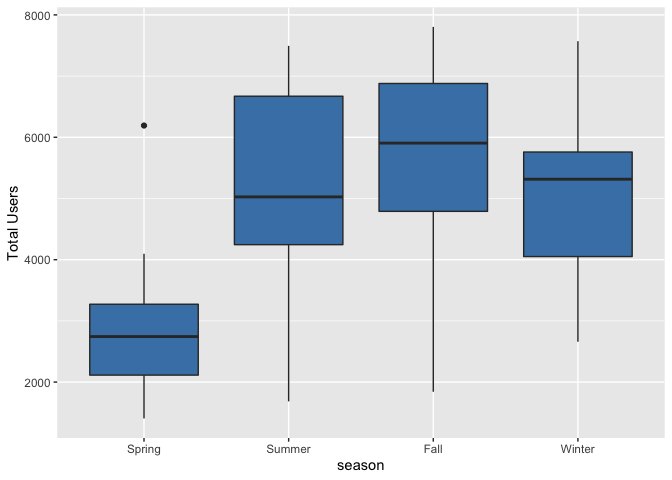

Project2
================
Rashmi Kadam, Dionte Watie
7/6/2021

-   [Introduction](#introduction)
-   [Linear Regresion Model](#linear-regresion-model)
-   [Fitting Random forest model](#fitting-random-forest-model)
-   [Fitted Boosted Tree Model](#fitted-boosted-tree-model)

### Introduction

*Bike Data Analysis for Thursday*

For this study we will be aiming to predict the number of bike users.
The bike users have been split into two groups that will be the target
variables (response), casual bikers that rent bikes casually and
registered bikers that rent bikes regularly. The predictor variables
that will be in question are:

-   weekday (day of the week)
-   season
-   yr (year)
-   holiday (whether it is a holiday or not)
-   weathersit (weather: rainy, snowy, clear, cloudy)
-   mnth
-   atemp (Feeling temperature)
-   windspeed

The response and predictor variables will be used in various Multiple
Linear Regression Models, Logistics Models, and Tree fits. The models
will then be tested against the testing data set and the results will
determine which model would be best to use for prediction.

``` r
library(tidyverse)
library(corrplot)
library(ggplot2)
library(ggpubr)
library(caret)
library(randomForest)
```

``` r
set.seed(1)

# read Bike data
bikeData <- read_csv("day.csv")
```

    ## 
    ## ── Column specification ─────────────────────────────────────────────────────────────────────────
    ## cols(
    ##   instant = col_double(),
    ##   dteday = col_date(format = ""),
    ##   season = col_double(),
    ##   yr = col_double(),
    ##   mnth = col_double(),
    ##   holiday = col_double(),
    ##   weekday = col_double(),
    ##   workingday = col_double(),
    ##   weathersit = col_double(),
    ##   temp = col_double(),
    ##   atemp = col_double(),
    ##   hum = col_double(),
    ##   windspeed = col_double(),
    ##   casual = col_double(),
    ##   registered = col_double(),
    ##   cnt = col_double()
    ## )

``` r
wnum <- weekday
wnum
```

    ## [1] 4

``` r
# filtering weekday data
bikeDataWD <- bikeData %>% filter(weekday == wnum)

# Correlation graph has been used to select the predictors
Correlation <- cor(select(bikeDataWD, casual, registered, cnt,holiday, mnth, season,  weathersit ,yr, temp, atemp, hum, windspeed))

corrplot(Correlation)
```

<!-- -->

``` r
#Selected the predictors and factored the categorical predictors.

bikeDataM <- bikeDataWD %>% select (season, holiday, mnth, weathersit, atemp, windspeed, casual, registered, cnt, yr)

#
bikeDataM$mnth <- as.factor(bikeDataM$mnth)

bikeDataM$season <- factor(bikeDataM$season,
                          levels = c("1", "2","3","4") , 
                          labels = c("Spring","Summer","Fall","Winter"))

bikeDataM$holiday <- factor(bikeDataM$holiday, 
                           levels = c("0", "1") , 
                           labels = c("Working Day","Holiday"))


bikeDataM$weathersit <- factor(bikeDataM$weathersit,
                          levels = c("1", "2","3","4") , 
                          labels = c("Good:Clear/Sunny","Moderate:Cloudy/Mist","Bad: Rain/Snow/Fog",
                                     "Worse: Heavy Rain/Snow/Fog"))

bikeDataM$yr <- factor(bikeDataM$yr,
                      levels = c("0", "1") , 
                      labels = c("2011","2012"))
```

Created train and test data sets

``` r
train <- sample(1:nrow(bikeDataM), size = nrow(bikeDataM)*0.7)
test <- dplyr::setdiff(1:nrow(bikeDataM), train)
bikeDataTrain <- bikeDataM[train, ]
bikeDataTest <- bikeDataM[test, ]


summary(bikeDataTrain)
```

    ##     season          holiday        mnth                         weathersit     atemp       
    ##  Spring:13   Working Day:72   9      : 9   Good:Clear/Sunny          :45   Min.   :0.1495  
    ##  Summer:19   Holiday    : 0   5      : 8   Moderate:Cloudy/Mist      :25   1st Qu.:0.3799  
    ##  Fall  :21                    6      : 8   Bad: Rain/Snow/Fog        : 2   Median :0.5325  
    ##  Winter:19                    10     : 7   Worse: Heavy Rain/Snow/Fog: 0   Mean   :0.5012  
    ##                               12     : 7                                   3rd Qu.:0.6323  
    ##                               7      : 6                                   Max.   :0.8264  
    ##                               (Other):27                                                   
    ##    windspeed           casual         registered        cnt          yr    
    ##  Min.   :0.04727   Min.   :  38.0   Min.   :1368   Min.   :1406   2011:34  
    ##  1st Qu.:0.13480   1st Qu.: 308.0   1st Qu.:3160   1st Qu.:3630   2012:38  
    ##  Median :0.17351   Median : 612.5   Median :4191   Median :4817            
    ##  Mean   :0.18523   Mean   : 619.6   Mean   :4309   Mean   :4928            
    ##  3rd Qu.:0.22060   3rd Qu.: 888.0   3rd Qu.:5668   3rd Qu.:6567            
    ##  Max.   :0.42228   Max.   :1405.0   Max.   :6781   Max.   :7804            
    ## 

``` r
#Side by side bar plots for month and count by year
  
Year <- bikeDataTrain$yr

ggplot(bikeDataTrain, aes(fill=Year, y=cnt, x=mnth)) + 
    geom_bar(position="dodge", stat="identity") + xlab("Months") + ylab('Total Users')
```

<!-- -->

``` r
#Boxplot of season versus count

ggplot(bikeDataTrain, aes(x = season,y=cnt)) +
  geom_boxplot(fill="steelblue") +ylab('Total Users')
```

<!-- -->

``` r
#Scatter plots for casual and registered versus actual temperature

mintemp <- -16
maxtemp <- 50

bikeDataTrain$atemp = bikeDataTrain$atemp * (maxtemp - mintemp) + mintemp
bikeDataTrain$atemp
```

    ##  [1] 14.165036 12.623936 32.791358  5.790692 12.123986  6.564806 27.209408 27.209408  9.207908
    ## [10] 25.667714 12.291428 24.042200 34.250222  5.416472 20.542286 22.250828 19.124672 26.626364
    ## [19] 10.790786 24.126350 27.709028 24.584786 19.457972 18.959408 14.790650 20.627558 17.708972
    ## [28] 25.916864 28.583792 26.042528  3.416408 15.708050 21.583172 29.792978 31.166372 21.917792
    ## [37]  3.695852 27.209078 -6.129832 23.292836 27.000386  6.124322 -6.041722  8.665586 13.166522
    ## [46] 26.500172 19.166450 24.126350 -0.608206 16.541036 -3.457492 12.457022 12.456758 34.000214
    ## [55] 21.792458  1.416872  2.375192 15.916478 11.081978 22.209314 20.653826  0.999950  4.166564
    ## [64] 16.457678 20.419064  8.416172 25.209278 38.540486 -1.041628  1.041464 27.251714 33.667772

``` r
  cTemp <- ggplot(bikeDataTrain,aes(x=atemp, y=casual)) + geom_point() + geom_smooth() + ylim(0, 7000) 
  rTemp <- ggplot(bikeDataTrain, aes(x=atemp, y=registered)) + geom_point() + geom_smooth() + ylim(0, 7000) 
  
  ggarrange(cTemp, rTemp, labels = c("Casual Users", "Registered Users"), ncol = 2, nrow = 1)
```

    ## `geom_smooth()` using method = 'loess' and formula 'y ~ x'
    ## `geom_smooth()` using method = 'loess' and formula 'y ~ x'

<!-- -->

``` r
#Bar plots split by casual and registered users for season and holiday
rSeason <- ggplot(bikeDataTrain, aes(fill = holiday, x = season,y = registered,)) + geom_bar(position= 'dodge',stat = 'identity')

cSeason <- ggplot(bikeDataTrain, aes(fill = holiday, x = season,y = casual,)) + geom_bar(position= 'dodge',stat = 'identity')

ggarrange(cSeason, rSeason, labels= c("Casual Users", "Registered Users"), ncol = 2, nrow = 1)
```

<!-- -->

``` r
#Density plot for weathersit by year 
weather <- ggplot(bikeDataTrain, aes(x= weathersit))
weather + geom_density(adjust= 0.5, alpha= 0.5, aes(fill= Year), kernel="gaussian")
```

<!-- -->

``` r
#ECDF plot for count by year
cntPlot <- ggplot(bikeDataTrain, aes(x= cnt))
cntPlot + stat_ecdf(geom = 'step', aes(color= Year)) + ylab("ECDF")
```

<!-- -->

``` r
#Summary Statistics by Dionte
#variance, stdev, mean, and median of casual users by month
statsCasual <- bikeDataTrain %>% 
  group_by(mnth) %>% 
  summarise(avg = mean(casual), 
            med = median(casual), 
            var = var(casual), 
            stDev = sd(casual))
statsCasual
```

    ## # A tibble: 12 x 5
    ##    mnth    avg   med     var stDev
    ##    <fct> <dbl> <dbl>   <dbl> <dbl>
    ##  1 1      133    130   7401   86.0
    ##  2 2      127.    74  13316. 115. 
    ##  3 3      536    424 179977  424. 
    ##  4 4      731.   571  85781. 293. 
    ##  5 5      912.   895  49229. 222. 
    ##  6 6      813.   762  48992. 221. 
    ##  7 7      980.   960  64899. 255. 
    ##  8 8      917.   812 174197. 417. 
    ##  9 9      659.   653  72602. 269. 
    ## 10 10     606.   639  76449. 276. 
    ## 11 11     313.   319   8848.  94.1
    ## 12 12     284.   254   6640.  81.5

``` r
#variance, stdev, mean, and median of registered users by month
statsRegistered <- bikeDataTrain %>% 
  group_by(mnth) %>% 
  summarise(avg = mean(registered), 
            med = median(registered), 
            var = var(registered), 
            stDev = sd(registered))
statsRegistered
```

    ## # A tibble: 12 x 5
    ##    mnth    avg   med      var stDev
    ##    <fct> <dbl> <dbl>    <dbl> <dbl>
    ##  1 1     2602. 3132  1198847. 1095.
    ##  2 2     2213. 2216   518408.  720.
    ##  3 3     3004. 2320  3738674. 1934.
    ##  4 4     4319. 4551  1664160. 1290.
    ##  5 5     5109  5602. 1126567. 1061.
    ##  6 6     4822. 4680. 1654297. 1286.
    ##  7 7     5021  5270. 1452000  1205.
    ##  8 8     4584. 3980  2673670. 1635.
    ##  9 9     4827  4332  3098779. 1760.
    ## 10 10    4650. 4126  3521077. 1876.
    ## 11 11    4516. 5028. 1158160. 1076.
    ## 12 12    3483. 3545  1651617. 1285.

``` r
#variance, stdev, mean, and median of total bike users by season
statsCnt <- bikeDataTrain %>% 
  group_by(season) %>% 
  summarise(avg = mean(cnt), 
            med = median(cnt), 
            var = var(cnt), 
            stDev = sd(cnt))
statsCnt
```

    ## # A tibble: 4 x 5
    ##   season   avg   med      var stDev
    ##   <fct>  <dbl> <dbl>    <dbl> <dbl>
    ## 1 Spring 2864   2744 1616360. 1271.
    ## 2 Summer 5400.  5026 2818879. 1679.
    ## 3 Fall   5630.  5905 2881376. 1697.
    ## 4 Winter 5093.  5315 2401194. 1550.

``` r
#Calculating z statistic
tapply(bikeDataTrain$casual, INDEX = bikeDataTrain$weathersit, FUN = function(x){x -mean(x)/sd(x)})
```

    ## $`Good:Clear/Sunny`
    ##  [1]  569.17257 1034.17257  338.17257 1336.17257  756.17257 1098.17257  257.17257 1057.17257
    ##  [9] 1403.17257 1052.17257  937.17257  316.17257  637.17257  781.17257  469.17257  886.17257
    ## [17]  919.17257 1361.17257  423.17257  637.17257 1036.17257  886.17257  651.17257  241.17257
    ## [25] 1030.17257   45.17257  810.17257   36.17257  612.17257  734.17257 1003.17257   86.17257
    ## [33]  844.17257  128.17257  832.17257 1190.17257 1240.17257  252.17257  138.17257  422.17257
    ## [41]  180.17257 1024.17257 1178.17257  338.17257  776.17257
    ## 
    ## $`Moderate:Cloudy/Mist`
    ##  [1] 237.85228  71.85228 224.85228 266.85228 317.85228 425.85228 432.85228 888.85228 761.85228
    ## [10] 872.85228 552.85228 732.85228 743.85228 542.85228 311.85228 187.85228 748.85228 560.85228
    ## [19] 472.85228 566.85228 287.85228 463.85228 629.85228 244.85228 608.85228
    ## 
    ## $`Bad: Rain/Snow/Fog`
    ## [1] 143.9708 169.9708
    ## 
    ## $`Worse: Heavy Rain/Snow/Fog`
    ## NULL

``` r
# summary statistics by Rashmi
#min max stdev and mean of feeling temperature by season
statsAtemp <- bikeDataTrain %>%
  group_by(season) %>%
  summarise(
    atemp.min = min(atemp),
    atemp.max = max(atemp),
    atemp.med = median(atemp),
    atemp.stdev = sd(atemp),
    atemp.mean = mean(atemp))
statsAtemp
```

    ## # A tibble: 4 x 6
    ##   season atemp.min atemp.max atemp.med atemp.stdev atemp.mean
    ##   <fct>      <dbl>     <dbl>     <dbl>       <dbl>      <dbl>
    ## 1 Spring     -6.13      19.2      2.38        7.95       4.32
    ## 2 Summer      1.00      34.0     21.6         7.27      19.8 
    ## 3 Fall       19.1       38.5     27.2         5.03      27.2 
    ## 4 Winter      1.04      24.1     10.8         7.43      11.8

``` r
#min max stdev and mean of total bike users per year
statsYear<- bikeDataTrain %>%
  group_by(yr) %>%
  summarise(
    cnt.min = min(cnt),
    cnt.max = max(cnt),
    cnt.med = median(cnt),
    cnt.stdev = sd(cnt),
    cnt.mean = mean(cnt)) 
statsYear
```

    ## # A tibble: 2 x 6
    ##   yr    cnt.min cnt.max cnt.med cnt.stdev cnt.mean
    ##   <fct>   <dbl>   <dbl>   <dbl>     <dbl>    <dbl>
    ## 1 2011     1406    5115   3776.     1138.    3579.
    ## 2 2012     2114    7804   6511      1484.    6135.

``` r
#min max stdev and mean of total bike users per holiday
statsHoliday<- bikeDataTrain %>%
  group_by(holiday) %>%
  summarise(
    cnt.min = min(cnt),
    cnt.max = max(cnt),
    cnt.med = median(cnt),
    cnt.stdev = sd(cnt),
    cnt.mean = mean(cnt)) 
statsHoliday
```

    ## # A tibble: 1 x 6
    ##   holiday     cnt.min cnt.max cnt.med cnt.stdev cnt.mean
    ##   <fct>         <dbl>   <dbl>   <dbl>     <dbl>    <dbl>
    ## 1 Working Day    1406    7804    4817     1844.    4928.

``` r
#contingency table 

table(bikeDataTrain$holiday, bikeDataTrain$season)
```

    ##              
    ##               Spring Summer Fall Winter
    ##   Working Day     13     19   21     19
    ##   Holiday          0      0    0      0

### Linear Regresion Model

Idea of linear regression model -Linear regression model assumes a
linear relationship between the input variables (x) and the single
output variable(y).The linear equation assigns one scale factor to each
input value or column, called a coefficient and represented by the
capital Greek letter Beta (B). It is a slope term.Regression models
estimate the values of Beta. Betas are chosen by using ordinary least
square method.Ordinary least squares minimize the sum of squared
residuals assuming normality and constant variance on error terms.It is
called linear regression because it is linear in parameters.

``` r
#Fitting multiple regression models
set.seed(1)

bikeDataTrainF <- bikeDataTrain %>% select(cnt,season,weathersit,atemp,yr)
bikeDataTestF <- bikeDataTest %>% select(cnt,season,weathersit,atemp,yr)

lmRM<-lm(log(cnt)~.,data=bikeDataTrainF)
summary(lmRM)
```

    ## 
    ## Call:
    ## lm(formula = log(cnt) ~ ., data = bikeDataTrainF)
    ## 
    ## Residuals:
    ##      Min       1Q   Median       3Q      Max 
    ## -0.30596 -0.09139  0.02638  0.08715  0.33752 
    ## 
    ## Coefficients:
    ##                                 Estimate Std. Error t value Pr(>|t|)    
    ## (Intercept)                     7.625563   0.051702 147.491  < 2e-16 ***
    ## seasonSummer                    0.408780   0.076790   5.323 1.40e-06 ***
    ## seasonFall                      0.327435   0.092292   3.548 0.000733 ***
    ## seasonWinter                    0.451716   0.062733   7.201 8.26e-10 ***
    ## weathersitModerate:Cloudy/Mist -0.133164   0.041599  -3.201 0.002132 ** 
    ## weathersitBad: Rain/Snow/Fog   -0.697195   0.126393  -5.516 6.68e-07 ***
    ## atemp                           0.016403   0.003065   5.352 1.25e-06 ***
    ## yr2012                          0.484278   0.039103  12.385  < 2e-16 ***
    ## ---
    ## Signif. codes:  0 '***' 0.001 '**' 0.01 '*' 0.05 '.' 0.1 ' ' 1
    ## 
    ## Residual standard error: 0.1614 on 64 degrees of freedom
    ## Multiple R-squared:  0.879,  Adjusted R-squared:  0.8658 
    ## F-statistic: 66.44 on 7 and 64 DF,  p-value: < 2.2e-16

``` r
lmFit <- train(log(cnt) ~ ., data = bikeDataTrainF , 
         method = "lm", 
         preProcess = c("center", "scale"),
         trControl = trainControl(method = "cv", number = 10))

predlm <- predict(lmFit, newdata = dplyr::select(bikeDataTestF,-cnt))

lmRM <- postResample(predlm, bikeDataTestF$cnt)

lmRMSE <- lmRM["RMSE"]

lmRMSE
```

    ##     RMSE 
    ## 4543.672

``` r
#Fitting Multiple Linear Regression model
#Using BIC to select predictors for the best fit model
set.seed(1)

#bic_selection = step(
#  lm(cnt ~ 1, bikeDataTrain),
#  scope = cnt ~ season + holiday + mnth + weathersit + atemp + windspeed + Year,
#  direction = "both", k = log(nrow(bikeDataTrain))
#)
#Best fit linear regression model
bikeDataTrainF2 <- bikeDataTrain %>% select(cnt, atemp, season,weathersit)
bikeDataTestF2 <- bikeDataTest %>% select(cnt, atemp, season,weathersit)

bestLm <- lm(cnt ~ atemp + season + weathersit, data = bikeDataTrain)
bestLm
```

    ## 
    ## Call:
    ## lm(formula = cnt ~ atemp + season + weathersit, data = bikeDataTrain)
    ## 
    ## Coefficients:
    ##                    (Intercept)                           atemp                    seasonSummer  
    ##                        2910.19                           57.74                         1831.81  
    ##                     seasonFall                    seasonWinter  weathersitModerate:Cloudy/Mist  
    ##                        1588.59                         1953.93                         -961.03  
    ##   weathersitBad: Rain/Snow/Fog  
    ##                       -3482.05

``` r
summary(bestLm)
```

    ## 
    ## Call:
    ## lm(formula = cnt ~ atemp + season + weathersit, data = bikeDataTrain)
    ## 
    ## Residuals:
    ##     Min      1Q  Median      3Q     Max 
    ## -2329.9 -1147.5   148.2  1097.2  2361.2 
    ## 
    ## Coefficients:
    ##                                Estimate Std. Error t value Pr(>|t|)    
    ## (Intercept)                     2910.19     404.53   7.194 7.87e-10 ***
    ## atemp                             57.74      25.93   2.227 0.029451 *  
    ## seasonSummer                    1831.81     648.48   2.825 0.006276 ** 
    ## seasonFall                      1588.59     779.75   2.037 0.045695 *  
    ## seasonWinter                    1953.93     528.69   3.696 0.000452 ***
    ## weathersitModerate:Cloudy/Mist  -961.03     350.74  -2.740 0.007922 ** 
    ## weathersitBad: Rain/Snow/Fog   -3482.05    1050.09  -3.316 0.001497 ** 
    ## ---
    ## Signif. codes:  0 '***' 0.001 '**' 0.01 '*' 0.05 '.' 0.1 ' ' 1
    ## 
    ## Residual standard error: 1367 on 65 degrees of freedom
    ## Multiple R-squared:  0.4968, Adjusted R-squared:  0.4503 
    ## F-statistic: 10.69 on 6 and 65 DF,  p-value: 3.073e-08

``` r
plot(bestLm)
```

<!-- --><!-- --><!-- --><!-- -->

``` r
bestLmFit <- train(cnt~ atemp + season +weathersit, data= bikeDataTrainF2,
                   method = "lm",
                   preProcess = c("center", "scale"),
                   trControl = trainControl(method = "cv", number = 10))
lmFitPred <- predict(bestLmFit, newdata = dplyr::select(bikeDataTestF2,-cnt))

lm2RM <- postResample(lmFitPred, bikeDataTestF2$cnt)

lm2RMSE <- lm2RM["RMSE"]

lm2RMSE
```

    ##    RMSE 
    ## 1835.05

### Fitting Random forest model

Random Forest model is tree based method used to prediction. It is
powerful ensembling machine learning algorithm which extends the idea of
bagging but instead of including every predictor, we are including
subset of predictors. It works by creating bootstrap samples fitting a
tree for each bootstrap sample. Random Forest method avoids correlation
amoung the trees. It uses m subset of predictors.

m = SQRT(p) for classification and m = p/3 for regression.

``` r
set.seed(1)


rfFit <- train(cnt ~ ., 
               method = "rf",
               trControl = trainControl(method = "repeatedcv",
                                        repeats = 3,
                                        number = 10),
               tuneGrid = data.frame(mtry = 1:9),
               data = bikeDataTrainF)
rfFit
```

    ## Random Forest 
    ## 
    ## 72 samples
    ##  4 predictor
    ## 
    ## No pre-processing
    ## Resampling: Cross-Validated (10 fold, repeated 3 times) 
    ## Summary of sample sizes: 65, 65, 65, 64, 65, 65, ... 
    ## Resampling results across tuning parameters:
    ## 
    ##   mtry  RMSE       Rsquared   MAE      
    ##   1     1384.2401  0.8301657  1173.8477
    ##   2      963.2262  0.8519854   815.1880
    ##   3      803.5509  0.8638991   671.9022
    ##   4      762.5421  0.8587319   643.9227
    ##   5      750.3553  0.8571447   627.8379
    ##   6      756.2222  0.8528900   627.3048
    ##   7      761.8485  0.8485222   624.8564
    ##   8      767.9037  0.8447700   625.2027
    ##   9      772.0617  0.8419601   629.5720
    ## 
    ## RMSE was used to select the optimal model using the smallest value.
    ## The final value used for the model was mtry = 5.

``` r
rfPred <- predict(rfFit,  newdata = dplyr::select(bikeDataTestF,-cnt))
rfRM <- postResample(rfPred, bikeDataTestF$cnt)
rfRMSE <- rfRM["RMSE"]

rfRMSE
```

    ##     RMSE 
    ## 1885.306

### Fitted Boosted Tree Model

The Boosted tree fit model is used on the bike data set to create a
model candidate. The training data set was used in the model to find the
highest accuracy rate when using the tuning parameters n.trees,
interaction.depth, shrinkage, and n.minobsinnode. When the highest rate
was chosen given the parameters, it was used for prediction against the
testing data set. Finally, the predictions was tested finding the RMSE,
Rsquared, and MAE values

``` r
set.seed(1)

trCtrl <- trainControl(method = "repeatedcv", number = 10, repeats =3)
set.seed(1)
BoostFit <- train(cnt ~., data = bikeDataTrain,
                     method = "gbm",
                      verbose = FALSE,
                     preProcess = c("center", "scale"),
                     trControl = trCtrl)
BoostFit
```

    ## Stochastic Gradient Boosting 
    ## 
    ## 72 samples
    ##  9 predictor
    ## 
    ## Pre-processing: centered (23), scaled (23) 
    ## Resampling: Cross-Validated (10 fold, repeated 3 times) 
    ## Summary of sample sizes: 65, 65, 65, 64, 65, 65, ... 
    ## Resampling results across tuning parameters:
    ## 
    ##   interaction.depth  n.trees  RMSE      Rsquared   MAE     
    ##   1                   50      400.2016  0.9659738  322.2186
    ##   1                  100      387.2091  0.9686375  316.1240
    ##   1                  150      374.6522  0.9707438  308.7989
    ##   2                   50      406.2094  0.9665587  330.2179
    ##   2                  100      385.1718  0.9703895  319.9085
    ##   2                  150      377.7620  0.9717091  313.6674
    ##   3                   50      398.2020  0.9676428  326.4216
    ##   3                  100      384.7967  0.9713377  323.2241
    ##   3                  150      374.2599  0.9725513  314.7700
    ## 
    ## Tuning parameter 'shrinkage' was held constant at a value of 0.1
    ## Tuning
    ##  parameter 'n.minobsinnode' was held constant at a value of 10
    ## RMSE was used to select the optimal model using the smallest value.
    ## The final values used for the model were n.trees = 150, interaction.depth = 3, shrinkage =
    ##  0.1 and n.minobsinnode = 10.

``` r
BoostFitPred <- predict(BoostFit, newdata = dplyr::select(bikeDataTest, -cnt))
BoostFitPred
```

    ##  [1] 2113.359 2269.799 1907.098 2040.055 1907.098 1907.098 2020.832 2805.976 3855.235 4274.187
    ## [11] 5127.015 4239.210 3767.497 4062.210 2347.864 2705.813 2881.522 3504.295 4115.194 3627.550
    ## [21] 3516.319 4761.732 4804.895 5142.597 6568.676 6149.007 5091.812 7272.799 7107.478 7285.719
    ## [31] 7221.502 3868.349

``` r
bfRM <- postResample(BoostFitPred, bikeDataTest$cnt)

bfRMSE <- bfRM["RMSE"]
bfRMSE
```

    ##     RMSE 
    ## 612.1196

``` r
cRMSEsTitles <- c("Linear Regression Model","Liner Regression Model 2","Random Forest","Boosted Tree")
  
cRMSEs <- c(lm = lmRMSE, lm2 = lm2RMSE, rf = rfRMSE, boost = bfRMSE)
cRMSEs
```

    ##    lm.RMSE   lm2.RMSE    rf.RMSE boost.RMSE 
    ##  4543.6717  1835.0499  1885.3063   612.1196

``` r
bestCRMSE <- cRMSEsTitles[which.min(cRMSEs)]

bestCRMSE
```

    ## [1] "Boosted Tree"

*Best model fit is :Boosted Tree model*
