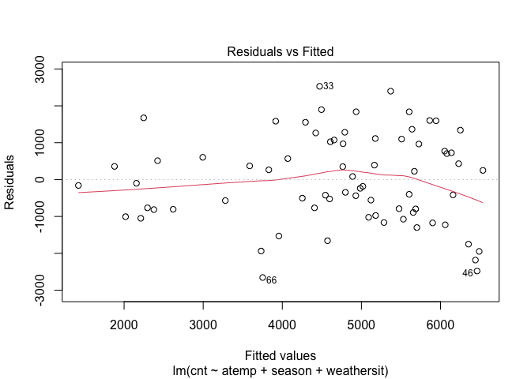

Project2
================
Rashmi Kadam, Dionte Watie
7/6/2021

-   [Introduction](#introduction)
-   [Linear Regresion Model](#linear-regresion-model)
-   [Fitting Random forest model](#fitting-random-forest-model)
-   [Fitted Boosted Tree Model](#fitted-boosted-tree-model)

### Introduction

*Bike Data Analysis for Tuesday*

For this study we will be aiming to predict the number of bike users.
The bike users have been split into two groups that will be the target
variables (response), casual bikers that rent bikes casually and
registered bikers that rent bikes regularly. The predictor variables
that will be in question are:

-   weekday (day of the week)
-   season
-   yr (year)
-   holiday (whether it is a holiday or not)
-   weathersit (weather: rainy, snowy, clear, cloudy)
-   mnth
-   atemp (Feeling temperature)
-   windspeed

The response and predictor variables will be used in various Multiple
Linear Regression Models, Logistics Models, and Tree fits. The models
will then be tested against the testing data set and the results will
determine which model would be best to use for prediction.

``` r
library(tidyverse)
library(corrplot)
library(ggplot2)
library(ggpubr)
library(caret)
library(randomForest)
```

``` r
set.seed(1)

# read Bike data
bikeData <- read_csv("day.csv")
```

    ## 
    ## ── Column specification ─────────────────────────────────────────────────────────────────────────
    ## cols(
    ##   instant = col_double(),
    ##   dteday = col_date(format = ""),
    ##   season = col_double(),
    ##   yr = col_double(),
    ##   mnth = col_double(),
    ##   holiday = col_double(),
    ##   weekday = col_double(),
    ##   workingday = col_double(),
    ##   weathersit = col_double(),
    ##   temp = col_double(),
    ##   atemp = col_double(),
    ##   hum = col_double(),
    ##   windspeed = col_double(),
    ##   casual = col_double(),
    ##   registered = col_double(),
    ##   cnt = col_double()
    ## )

``` r
wnum <- weekday
wnum
```

    ## [1] 2

``` r
# filtering weekday data
bikeDataWD <- bikeData %>% filter(weekday == wnum)

# Correlation graph has been used to select the predictors
Correlation <- cor(select(bikeDataWD, casual, registered, cnt,holiday, mnth, season,  weathersit ,yr, temp, atemp, hum, windspeed))

corrplot(Correlation)
```

<!-- -->

``` r
#Selected the predictors and factored the categorical predictors.

bikeDataM <- bikeDataWD %>% select (season, holiday, mnth, weathersit, atemp, windspeed, casual, registered, cnt, yr)

#
bikeDataM$mnth <- as.factor(bikeDataM$mnth)

bikeDataM$season <- factor(bikeDataM$season,
                          levels = c("1", "2","3","4") , 
                          labels = c("Spring","Summer","Fall","Winter"))

bikeDataM$holiday <- factor(bikeDataM$holiday, 
                           levels = c("0", "1") , 
                           labels = c("Working Day","Holiday"))


bikeDataM$weathersit <- factor(bikeDataM$weathersit,
                          levels = c("1", "2","3","4") , 
                          labels = c("Good:Clear/Sunny","Moderate:Cloudy/Mist","Bad: Rain/Snow/Fog",
                                     "Worse: Heavy Rain/Snow/Fog"))

bikeDataM$yr <- factor(bikeDataM$yr,
                      levels = c("0", "1") , 
                      labels = c("2011","2012"))
```

Created train and test data sets

``` r
train <- sample(1:nrow(bikeDataM), size = nrow(bikeDataM)*0.7)
test <- dplyr::setdiff(1:nrow(bikeDataM), train)
bikeDataTrain <- bikeDataM[train, ]
bikeDataTest <- bikeDataM[test, ]


summary(bikeDataTrain)
```

    ##     season          holiday        mnth                         weathersit     atemp       
    ##  Spring:12   Working Day:71   5      : 9   Good:Clear/Sunny          :40   Min.   :0.1263  
    ##  Summer:20   Holiday    : 1   9      : 8   Moderate:Cloudy/Mist      :30   1st Qu.:0.3969  
    ##  Fall  :20                    10     : 8   Bad: Rain/Snow/Fog        : 2   Median :0.5426  
    ##  Winter:20                    6      : 7   Worse: Heavy Rain/Snow/Fog: 0   Mean   :0.5033  
    ##                               7      : 6                                   3rd Qu.:0.6017  
    ##                               8      : 6                                   Max.   :0.7557  
    ##                               (Other):28                                                   
    ##    windspeed           casual         registered        cnt          yr    
    ##  Min.   :0.06157   Min.   :  43.0   Min.   : 573   Min.   :1013   2011:34  
    ##  1st Qu.:0.13978   1st Qu.: 316.5   1st Qu.:3512   1st Qu.:3950   2012:38  
    ##  Median :0.18768   Median : 645.0   Median :4032   Median :4706            
    ##  Mean   :0.20161   Mean   : 590.7   Mean   :4119   Mean   :4710            
    ##  3rd Qu.:0.25156   3rd Qu.: 824.5   3rd Qu.:5228   3rd Qu.:5940            
    ##  Max.   :0.38807   Max.   :1348.0   Max.   :6697   Max.   :7767            
    ## 

``` r
#Side by side bar plots for month and count by year
  
Year <- bikeDataTrain$yr

ggplot(bikeDataTrain, aes(fill=Year, y=cnt, x=mnth)) + 
    geom_bar(position="dodge", stat="identity") + xlab("Months") + ylab('Total Users')
```

<!-- -->

``` r
#Boxplot of season versus count

ggplot(bikeDataTrain, aes(x = season,y=cnt)) +
  geom_boxplot(fill="steelblue") +ylab('Total Users')
```

<!-- -->

``` r
#Scatter plots for casual and registered versus actual temperature

mintemp <- -16
maxtemp <- 50

bikeDataTrain$atemp = bikeDataTrain$atemp * (maxtemp - mintemp) + mintemp
bikeDataTrain$atemp
```

    ##  [1] 14.582750 10.291100 30.625700  6.040436 10.165964  2.583422 28.667414 23.917658  5.042516
    ## [10] 28.417472  0.782084 22.334450 30.374900  5.332850 23.834564 20.583272 21.294422 24.000422
    ## [19] 10.207808 19.793978 26.625242 23.250464 22.083386 19.000064 18.499586 19.126322 19.542914
    ## [28] 32.792150 23.250464 23.667650  6.331958 15.208628 18.708872 26.084636 33.875078 21.918650
    ## [37]  2.582828 27.876536 -2.915764 23.042036 31.791986 11.040728 -3.363376 11.208236 22.417214
    ## [46] 31.875278 19.833314 19.915814 -1.999948 23.500142  8.042348 12.915392 14.457878 27.292700
    ## [55] 22.042664  5.623778 -7.665850 10.748678  4.999748 23.209478 18.003200  3.331928 13.790750
    ## [64] 20.793086 20.042336  4.453994 23.459750 33.333614  3.434690 14.957564 29.334608 27.209672

``` r
  cTemp <- ggplot(bikeDataTrain,aes(x=atemp, y=casual)) + geom_point() + geom_smooth() + ylim(0, 7000) 
  rTemp <- ggplot(bikeDataTrain, aes(x=atemp, y=registered)) + geom_point() + geom_smooth() + ylim(0, 7000) 
  
  ggarrange(cTemp, rTemp, labels = c("Casual Users", "Registered Users"), ncol = 2, nrow = 1)
```

    ## `geom_smooth()` using method = 'loess' and formula 'y ~ x'
    ## `geom_smooth()` using method = 'loess' and formula 'y ~ x'

<!-- -->

``` r
#Bar plots split by casual and registered users for season and holiday
rSeason <- ggplot(bikeDataTrain, aes(fill = holiday, x = season,y = registered,)) + geom_bar(position= 'dodge',stat = 'identity')

cSeason <- ggplot(bikeDataTrain, aes(fill = holiday, x = season,y = casual,)) + geom_bar(position= 'dodge',stat = 'identity')

ggarrange(cSeason, rSeason, labels= c("Casual Users", "Registered Users"), ncol = 2, nrow = 1)
```

<!-- -->

``` r
#Density plot for weathersit by year 
weather <- ggplot(bikeDataTrain, aes(x= weathersit))
weather + geom_density(adjust= 0.5, alpha= 0.5, aes(fill= Year), kernel="gaussian")
```

<!-- -->

``` r
#ECDF plot for count by year
cntPlot <- ggplot(bikeDataTrain, aes(x= cnt))
cntPlot + stat_ecdf(geom = 'step', aes(color= Year)) + ylab("ECDF")
```

<!-- -->

``` r
#Summary Statistics by Dionte
#variance, stdev, mean, and median of casual users by month
statsCasual <- bikeDataTrain %>% 
  group_by(mnth) %>% 
  summarise(avg = mean(casual), 
            med = median(casual), 
            var = var(casual), 
            stDev = sd(casual))
statsCasual
```

    ## # A tibble: 12 x 5
    ##    mnth    avg   med     var stDev
    ##    <fct> <dbl> <dbl>   <dbl> <dbl>
    ##  1 1      108   108    2293   47.9
    ##  2 2      113   135    1807   42.5
    ##  3 3      456   317   70423  265. 
    ##  4 4      740   678  203280. 451. 
    ##  5 5      703.  673    8507.  92.2
    ##  6 6      822   774   40249. 201. 
    ##  7 7      914.  938.  32303. 180. 
    ##  8 8      982.  994   47423. 218. 
    ##  9 9      622.  589   87043. 295. 
    ## 10 10     541.  619   57518. 240. 
    ## 11 11     300.  352.  23821. 154. 
    ## 12 12     338.  358.  27608. 166.

``` r
#variance, stdev, mean, and median of registered users by month
statsRegistered <- bikeDataTrain %>% 
  group_by(mnth) %>% 
  summarise(avg = mean(registered), 
            med = median(registered), 
            var = var(registered), 
            stDev = sd(registered))
statsRegistered
```

    ## # A tibble: 12 x 5
    ##    mnth    avg   med      var stDev
    ##    <fct> <dbl> <dbl>    <dbl> <dbl>
    ##  1 1     2211. 2147   847358.  921.
    ##  2 2     2309. 1675  1648544. 1284.
    ##  3 3     2987. 2108  3331322. 1825.
    ##  4 4     4318. 5115  2841304. 1686.
    ##  5 5     4347. 4490   559331.  748.
    ##  6 6     5006. 4495  1060836. 1030.
    ##  7 7     5108. 5472  1341455. 1158.
    ##  8 8     4720. 4522.  797464.  893.
    ##  9 9     4563. 3882  2723826. 1650.
    ## 10 10    4215. 4052. 2686360. 1639.
    ## 11 11    3855. 3798   597237.  773.
    ## 12 12    3594  4329  5318862. 2306.

``` r
#variance, stdev, mean, and median of total bike users by season
statsCnt <- bikeDataTrain %>% 
  group_by(season) %>% 
  summarise(avg = mean(cnt), 
            med = median(cnt), 
            var = var(cnt), 
            stDev = sd(cnt))
statsCnt
```

    ## # A tibble: 4 x 5
    ##   season   avg   med      var stDev
    ##   <fct>  <dbl> <dbl>    <dbl> <dbl>
    ## 1 Spring 2412. 1936. 2055809. 1434.
    ## 2 Summer 5084. 5044. 1897638. 1378.
    ## 3 Fall   5622. 5550. 2145538. 1465.
    ## 4 Winter 4802. 4601  2284349. 1511.

``` r
#Calculating z statistic
tapply(bikeDataTrain$casual, INDEX = bikeDataTrain$weathersit, FUN = function(x){x -mean(x)/sd(x)})
```

    ## $`Good:Clear/Sunny`
    ##  [1]  692.86615 1137.86615  463.86615 1125.86615  170.86615  877.86615  137.86615 1049.86615
    ##  [9]  698.86615 1067.86615 1278.86615  407.86615  718.86615  772.86615  838.86615  659.86615
    ## [17] 1074.86615 1078.86615  483.86615  918.86615   61.86615  724.86615  904.86615  430.86615
    ## [25]  373.86615  670.86615  759.86615  842.86615  105.86615  986.86615 1345.86615  760.86615
    ## [33]   86.86615  515.86615  675.86615  314.86615  749.86615  548.86615  864.86615  965.86615
    ## 
    ## $`Moderate:Cloudy/Mist`
    ##  [1] 165.3601 133.3601 214.3601 657.3601 817.3601 325.3601 369.3601 651.3601 635.3601 436.3601
    ## [11] 676.3601 280.3601 966.3601 772.3601 475.3601 121.3601 952.3601  41.3601 601.3601 125.3601
    ## [21] 599.3601 623.3601 101.3601 287.3601  94.3601 736.3601 665.3601  85.3601 475.3601 438.3601
    ## 
    ## $`Bad: Rain/Snow/Fog`
    ## [1] 311.6938 200.6938
    ## 
    ## $`Worse: Heavy Rain/Snow/Fog`
    ## NULL

``` r
# summary statistics by Rashmi
#min max stdev and mean of feeling temperature by season
statsAtemp <- bikeDataTrain %>%
  group_by(season) %>%
  summarise(
    atemp.min = min(atemp),
    atemp.max = max(atemp),
    atemp.med = median(atemp),
    atemp.stdev = sd(atemp),
    atemp.mean = mean(atemp))
statsAtemp
```

    ## # A tibble: 4 x 6
    ##   season atemp.min atemp.max atemp.med atemp.stdev atemp.mean
    ##   <fct>      <dbl>     <dbl>     <dbl>       <dbl>      <dbl>
    ## 1 Spring     -7.67      19.8      4.22        7.08       3.15
    ## 2 Summer      3.33      31.9     22.4         6.76      20.9 
    ## 3 Fall       18.0       33.9     26.4         4.85      26.4 
    ## 4 Winter      2.58      21.9     13.4         6.14      12.7

``` r
#min max stdev and mean of total bike users per year
statsYear<- bikeDataTrain %>%
  group_by(yr) %>%
  summarise(
    cnt.min = min(cnt),
    cnt.max = max(cnt),
    cnt.med = median(cnt),
    cnt.stdev = sd(cnt),
    cnt.mean = mean(cnt)) 
statsYear
```

    ## # A tibble: 2 x 6
    ##   yr    cnt.min cnt.max cnt.med cnt.stdev cnt.mean
    ##   <fct>   <dbl>   <dbl>   <dbl>     <dbl>    <dbl>
    ## 1 2011     1162    5895   4232.     1299.    3749.
    ## 2 2012     1013    7767   5795      1730.    5570.

``` r
#min max stdev and mean of total bike users per holiday
statsHoliday<- bikeDataTrain %>%
  group_by(holiday) %>%
  summarise(
    cnt.min = min(cnt),
    cnt.max = max(cnt),
    cnt.med = median(cnt),
    cnt.stdev = sd(cnt),
    cnt.mean = mean(cnt)) 
statsHoliday
```

    ## # A tibble: 2 x 6
    ##   holiday     cnt.min cnt.max cnt.med cnt.stdev cnt.mean
    ##   <fct>         <dbl>   <dbl>   <dbl>     <dbl>    <dbl>
    ## 1 Working Day    1096    7767    4725     1740.    4762.
    ## 2 Holiday        1013    1013    1013       NA     1013

``` r
#contingency table 

table(bikeDataTrain$holiday, bikeDataTrain$season)
```

    ##              
    ##               Spring Summer Fall Winter
    ##   Working Day     11     20   20     20
    ##   Holiday          1      0    0      0

### Linear Regresion Model

Idea of linear regression model -Linear regression model assumes a
linear relationship between the input variables (x) and the single
output variable(y).The linear equation assigns one scale factor to each
input value or column, called a coefficient and represented by the
capital Greek letter Beta (B). It is a slope term.Regression models
estimate the values of Beta. Betas are chosen by using ordinary least
square method.Ordinary least squares minimize the sum of squared
residuals assuming normality and constant variance on error terms.It is
called linear regression because it is linear in parameters.

``` r
#Fitting multiple regression models
set.seed(1)

bikeDataTrainF <- bikeDataTrain %>% select(cnt,season,weathersit,atemp,yr)
bikeDataTestF <- bikeDataTest %>% select(cnt,season,weathersit,atemp,yr)

lmRM<-lm(log(cnt)~.,data=bikeDataTrainF)
summary(lmRM)
```

    ## 
    ## Call:
    ## lm(formula = log(cnt) ~ ., data = bikeDataTrainF)
    ## 
    ## Residuals:
    ##      Min       1Q   Median       3Q      Max 
    ## -1.28928 -0.07567  0.04543  0.14878  0.46318 
    ## 
    ## Coefficients:
    ##                                 Estimate Std. Error t value Pr(>|t|)    
    ## (Intercept)                     7.477214   0.091648  81.586  < 2e-16 ***
    ## seasonSummer                    0.361231   0.135034   2.675  0.00947 ** 
    ## seasonFall                      0.307597   0.156533   1.965  0.05375 .  
    ## seasonWinter                    0.518535   0.110152   4.707 1.39e-05 ***
    ## weathersitModerate:Cloudy/Mist -0.205958   0.067062  -3.071  0.00313 ** 
    ## weathersitBad: Rain/Snow/Fog   -0.397221   0.194883  -2.038  0.04566 *  
    ## atemp                           0.025850   0.005269   4.906 6.70e-06 ***
    ## yr2012                          0.383775   0.062961   6.095 6.95e-08 ***
    ## ---
    ## Signif. codes:  0 '***' 0.001 '**' 0.01 '*' 0.05 '.' 0.1 ' ' 1
    ## 
    ## Residual standard error: 0.2663 on 64 degrees of freedom
    ## Multiple R-squared:  0.7437, Adjusted R-squared:  0.7157 
    ## F-statistic: 26.54 on 7 and 64 DF,  p-value: < 2.2e-16

``` r
lmFit <- train(log(cnt) ~ ., data = bikeDataTrainF , 
         method = "lm", 
         preProcess = c("center", "scale"),
         trControl = trainControl(method = "cv", number = 10))

predlm <- predict(lmFit, newdata = dplyr::select(bikeDataTestF,-cnt))

lmRM <- postResample(predlm, bikeDataTestF$cnt)

lmRMSE <- lmRM["RMSE"]

lmRMSE
```

    ##     RMSE 
    ## 4453.731

``` r
#Fitting Multiple Linear Regression model
#Using BIC to select predictors for the best fit model
set.seed(1)

#bic_selection = step(
#  lm(cnt ~ 1, bikeDataTrain),
#  scope = cnt ~ season + holiday + mnth + weathersit + atemp + windspeed + Year,
#  direction = "both", k = log(nrow(bikeDataTrain))
#)
#Best fit linear regression model
bikeDataTrainF2 <- bikeDataTrain %>% select(cnt, atemp, season,weathersit)
bikeDataTestF2 <- bikeDataTest %>% select(cnt, atemp, season,weathersit)

bestLm <- lm(cnt ~ atemp + season + weathersit, data = bikeDataTrain)
bestLm
```

    ## 
    ## Call:
    ## lm(formula = cnt ~ atemp + season + weathersit, data = bikeDataTrain)
    ## 
    ## Coefficients:
    ##                    (Intercept)                           atemp                    seasonSummer  
    ##                        2551.85                           87.78                         1111.95  
    ##                     seasonFall                    seasonWinter  weathersitModerate:Cloudy/Mist  
    ##                        1010.91                         1643.57                         -834.36  
    ##   weathersitBad: Rain/Snow/Fog  
    ##                       -1863.56

``` r
summary(bestLm)
```

    ## 
    ## Call:
    ## lm(formula = cnt ~ atemp + season + weathersit, data = bikeDataTrain)
    ## 
    ## Residuals:
    ##     Min      1Q  Median      3Q     Max 
    ## -2656.1  -833.7  -129.8   985.4  2529.2 
    ## 
    ## Coefficients:
    ##                                Estimate Std. Error t value Pr(>|t|)    
    ## (Intercept)                     2551.85     408.88   6.241 3.71e-08 ***
    ## atemp                             87.78      25.00   3.512 0.000815 ***
    ## seasonSummer                    1111.95     640.63   1.736 0.087356 .  
    ## seasonFall                      1010.91     742.63   1.361 0.178133    
    ## seasonWinter                    1643.57     522.50   3.146 0.002500 ** 
    ## weathersitModerate:Cloudy/Mist  -834.36     318.18  -2.622 0.010868 *  
    ## weathersitBad: Rain/Snow/Fog   -1863.56     924.61  -2.016 0.047989 *  
    ## ---
    ## Signif. codes:  0 '***' 0.001 '**' 0.01 '*' 0.05 '.' 0.1 ' ' 1
    ## 
    ## Residual standard error: 1264 on 65 degrees of freedom
    ## Multiple R-squared:  0.5404, Adjusted R-squared:  0.498 
    ## F-statistic: 12.74 on 6 and 65 DF,  p-value: 1.89e-09

``` r
plot(bestLm)
```

<!-- --><!-- --><!-- --><!-- -->

``` r
bestLmFit <- train(cnt~ atemp + season +weathersit, data= bikeDataTrainF2,
                   method = "lm",
                   preProcess = c("center", "scale"),
                   trControl = trainControl(method = "cv", number = 10))
lmFitPred <- predict(bestLmFit, newdata = dplyr::select(bikeDataTestF2,-cnt))

lm2RM <- postResample(lmFitPred, bikeDataTestF2$cnt)

lm2RMSE <- lm2RM["RMSE"]

lm2RMSE
```

    ##     RMSE 
    ## 1844.064

### Fitting Random forest model

Random Forest model is tree based method used to prediction. It is
powerful ensembling machine learning algorithm which extends the idea of
bagging but instead of including every predictor, we are including
subset of predictors. It works by creating bootstrap samples fitting a
tree for each bootstrap sample. Random Forest method avoids correlation
amoung the trees. It uses m subset of predictors.

m = SQRT(p) for classification and m = p/3 for regression.

``` r
set.seed(1)


rfFit <- train(cnt ~ ., 
               method = "rf",
               trControl = trainControl(method = "repeatedcv",
                                        repeats = 3,
                                        number = 10),
               tuneGrid = data.frame(mtry = 1:9),
               data = bikeDataTrainF)
rfFit
```

    ## Random Forest 
    ## 
    ## 72 samples
    ##  4 predictor
    ## 
    ## No pre-processing
    ## Resampling: Cross-Validated (10 fold, repeated 3 times) 
    ## Summary of sample sizes: 65, 65, 65, 64, 65, 65, ... 
    ## Resampling results across tuning parameters:
    ## 
    ##   mtry  RMSE       Rsquared   MAE      
    ##   1     1348.2666  0.7402920  1080.3410
    ##   2     1032.6038  0.7556824   818.1921
    ##   3      943.7962  0.7642852   727.9613
    ##   4      935.1088  0.7613592   722.5850
    ##   5      935.8550  0.7577531   728.1198
    ##   6      937.7391  0.7543001   733.7165
    ##   7      942.5259  0.7513258   740.6961
    ##   8      961.1032  0.7390701   753.6702
    ##   9      967.5161  0.7366528   758.6158
    ## 
    ## RMSE was used to select the optimal model using the smallest value.
    ## The final value used for the model was mtry = 4.

``` r
rfPred <- predict(rfFit,  newdata = dplyr::select(bikeDataTestF,-cnt))
rfRM <- postResample(rfPred, bikeDataTestF$cnt)
rfRMSE <- rfRM["RMSE"]

rfRMSE
```

    ##     RMSE 
    ## 1982.378

### Fitted Boosted Tree Model

The Boosted tree fit model is used on the bike data set to create a
model candidate. The training data set was used in the model to find the
highest accuracy rate when using the tuning parameters n.trees,
interaction.depth, shrinkage, and n.minobsinnode. When the highest rate
was chosen given the parameters, it was used for prediction against the
testing data set. Finally, the predictions was tested finding the RMSE,
Rsquared, and MAE values

``` r
set.seed(1)

trCtrl <- trainControl(method = "repeatedcv", number = 10, repeats =3)
set.seed(1)
BoostFit <- train(cnt ~., data = bikeDataTrain,
                     method = "gbm",
                      verbose = FALSE,
                     preProcess = c("center", "scale"),
                     trControl = trCtrl)
BoostFit
```

    ## Stochastic Gradient Boosting 
    ## 
    ## 72 samples
    ##  9 predictor
    ## 
    ## Pre-processing: centered (23), scaled (23) 
    ## Resampling: Cross-Validated (10 fold, repeated 3 times) 
    ## Summary of sample sizes: 65, 65, 65, 64, 65, 65, ... 
    ## Resampling results across tuning parameters:
    ## 
    ##   interaction.depth  n.trees  RMSE      Rsquared   MAE     
    ##   1                   50      478.7804  0.9464231  352.6190
    ##   1                  100      473.5339  0.9452277  358.7036
    ##   1                  150      467.6056  0.9445453  358.0017
    ##   2                   50      479.8292  0.9469761  363.0544
    ##   2                  100      473.0035  0.9458008  369.5160
    ##   2                  150      480.4145  0.9431800  377.0751
    ##   3                   50      481.3753  0.9457220  370.4928
    ##   3                  100      484.1023  0.9424917  377.7050
    ##   3                  150      492.7277  0.9409049  390.6141
    ## 
    ## Tuning parameter 'shrinkage' was held constant at a value of 0.1
    ## Tuning
    ##  parameter 'n.minobsinnode' was held constant at a value of 10
    ## RMSE was used to select the optimal model using the smallest value.
    ## The final values used for the model were n.trees = 150, interaction.depth = 1, shrinkage =
    ##  0.1 and n.minobsinnode = 10.

``` r
BoostFitPred <- predict(BoostFit, newdata = dplyr::select(bikeDataTest, -cnt))
BoostFitPred
```

    ##  [1] 1724.846 1856.728 1856.728 1939.401 1958.452 2031.669 2304.765 1850.187 1877.755 4365.769
    ## [11] 3942.811 3782.467 3897.569 4427.699 3808.524 2136.309 2160.505 2687.393 4100.109 4227.405
    ## [21] 3897.610 3141.066 3939.800 3692.536 5542.883 4804.724 5514.929 6160.412 6251.874 6288.997
    ## [31] 6393.067 5313.966

``` r
bfRM <- postResample(BoostFitPred, bikeDataTest$cnt)

bfRMSE <- bfRM["RMSE"]
bfRMSE
```

    ##     RMSE 
    ## 629.8229

``` r
cRMSEsTitles <- c("Linear Regression Model","Liner Regression Model 2","Random Forest","Boosted Tree")
  
cRMSEs <- c(lm = lmRMSE, lm2 = lm2RMSE, rf = rfRMSE, boost = bfRMSE)
cRMSEs
```

    ##    lm.RMSE   lm2.RMSE    rf.RMSE boost.RMSE 
    ##  4453.7307  1844.0635  1982.3776   629.8229

``` r
bestCRMSE <- cRMSEsTitles[which.min(cRMSEs)]

bestCRMSE
```

    ## [1] "Boosted Tree"

*Best model fit is :Boosted Tree model*
