Project2
================
Rashmi Kadam, Dionte Watie
7/6/2021

-   [Introduction](#introduction)
-   [Linear Regresion Model](#linear-regresion-model)
-   [Fitting Random forest model](#fitting-random-forest-model)
-   [Fitted Boosted Tree Model](#fitted-boosted-tree-model)

### Introduction

For this study we will be aiming to predict the number of bike users.
The bike users have been split into two groups that will be the target
variables (response), casual bikers that rent bikes casually and
registered bikers that rent bikes regularly. The predictor variables
that will be in question are:

-   weekday (day of the week)
-   season
-   yr (year)
-   holiday (whether it is a holiday or not)
-   weathersit (weather: rainy, snowy, clear, cloudy)
-   mnth
-   atemp
-   windspeed

The response and predictor variables will be used in various Multiple
Linear Regression Models, Logistics Models, and Tree fits. The models
will then be tested against the testing data set and the results will
determine which model would be best to use for prediction.

``` r
library(tidyverse)
library(corrplot)
library(ggplot2)
library(ggpubr)
library(caret)
library(randomForest)
```

``` r
set.seed(1)

# read Bike data
bikeData <- read_csv("day.csv")
```

    ## 
    ## ── Column specification ──────────────────────────────────────────────────────────────────────────────────────────────────────────────────
    ## cols(
    ##   instant = col_double(),
    ##   dteday = col_date(format = ""),
    ##   season = col_double(),
    ##   yr = col_double(),
    ##   mnth = col_double(),
    ##   holiday = col_double(),
    ##   weekday = col_double(),
    ##   workingday = col_double(),
    ##   weathersit = col_double(),
    ##   temp = col_double(),
    ##   atemp = col_double(),
    ##   hum = col_double(),
    ##   windspeed = col_double(),
    ##   casual = col_double(),
    ##   registered = col_double(),
    ##   cnt = col_double()
    ## )

``` r
# filtering weekday data
bikeDataWD <- bikeData %>% filter(weekday == 1)

# Correlation graph has been used to select the predictors
Correlation <- cor(select(bikeDataWD, casual, registered, cnt,holiday, mnth, season,  weathersit ,yr, temp, atemp, hum, windspeed))

corrplot(Correlation)
```

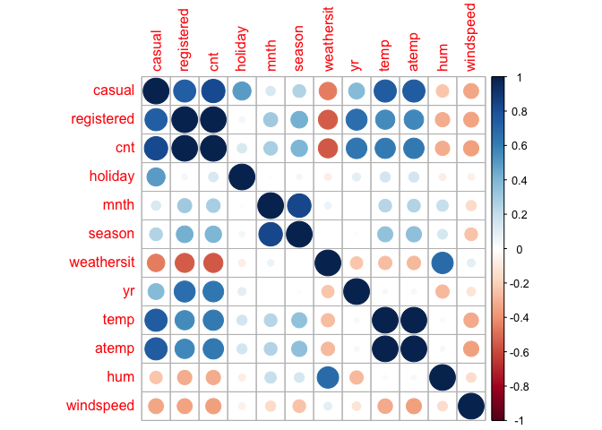<!-- -->

``` r
#Selected the predictors and factored the categorical predictors.

bikeDataM <- bikeDataWD %>% select (season, holiday, mnth, weathersit, atemp, windspeed, casual, registered, cnt, yr)

#
bikeDataM$mnth <- as.factor(bikeDataM$mnth)

bikeDataM$season <- factor(bikeDataM$season,
                          levels = c("1", "2","3","4") , 
                          labels = c("Spring","Summer","Fall","Winter"))

bikeDataM$holiday <- factor(bikeDataM$holiday, 
                           levels = c("0", "1") , 
                           labels = c("Working Day","Holiday"))


bikeDataM$weathersit <- factor(bikeDataM$weathersit,
                          levels = c("1", "2","3","4") , 
                          labels = c("Good:Clear/Sunny","Moderate:Cloudy/Mist","Bad: Rain/Snow/Fog",
                                     "Worse: Heavy Rain/Snow/Fog"))

bikeDataM$yr <- factor(bikeDataM$yr,
                      levels = c("0", "1") , 
                      labels = c("2011","2012"))
```

Created train and test data sets

``` r
train <- sample(1:nrow(bikeDataM), size = nrow(bikeDataM)*0.7)
test <- dplyr::setdiff(1:nrow(bikeDataM), train)
bikeDataTrain <- bikeDataM[train, ]
bikeDataTest <- bikeDataM[test, ]


summary(bikeDataTrain)
```

    ##     season          holiday        mnth                         weathersit     atemp          windspeed          casual      
    ##  Spring:13   Working Day:64   5      : 8   Good:Clear/Sunny          :46   Min.   :0.1509   Min.   :0.0423   Min.   :   2.0  
    ##  Summer:21   Holiday    : 9   8      : 8   Moderate:Cloudy/Mist      :26   1st Qu.:0.3876   1st Qu.:0.1312   1st Qu.: 342.0  
    ##  Fall  :20                    10     : 8   Bad: Rain/Snow/Fog        : 1   Median :0.5392   Median :0.1835   Median : 713.0  
    ##  Winter:19                    6      : 7   Worse: Heavy Rain/Snow/Fog: 0   Mean   :0.4948   Mean   :0.1893   Mean   : 701.5  
    ##                               9      : 7                                   3rd Qu.:0.6149   3rd Qu.:0.2338   3rd Qu.: 998.0  
    ##                               12     : 7                                   Max.   :0.7298   Max.   :0.4179   Max.   :2557.0  
    ##                               (Other):28                                                                                     
    ##    registered        cnt          yr    
    ##  Min.   :  20   Min.   :  22   2011:34  
    ##  1st Qu.:3143   1st Qu.:3422   2012:39  
    ##  Median :3729   Median :4548            
    ##  Mean   :3813   Mean   :4514            
    ##  3rd Qu.:5050   3rd Qu.:5936            
    ##  Max.   :6435   Max.   :7525            
    ## 

``` r
#Side by side bar plots for month and count by year
  
Year <- bikeDataTrain$yr

ggplot(bikeDataTrain, aes(fill=Year, y=cnt, x=mnth)) + 
    geom_bar(position="dodge", stat="identity") + xlab("Months") + ylab('Total Users')
```

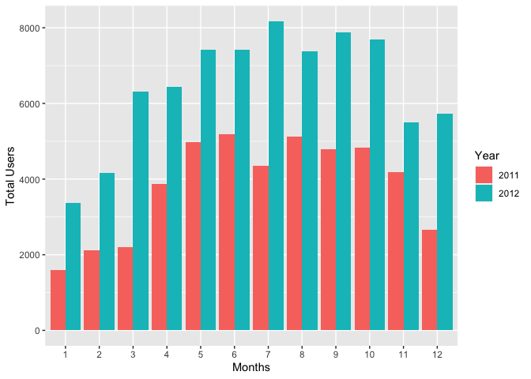<!-- -->

``` r
#Boxplot of season versus count

ggplot(bikeDataTrain, aes(x = season,y=cnt)) +
  geom_boxplot(fill="steelblue") +ylab('Total Users')
```

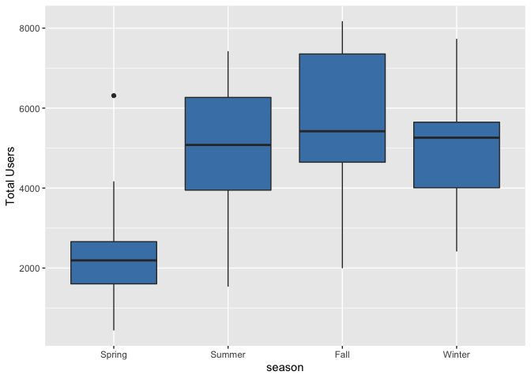<!-- -->

``` r
#Scatter plots for casual and registered versus actual temperature

mintemp <- -16
maxtemp <- 50

bikeDataTrain$atemp = bikeDataTrain$atemp * (maxtemp - mintemp) + mintemp
bikeDataTrain$atemp
```

    ##  [1] 14.166422 19.833314 29.541122 -0.957742  2.541578  4.332950 27.708764 22.959536  0.333614 28.833800 10.291100 21.334022 30.334508
    ## [14]  8.790986 23.740580 21.333164 17.165858 26.124764  7.500158  9.582128 24.667022 30.876236 24.125228 14.207936 13.000400 17.707850
    ## [27] 18.958550 20.333792 32.167064 27.166772 27.209408 10.499000  9.875036 22.166678 23.292836 31.792250 22.876772 14.082536 27.167564
    ## [40]  4.041428 23.709164 30.416678  1.087400 -6.041392 10.457486 19.166978 28.292072 14.333072 23.333822 -3.499270 24.585050 -3.416242
    ## [53] 19.583900 12.215858 25.042628 20.293400  4.825310  0.652064  3.874250  5.912000 21.917000 25.292636  0.999884 16.348052 18.791372
    ## [66] 19.833050  6.374264 27.541586 30.459050 -1.249858 12.747950 20.501300 19.959572

``` r
  cTemp <- ggplot(bikeDataTrain,aes(x=atemp, y=casual)) + geom_point() + geom_smooth() + ylim(0, 7000) 
  rTemp <- ggplot(bikeDataTrain, aes(x=atemp, y=registered)) + geom_point() + geom_smooth() + ylim(0, 7000) 
  
  ggarrange(cTemp, rTemp, labels = c("Casual Users", "Registered Users"), ncol = 2, nrow = 1)
```

    ## `geom_smooth()` using method = 'loess' and formula 'y ~ x'
    ## `geom_smooth()` using method = 'loess' and formula 'y ~ x'

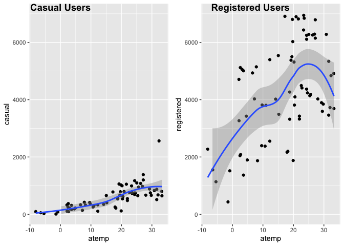<!-- -->

``` r
#Dionte -- bar plots split by casual and registered users for season and holiday
rSeason <- ggplot(bikeDataTrain, aes(fill = holiday, x = season,y = registered,)) + geom_bar(position= 'dodge',stat = 'identity')

cSeason <- ggplot(bikeDataTrain, aes(fill = holiday, x = season,y = casual,)) + geom_bar(position= 'dodge',stat = 'identity')

ggarrange(cSeason, rSeason, labels= c("Casual Users", "Registered Users"), ncol = 2, nrow = 1)
```

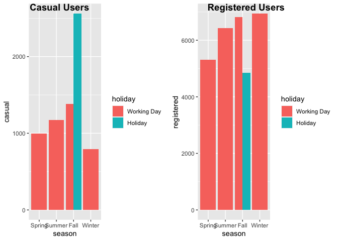<!-- -->

``` r
#Dionte -- Density plot for weathersit by year 
weather <- ggplot(bikeDataTrain, aes(x= weathersit))
weather + geom_density(adjust= 0.5, alpha= 0.5, aes(fill= Year), kernel="gaussian")
```

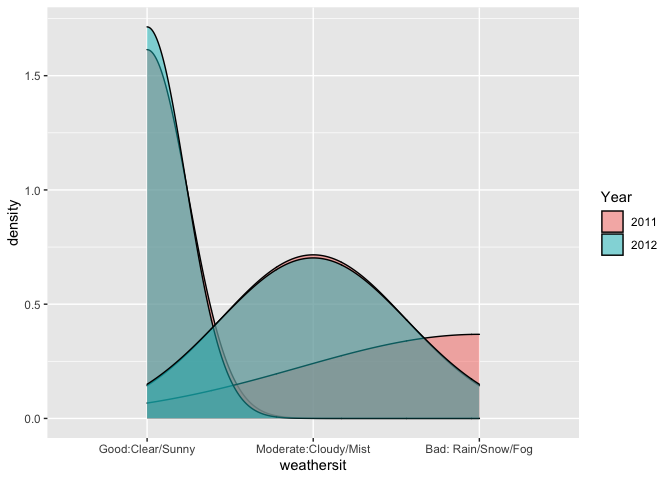<!-- -->

``` r
#Dionte -- ECDF plot for count by year
cntPlot <- ggplot(bikeDataTrain, aes(x= cnt))
cntPlot + stat_ecdf(geom = 'step', aes(color= Year)) + ylab("ECDF")
```

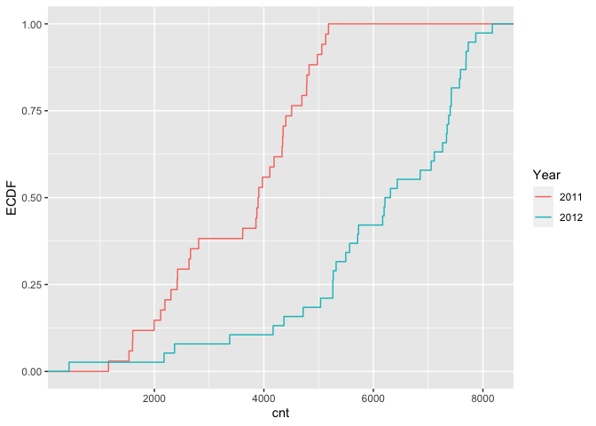<!-- -->

``` r
#Summary Statistics by Dionte
#variance, stdev, mean, and median of casual users by month
statsCasual <- bikeDataTrain %>% 
  group_by(mnth) %>% 
  summarise(avg = mean(casual), 
            med = median(casual), 
            var = var(casual), 
            stDev = sd(casual))
statsCasual
```

    ## # A tibble: 12 x 5
    ##    mnth    avg   med     var stDev
    ##    <fct> <dbl> <dbl>   <dbl> <dbl>
    ##  1 1      146.  120    6986.  83.6
    ##  2 2      141.  120    3569.  59.7
    ##  3 3      473   359  104611  323. 
    ##  4 4      796.  754. 142816. 378. 
    ##  5 5     1068.  842. 480099. 693. 
    ##  6 6      874.  863   41578. 204. 
    ##  7 7      948.  951   24216. 156. 
    ##  8 8      955.  918.  36746. 192. 
    ##  9 9      920. 1001   52844. 230. 
    ## 10 10     657.  706  202861. 450. 
    ## 11 11     358   373    5093   71.4
    ## 12 12     343.  329   19089. 138.

``` r
#variance, stdev, mean, and median of registered users by month
statsRegistered <- bikeDataTrain %>% 
  group_by(mnth) %>% 
  summarise(avg = mean(registered), 
            med = median(registered), 
            var = var(registered), 
            stDev = sd(registered))
statsRegistered
```

    ## # A tibble: 12 x 5
    ##    mnth    avg   med      var stDev
    ##    <fct> <dbl> <dbl>    <dbl> <dbl>
    ##  1 1     1713. 1707   216863.  466.
    ##  2 2     2208. 1705   943432.  971.
    ##  3 3     2651  1806  2457901  1568.
    ##  4 4     3918. 4014  1351846. 1163.
    ##  5 5     3463. 3462   737931.  859.
    ##  6 6     4715. 4446  1042289. 1021.
    ##  7 7     4908. 5447  1242597. 1115.
    ##  8 8     4720. 4714. 1183422. 1088.
    ##  9 9     4660. 4023  2610589. 1616.
    ## 10 10    3404. 3546. 2301021. 1517.
    ## 11 11    4391. 4750   484608.  696.
    ## 12 12    3137  3143  3731650. 1932.

``` r
#variance, stdev, mean, and median of total bike users by season
statsCnt <- bikeDataTrain %>% 
  group_by(season) %>% 
  summarise(avg = mean(cnt), 
            med = median(cnt), 
            var = var(cnt), 
            stDev = sd(cnt))
statsCnt
```

    ## # A tibble: 4 x 5
    ##   season   avg   med      var stDev
    ##   <fct>  <dbl> <dbl>    <dbl> <dbl>
    ## 1 Spring 2204  1951  1311022. 1145.
    ## 2 Summer 4709. 4401  1812687. 1346.
    ## 3 Fall   5716. 6378. 1727193. 1314.
    ## 4 Winter 4615. 4630  2251352. 1500.

``` r
#Calculating z statistic
tapply(bikeDataTrain$casual, INDEX = bikeDataTrain$weathersit, FUN = function(x){x -mean(x)/sd(x)})
```

    ## $`Good:Clear/Sunny`
    ##  [1]  697.45676  732.45676 1133.45676   92.45676  258.45676  376.45676 1205.45676 2555.45676  206.45676  902.45676  688.45676 1116.45676
    ## [13]  999.45676  831.45676  360.45676  773.45676  727.45676  711.45676  771.45676  721.45676 1137.45676  987.45676 1069.45676 1086.45676
    ## [25]  553.45676  118.45676  861.45676  844.45676   39.45676  371.45676 1547.45676  836.45676  118.45676 1196.45676  215.45676 1206.45676
    ## [37]  671.45676  428.45676  242.45676  357.45676  771.45676  220.45676  251.45676 1512.45676  335.45676  839.45676
    ## 
    ## $`Moderate:Cloudy/Mist`
    ##  [1]  833.988  103.988  627.988  446.988  871.988 1230.988  662.988  688.988  209.988  327.988  696.988  681.988  995.988  171.988
    ## [15]  844.988 1023.988  757.988  339.988  192.988 1233.988 1005.988 1014.988  436.988  326.988 1019.988  650.988
    ## 
    ## $`Bad: Rain/Snow/Fog`
    ## [1] NA
    ## 
    ## $`Worse: Heavy Rain/Snow/Fog`
    ## NULL

``` r
# summary statistics by Rashmi
#min max stdev and mean of feeling temperature by season
statsAtemp <- bikeDataTrain %>%
  group_by(season) %>%
  summarise(
    atemp.min = min(atemp),
    atemp.max = max(atemp),
    atemp.med = median(atemp),
    atemp.stdev = sd(atemp),
    atemp.mean = mean(atemp))
statsAtemp
```

    ## # A tibble: 4 x 6
    ##   season atemp.min atemp.max atemp.med atemp.stdev atemp.mean
    ##   <fct>      <dbl>     <dbl>     <dbl>       <dbl>      <dbl>
    ## 1 Spring     -6.04      14.3     0.652        5.75       2.02
    ## 2 Summer      1.00      28.8    21.3          7.11      20.0 
    ## 3 Fall       19.0       32.2    27.2          3.87      26.6 
    ## 4 Winter      2.54      22.9    12.7          5.51      12.5

``` r
#min max stdev and mean of total bike users per year
statsYear<- bikeDataTrain %>%
  group_by(yr) %>%
  summarise(
    cnt.min = min(cnt),
    cnt.max = max(cnt),
    cnt.med = median(cnt),
    cnt.stdev = sd(cnt),
    cnt.mean = mean(cnt)) 
statsYear
```

    ## # A tibble: 2 x 6
    ##   yr    cnt.min cnt.max cnt.med cnt.stdev cnt.mean
    ##   <fct>   <dbl>   <dbl>   <dbl>     <dbl>    <dbl>
    ## 1 2011     1317    5117   4080.     1143.    3689.
    ## 2 2012       22    7525   5875      1907.    5234.

``` r
#min max stdev and mean of total bike users per holiday
statsHoliday<- bikeDataTrain %>%
  group_by(holiday) %>%
  summarise(
    cnt.min = min(cnt),
    cnt.max = max(cnt),
    cnt.med = median(cnt),
    cnt.stdev = sd(cnt),
    cnt.mean = mean(cnt)) 
statsHoliday
```

    ## # A tibble: 2 x 6
    ##   holiday     cnt.min cnt.max cnt.med cnt.stdev cnt.mean
    ##   <fct>         <dbl>   <dbl>   <dbl>     <dbl>    <dbl>
    ## 1 Working Day      22    7525    4559     1754.    4586.
    ## 2 Holiday        1317    6370    4098     1869.    4003.

``` r
#contingency table 

table(bikeDataTrain$holiday, bikeDataTrain$season)
```

    ##              
    ##               Spring Summer Fall Winter
    ##   Working Day     10     18   19     17
    ##   Holiday          3      3    1      2

### Linear Regresion Model

Idea of linear regression model -Linear regression model assumes a
linear relationship between the input variables (x) and the single
output variable(y).The linear equation assigns one scale factor to each
input value or column, called a coefficient and represented by the
capital Greek letter Beta (B). It is a slope term.Regression models
estimate the values of Beta. Betas are chosen by using ordianry least
square method.Ordinary least squares minimize the sum of squared
residuals assuming normality and constant variance on error terms.It is
called linear regression because it is linear in parameters.

``` r
#Fitting multiple regression models

bikeDataTrainF <- bikeDataTrain %>% select(cnt,season,weathersit,atemp,yr)
bikeDataTestF <- bikeDataTest %>% select(cnt,season,weathersit,atemp,yr)

lmRM<-lm(log(cnt)~.,data=bikeDataTrainF)
summary(lmRM)
```

    ## 
    ## Call:
    ## lm(formula = log(cnt) ~ ., data = bikeDataTrainF)
    ## 
    ## Residuals:
    ##      Min       1Q   Median       3Q      Max 
    ## -0.85928 -0.08404  0.01213  0.08910  0.50083 
    ## 
    ## Coefficients:
    ##                                 Estimate Std. Error t value Pr(>|t|)    
    ## (Intercept)                     7.352991   0.062935 116.834  < 2e-16 ***
    ## seasonSummer                    0.471608   0.107152   4.401 4.09e-05 ***
    ## seasonFall                      0.509848   0.128821   3.958  0.00019 ***
    ## seasonWinter                    0.687224   0.087337   7.869 5.00e-11 ***
    ## weathersitModerate:Cloudy/Mist -0.110147   0.053612  -2.055  0.04395 *  
    ## weathersitBad: Rain/Snow/Fog   -5.642216   0.211623 -26.662  < 2e-16 ***
    ## atemp                           0.021173   0.004315   4.907 6.51e-06 ***
    ## yr2012                          0.417790   0.050510   8.272 9.62e-12 ***
    ## ---
    ## Signif. codes:  0 '***' 0.001 '**' 0.01 '*' 0.05 '.' 0.1 ' ' 1
    ## 
    ## Residual standard error: 0.2027 on 65 degrees of freedom
    ## Multiple R-squared:  0.9375, Adjusted R-squared:  0.9308 
    ## F-statistic: 139.3 on 7 and 65 DF,  p-value: < 2.2e-16

``` r
lmFit <- train(log(cnt) ~ ., data = bikeDataTrainF , 
         method = "lm", 
         preProcess = c("center", "scale"),
         trControl = trainControl(method = "cv", number = 10))

predlm <- predict(lmFit, newdata = dplyr::select(bikeDataTestF,-cnt))

lmRM <- postResample(predlm, bikeDataTestF$cnt)

lmRMSE <- lmRM["RMSE"]

lmRMSE
```

    ##     RMSE 
    ## 4316.115

``` r
#Fitting Multiple Linear Regression model by Dionte
#Using BIC to select predictors for the best fit model
bic_selection = step(
  lm(cnt ~ 1, bikeDataTrain),
  scope = cnt ~ season + holiday + mnth + weathersit + atemp + windspeed + Year,
  direction = "both", k = log(nrow(bikeDataTrain))
)
```

    ## Start:  AIC=1094.85
    ## cnt ~ 1
    ## 
    ##              Df Sum of Sq       RSS    AIC
    ## + atemp       1  93771938 130795517 1059.7
    ## + season      3  99240431 125327024 1065.2
    ## + Year        1  43334121 181233334 1083.5
    ## <none>                    224567456 1094.8
    ## + weathersit  2  21164155 203403301 1096.2
    ## + mnth       11 102377151 122190305 1097.6
    ## + windspeed   1   2859835 221707621 1098.2
    ## + holiday     1   2689552 221877903 1098.3
    ## 
    ## Step:  AIC=1059.69
    ## cnt ~ atemp
    ## 
    ##              Df Sum of Sq       RSS    AIC
    ## + Year        1  47589914  83205604 1031.0
    ## + weathersit  2  17784930 113010588 1057.6
    ## <none>                    130795517 1059.7
    ## + windspeed   1   3849193 126946325 1061.8
    ## + season      3  16603083 114192434 1062.7
    ## + holiday     1   1411585 129383932 1063.2
    ## - atemp       1  93771938 224567456 1094.8
    ## + mnth       11  16809749 113985768 1096.8
    ## 
    ## Step:  AIC=1030.96
    ## cnt ~ atemp + Year
    ## 
    ##              Df Sum of Sq       RSS    AIC
    ## + weathersit  2  25984530  57221074 1012.2
    ## + windspeed   1   7062737  76142867 1028.8
    ## + season      3  15128635  68076969 1029.2
    ## <none>                     83205604 1031.0
    ## + holiday     1   1660244  81545360 1033.8
    ## - Year        1  47589914 130795517 1059.7
    ## + mnth       11  15182560  68023044 1063.4
    ## - atemp       1  98027731 181233334 1083.5
    ## 
    ## Step:  AIC=1012.21
    ## cnt ~ atemp + Year + weathersit
    ## 
    ##              Df Sum of Sq       RSS     AIC
    ## + season      3  23936749  33284325  985.52
    ## <none>                     57221074 1012.21
    ## + windspeed   1   2930596  54290478 1012.66
    ## + holiday     1   2926969  54294105 1012.66
    ## + mnth       11  22620307  34600768 1022.68
    ## - weathersit  2  25984530  83205604 1030.96
    ## - Year        1  55789514 113010588 1057.60
    ## - atemp       1  94154498 151375572 1078.93
    ## 
    ## Step:  AIC=985.52
    ## cnt ~ atemp + Year + weathersit + season
    ## 
    ##              Df Sum of Sq      RSS     AIC
    ## <none>                    33284325  985.52
    ## + holiday     1   1178529 32105797  987.18
    ## + windspeed   1    197242 33087083  989.38
    ## - atemp       1  13790259 47074585 1006.54
    ## - season      3  23936749 57221074 1012.21
    ## + mnth       11   7339288 25945038 1014.53
    ## - weathersit  2  34792644 68076969 1029.18
    ## - Year        1  58074847 91359172 1054.94

``` r
#Best fit linear regression model
bikeDataTrainF2 <- bikeDataTrain %>% select(cnt, atemp, season,weathersit)
bikeDataTestF2 <- bikeDataTest %>% select(cnt, atemp, season,weathersit)

bestLm <- lm(cnt ~ atemp + season + weathersit, data = bikeDataTrain)
bestLm
```

    ## 
    ## Call:
    ## lm(formula = cnt ~ atemp + season + weathersit, data = bikeDataTrain)
    ## 
    ## Coefficients:
    ##                    (Intercept)                           atemp                    seasonSummer                      seasonFall  
    ##                        2029.99                           72.71                         1171.98                         1713.22  
    ##                   seasonWinter  weathersitModerate:Cloudy/Mist    weathersitBad: Rain/Snow/Fog  
    ##                        1888.65                          116.35                        -4841.91

``` r
summary(bestLm)
```

    ## 
    ## Call:
    ## lm(formula = cnt ~ atemp + season + weathersit, data = bikeDataTrain)
    ## 
    ## Residuals:
    ##     Min      1Q  Median      3Q     Max 
    ## -2347.6  -795.0  -243.7   908.4  2269.2 
    ## 
    ## Coefficients:
    ##                                Estimate Std. Error t value Pr(>|t|)    
    ## (Intercept)                     2029.99     338.35   6.000 9.27e-08 ***
    ## atemp                             72.71      25.02   2.906 0.004978 ** 
    ## seasonSummer                    1171.98     621.75   1.885 0.063839 .  
    ## seasonFall                      1713.22     747.30   2.293 0.025070 *  
    ## seasonWinter                    1888.65     506.58   3.728 0.000403 ***
    ## weathersitModerate:Cloudy/Mist   116.35     295.78   0.393 0.695328    
    ## weathersitBad: Rain/Snow/Fog   -4841.91    1214.16  -3.988 0.000169 ***
    ## ---
    ## Signif. codes:  0 '***' 0.001 '**' 0.01 '*' 0.05 '.' 0.1 ' ' 1
    ## 
    ## Residual standard error: 1177 on 66 degrees of freedom
    ## Multiple R-squared:  0.5932, Adjusted R-squared:  0.5562 
    ## F-statistic: 16.04 on 6 and 66 DF,  p-value: 2.81e-11

``` r
plot(bestLm)
```

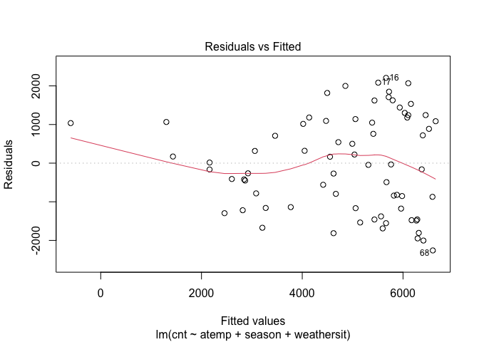<!-- -->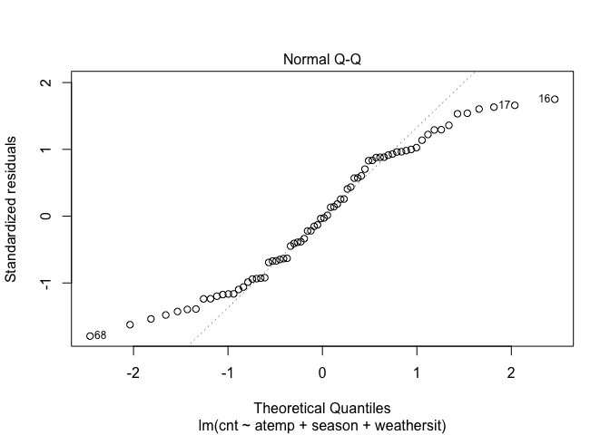<!-- -->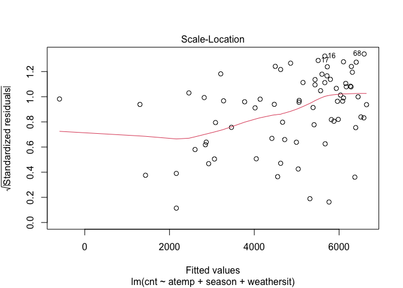<!-- -->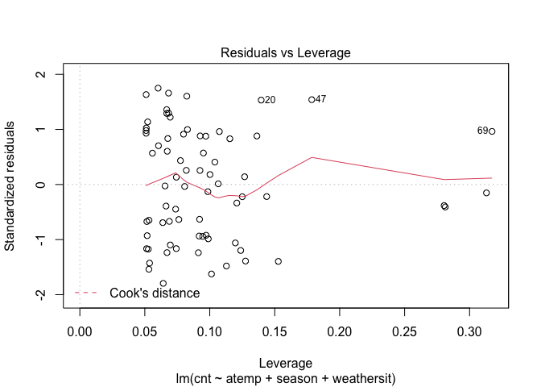<!-- -->

``` r
bestLmFit <- train(cnt~ atemp + season +weathersit, data= bikeDataTrainF2,
                   method = "lm",
                   preProcess = c("center", "scale"),
                   trControl = trainControl(method = "cv", number = 10))
lmFitPred <- predict(bestLmFit, newdata = dplyr::select(bikeDataTestF2,-cnt))

lm2RM <- postResample(lmFitPred, bikeDataTestF2$cnt)

lm2RMSE <- lm2RM["RMSE"]

lm2RMSE
```

    ##     RMSE 
    ## 1817.582

### Fitting Random forest model

Random Forest model is tree based method used to prediction. It is
powerful ensembling machine learning algorithm which extends the idea of
bagging but instead of including every predictor, we are including
subset of predictors. It works by creating bootstrap samples fitting a
tree for each bootstrap sample. Random Forest method avoids correlation
amoung the trees. It uses m subset of predictors.

m = SQRT(p) for classification and m = p/3 for regression.

``` r
set.seed(1)


rfFit <- train(cnt ~ ., 
               method = "rf",
               trControl = trainControl(method = "repeatedcv",
                                        repeats = 3,
                                        number = 10),
               tuneGrid = data.frame(mtry = 1:9),
               data = bikeDataTrainF)
rfFit
```

    ## Random Forest 
    ## 
    ## 73 samples
    ##  4 predictor
    ## 
    ## No pre-processing
    ## Resampling: Cross-Validated (10 fold, repeated 3 times) 
    ## Summary of sample sizes: 66, 66, 66, 65, 66, 66, ... 
    ## Resampling results across tuning parameters:
    ## 
    ##   mtry  RMSE       Rsquared   MAE      
    ##   1     1394.2730  0.6812036  1125.0535
    ##   2     1054.3402  0.7288401   825.9939
    ##   3      932.8283  0.7453844   691.8647
    ##   4      899.8343  0.7525831   656.8654
    ##   5      906.7537  0.7491820   660.9891
    ##   6      927.6028  0.7399397   680.6086
    ##   7      943.7690  0.7309883   689.6461
    ##   8      971.8917  0.7146193   713.5777
    ##   9      962.2592  0.7202426   705.3727
    ## 
    ## RMSE was used to select the optimal model using the smallest value.
    ## The final value used for the model was mtry = 4.

``` r
rfPred <- predict(rfFit,  newdata = dplyr::select(bikeDataTestF,-cnt))
rfRM <- postResample(rfPred, bikeDataTestF$cnt)
rfRMSE <- rfRM["RMSE"]

rfRMSE
```

    ##     RMSE 
    ## 1898.186

### Fitted Boosted Tree Model

The Boosted tree fit model is used on the bike data set to create a
model candidate. The training data set was used in the model to find the
highest accuracy rate when using the tuning parameters n.trees,
interaction.depth, shrinkage, and n.minobsinnode. When the highest rate
was chosen given the parameters, it was used for prediction against the
testing data set. Finally, the predictions was tested finding the RMSE,
Rsquared, and MAE values

``` r
trCtrl <- trainControl(method = "repeatedcv", number = 10, repeats =3)
set.seed(1)
BoostFit <- train(cnt ~., data = bikeDataTrain,
                     method = "gbm",
                      verbose = FALSE,
                     preProcess = c("center", "scale"),
                     trControl = trCtrl)
BoostFit
```

    ## Stochastic Gradient Boosting 
    ## 
    ## 73 samples
    ##  9 predictor
    ## 
    ## Pre-processing: centered (23), scaled (23) 
    ## Resampling: Cross-Validated (10 fold, repeated 3 times) 
    ## Summary of sample sizes: 66, 66, 66, 65, 66, 66, ... 
    ## Resampling results across tuning parameters:
    ## 
    ##   interaction.depth  n.trees  RMSE      Rsquared   MAE     
    ##   1                   50      459.5180  0.9455284  341.9216
    ##   1                  100      443.8337  0.9462717  333.0820
    ##   1                  150      448.5974  0.9469908  335.1811
    ##   2                   50      468.5476  0.9459174  340.6554
    ##   2                  100      465.1334  0.9462925  343.5862
    ##   2                  150      462.6206  0.9462029  345.6756
    ##   3                   50      463.2487  0.9439554  338.3608
    ##   3                  100      454.2565  0.9453524  331.6865
    ##   3                  150      462.7378  0.9444633  336.3771
    ## 
    ## Tuning parameter 'shrinkage' was held constant at a value of 0.1
    ## Tuning parameter 'n.minobsinnode' was held constant at a value of 10
    ## RMSE was used to select the optimal model using the smallest value.
    ## The final values used for the model were n.trees = 100, interaction.depth = 1, shrinkage = 0.1 and n.minobsinnode = 10.

``` r
BoostFitPred <- predict(BoostFit, newdata = dplyr::select(bikeDataTest, -cnt))
BoostFitPred
```

    ##  [1] 1796.376 1814.840 1796.376 1637.937 1637.937 1656.402 1940.693 3059.908 3125.997 4469.759 4646.183 4209.239 3570.042 4357.330
    ## [15] 4455.564 2320.455 3714.598 2920.701 1921.866 3704.963 3851.503 2892.064 3909.188 2860.992 6486.290 5410.098 5626.179 6819.978
    ## [29] 5485.664 6093.469 6111.933 6592.948

``` r
bfRM <- postResample(BoostFitPred, bikeDataTest$cnt)

bfRMSE <- bfRM["RMSE"]
bfRMSE
```

    ##     RMSE 
    ## 498.8638

``` r
cRMSEsTitles <- c("Linear Regression Model","Liner Regression Model 2","Random Forest","Boosted Tree")
  
cRMSEs <- c(lm = lmRMSE, lm2 = lm2RMSE, rf = rfRMSE, boost = bfRMSE)
cRMSEs
```

    ##    lm.RMSE   lm2.RMSE    rf.RMSE boost.RMSE 
    ##  4316.1148  1817.5824  1898.1863   498.8638

``` r
bestCRMSE <- cRMSEsTitles[which.min(cRMSEs)]

bestCRMSE
```

    ## [1] "Boosted Tree"

*Best model fit is :Boosted Tree model*
